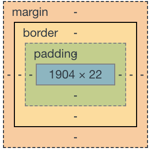
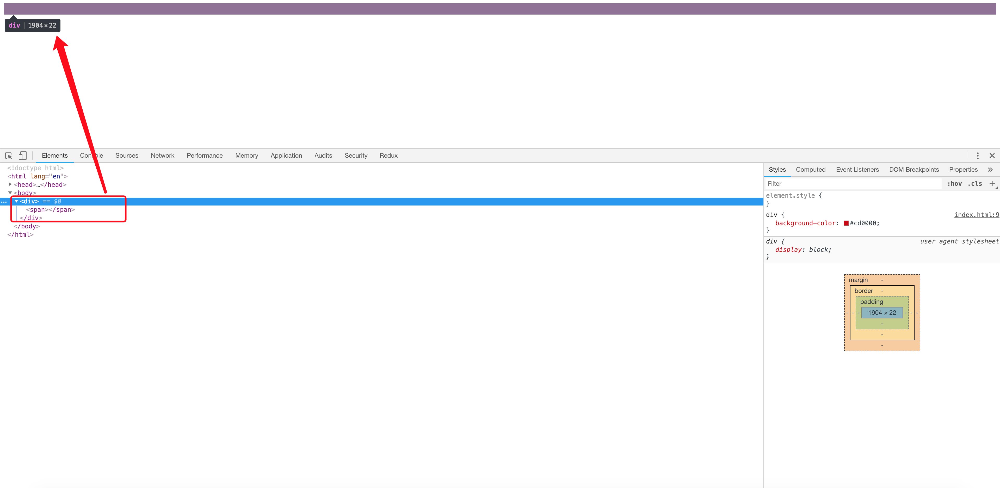

- [【第三章】流、元素与基本尺寸](#%E7%AC%AC%E4%B8%89%E7%AB%A0%E6%B5%81%E5%85%83%E7%B4%A0%E4%B8%8E%E5%9F%BA%E6%9C%AC%E5%B0%BA%E5%AF%B8)
  - [块级元素](#%E5%9D%97%E7%BA%A7%E5%85%83%E7%B4%A0)
    - [为什么list-item元素会出现项目符号](#%E4%B8%BA%E4%BB%80%E4%B9%88list-item%E5%85%83%E7%B4%A0%E4%BC%9A%E5%87%BA%E7%8E%B0%E9%A1%B9%E7%9B%AE%E7%AC%A6%E5%8F%B7)
    - [width/height作用在哪个盒子上](#widthheight%E4%BD%9C%E7%94%A8%E5%9C%A8%E5%93%AA%E4%B8%AA%E7%9B%92%E5%AD%90%E4%B8%8A)
  - [width/height作用的具体细节](#widthheight%E4%BD%9C%E7%94%A8%E7%9A%84%E5%85%B7%E4%BD%93%E7%BB%86%E8%8A%82)
    - [深藏不露的width:auto](#%E6%B7%B1%E8%97%8F%E4%B8%8D%E9%9C%B2%E7%9A%84widthauto)
      - [外部尺寸与流体特性](#%E5%A4%96%E9%83%A8%E5%B0%BA%E5%AF%B8%E4%B8%8E%E6%B5%81%E4%BD%93%E7%89%B9%E6%80%A7)
        - [1.正常流宽度 100%](#1%E6%AD%A3%E5%B8%B8%E6%B5%81%E5%AE%BD%E5%BA%A6-100)
        - [2.格式化宽度](#2%E6%A0%BC%E5%BC%8F%E5%8C%96%E5%AE%BD%E5%BA%A6)
      - [内部尺寸与流体特性](#%E5%86%85%E9%83%A8%E5%B0%BA%E5%AF%B8%E4%B8%8E%E6%B5%81%E4%BD%93%E7%89%B9%E6%80%A7)
        - [1.包裹性](#1%E5%8C%85%E8%A3%B9%E6%80%A7)
        - [2.首选最小宽度](#2%E9%A6%96%E9%80%89%E6%9C%80%E5%B0%8F%E5%AE%BD%E5%BA%A6)
        - [3.最大宽度](#3%E6%9C%80%E5%A4%A7%E5%AE%BD%E5%BA%A6)
    - [width值作用的细节](#width%E5%80%BC%E4%BD%9C%E7%94%A8%E7%9A%84%E7%BB%86%E8%8A%82)
    - [css流体布局下的宽度分离原则](#css%E6%B5%81%E4%BD%93%E5%B8%83%E5%B1%80%E4%B8%8B%E7%9A%84%E5%AE%BD%E5%BA%A6%E5%88%86%E7%A6%BB%E5%8E%9F%E5%88%99)
      - [为何要宽度分离](#%E4%B8%BA%E4%BD%95%E8%A6%81%E5%AE%BD%E5%BA%A6%E5%88%86%E7%A6%BB)
    - [改变width/height作用细节的box-sizing](#%E6%94%B9%E5%8F%98widthheight%E4%BD%9C%E7%94%A8%E7%BB%86%E8%8A%82%E7%9A%84box-sizing)
      - [box-sizing的作用](#box-sizing%E7%9A%84%E4%BD%9C%E7%94%A8)
      - [为何box-sizing不支持margin-box](#%E4%B8%BA%E4%BD%95box-sizing%E4%B8%8D%E6%94%AF%E6%8C%81margin-box)
      - [如何评价*{box-sizing: border-box}](#%E5%A6%82%E4%BD%95%E8%AF%84%E4%BB%B7box-sizing-border-box)
      - [box-sizing发明的初衷](#box-sizing%E5%8F%91%E6%98%8E%E7%9A%84%E5%88%9D%E8%A1%B7)
    - [相对简单而单纯的height:auto](#%E7%9B%B8%E5%AF%B9%E7%AE%80%E5%8D%95%E8%80%8C%E5%8D%95%E7%BA%AF%E7%9A%84heightauto)
    - [关于height:100%](#%E5%85%B3%E4%BA%8Eheight100)
      - [为何height:100%无效](#%E4%B8%BA%E4%BD%95height100%E6%97%A0%E6%95%88)
      - [如何让元素支持height:100%效果](#%E5%A6%82%E4%BD%95%E8%AE%A9%E5%85%83%E7%B4%A0%E6%94%AF%E6%8C%81height100%E6%95%88%E6%9E%9C)
        - [设定显式的高度值](#%E8%AE%BE%E5%AE%9A%E6%98%BE%E5%BC%8F%E7%9A%84%E9%AB%98%E5%BA%A6%E5%80%BC)
        - [使用绝对定位](#%E4%BD%BF%E7%94%A8%E7%BB%9D%E5%AF%B9%E5%AE%9A%E4%BD%8D)
  - [CSS min-width/max-width和min-height/max-height二三事](#css-min-widthmax-width%E5%92%8Cmin-heightmax-height%E4%BA%8C%E4%B8%89%E4%BA%8B)
    - [为流体而生的min-width/max-width](#%E4%B8%BA%E6%B5%81%E4%BD%93%E8%80%8C%E7%94%9F%E7%9A%84min-widthmax-width)
    - [与众不同的初始值](#%E4%B8%8E%E4%BC%97%E4%B8%8D%E5%90%8C%E7%9A%84%E5%88%9D%E5%A7%8B%E5%80%BC)
    - [超越!important，超越最大](#%E8%B6%85%E8%B6%8Aimportant%E8%B6%85%E8%B6%8A%E6%9C%80%E5%A4%A7)
      - [超越!important](#%E8%B6%85%E8%B6%8Aimportant)
      - [超越最大](#%E8%B6%85%E8%B6%8A%E6%9C%80%E5%A4%A7)
    - [任意高度元素的展开收起动画技术](#%E4%BB%BB%E6%84%8F%E9%AB%98%E5%BA%A6%E5%85%83%E7%B4%A0%E7%9A%84%E5%B1%95%E5%BC%80%E6%94%B6%E8%B5%B7%E5%8A%A8%E7%94%BB%E6%8A%80%E6%9C%AF)
  - [内联元素](#%E5%86%85%E8%81%94%E5%85%83%E7%B4%A0)
    - [哪些元素是内联盒子](#%E5%93%AA%E4%BA%9B%E5%85%83%E7%B4%A0%E6%98%AF%E5%86%85%E8%81%94%E7%9B%92%E5%AD%90)
    - [幽灵空白节点](#%E5%B9%BD%E7%81%B5%E7%A9%BA%E7%99%BD%E8%8A%82%E7%82%B9)

# 【第三章】流、元素与基本尺寸
HTML标签通常分为块级元素(block-level element)和内联元素(inline element)

## 块级元素
常见的块级元素有div、li和table等。需要注意的是“块级元素”和“display为block的元素”不是一个概念。例如，li元素默认的display值是list-item，table元素默认的display值是table，但是它们均是“块级元素”，因为它们都符合块级元素的基本特征，也就是一个水平流上只能单独显示一个元素，多个块级元素则换行显示。

正是由于“块级元素”具有换行特性，因此理论上它都可以配合clear属性来清除浮动带来的影响。例如
```css
.clear::after{
    content: '';
    display: table; /* 也可以是block，或则是list-item */
    clear: both;
}
```

> 实际开发时，一般使用table，并不会使用list-item，因为1.list-item的字符比较多；2.会出现不需要的项目符号；3.IE浏览器不支持伪元素的值为list-item

### 为什么list-item元素会出现项目符号
**盒子分为：块级盒子(block-level box)和内联盒子(inline box)。块级盒子就负责结构，内联盒子就负责内容。**

之所以list-item元素会出现项目符号是因为生成了一个附加的盒子，学名“标记盒子”，专门用来放圆点、数字这些项目符号。

**每个元素都有两个盒子，外在盒子和内在盒子。外在盒子负责元素是可以一行显示，还是只能换行显示；内在盒子负责宽高、内容呈现什么的。或则内在盒子叫“容器盒子”**

**按照display的属性值不同，值为block的元素的盒子实际由外在的“块级盒子”和内在的”块级容器盒子“组成，值为inline-block的元素则由外在的“内联盒子”和内在的“块级容器盒子”组成，值为inline的元素则内外均是“内联盒子”**

明白为何display属性值是inline-block的元素既能和图文一行显示，又能直接设置width/height。因为有两个盒子，外面的盒子是inline级别，里面的盒子是block级别

### width/height作用在哪个盒子上
是内在盒子，也就是“容器盒子”

## width/height作用的具体细节

### 深藏不露的width:auto
width的默认值是auto。auto因为是默认值，所以出镜率不高，但是，它却是个深藏不露的家伙，它至少包含了以下四种不同的宽度表现

+ 1.**充分利用可用空间**。比方说div，p这些元素的宽度默认是100%于父级容器的
+ 2.**收缩与包裹**。典型代表就是浮动、绝对定位、inline-block元素或table元素。css3中的fit-content指的就是这种宽度表现
+ 3.**收缩到最小**。这个容易出现在table-layout为auto的表格中
+ 4.**超出容器限制**。除非有明确的width相关设置，否则上面3种情况尺寸都不会主动超过父级容器宽度，但是存在一些特殊情况。例如设置white-space: nowrap

> 在css世界中，盒子分“内在盒子”和“外在盒子”，显示也分“内部显示”和“外部显示”，同样尺寸也分“内部尺寸”和“外部尺寸”。其中“内部尺寸”由内部元素决定，“外部尺寸”宽度由外部元素决定

> div默认宽度100%显示是“外部尺寸”，而这唯一的“外部尺寸”，是“流”的精髓所在

#### 外部尺寸与流体特性

##### 1.正常流宽度 100%

在页面中随便扔一个div元素，其尺寸表现就会和水流一样铺满容器。这就是block容器的流特性。这种特性。所有的浏览器的表现都是一致的

```css
/* example */
a {
    display: block;
    width: 100%
}
```

a元素默认display是inline，所以，设置display:block使其块状化绝对没有问题，但后面的width:100%就没有任何必要的出现

> "鑫三无准则"，既“无宽度，无图片，无浮动”为何要“无宽度”?  原因很简单，表现为“外部尺寸”的块级元素一旦设置了宽度，流动性就丢失了

> 所谓流动性，并不是看上去的宽度100%显示这么简单，而是一种margin/border/padding/content内容区域自动分配水平空间的机制

👉 [example](https://demo.cssworld.cn/3/2-3.php)

这是一个对比演示，上下两个导航均有margin和padding，前者无width设置，完全借助流的特性，后者宽度width:100%。结果，后者的尺寸超出了外部的容器，完全就不像“水流”那样完全利用容器空间，即所谓的“流动性丢失”

##### 2.格式化宽度

格式化宽度仅出现在“绝对定位模型”中，也就是出现在position属性值为absolute和fixed的元素中。在默认情况下，绝对定位元素的宽度表现是“包裹性”，宽度由内部尺寸决定，但是，有一种情况其宽度是外部尺寸决定的。

**对于非替换元素，当left/right或top/bottom对立方位的属性值同时存在的时候，元素的宽度表现为“格式化宽度”，其宽度大小相对于最近的具有定位特性(position属性值不是static)的祖先元素计算**

👉 [example](./格式化宽度/index.html)

> 此外和上面的普通流一样，“格式化宽度”具有完全的流体性，也就是margin、border、padding和content内容区域同样会自动分配水平（和垂直）空间

#### 内部尺寸与流体特性
所谓“内部尺寸”，简单来讲就是元素的尺寸由内部的元素决定，而非由外部的容器决定。如何判断一个元素使用的是否为“内部尺寸”呢？很简单，假如这个元素里面没有内容，宽度就是0，那就是应用的“内部尺寸”

##### 1.包裹性

“包裹性”除了“包裹”，还有“自适应性”。“自适应性”是区分后面两种尺寸表现很重要的一点。那么这个“自适应”指的是什么呢？

所谓“自适应性”指的是元素尺寸由内部元素决定，但永远小于“包含块”容器的尺寸(除非容器尺寸小于元素的“首选最小宽度”)。换句话说就是，“包裹性”元素冥冥中有个max-width:100%罩着的感觉(注意：此说法只是便于大家理解，实际上是有明显区别的)

因此，对于一个元素，如果其display属性值是inline-block，那么即使其里面内容再多，只要是正常的文本，宽度也不会超过容器。于是，图文混排的时候，我们只要关心内容，除非“首选最小宽度”比容器宽度要大，否则我们完全不需要担心某个元素内容太多而破坏了布局

按钮就是css世界中极具代表性的inline-block元素，可谓展示“包裹性”最好的例子，具体表现为：按钮文字越多宽度越宽(内部尺寸特性)，但如果文字足够多，则会在容器的宽度处自动换行(自适应性)

👉 [example](https://demo.cssworld.cn/3/2-4.php)

> button标签按钮才会自动换行，input标签按钮，默认white-space: pre，是不会换行的，需要将pre值重置为默认的normal

**”包裹性“对与实际开发有什么作用呢？**

请看这个需求：页面某个模块的文字内容是动态的，可能是几个字，也可能是一句话。然后希望文字少的时候居中显示，文字超过一行的时候居左显示

👉 [example](https://demo.cssworld.cn/3/2-5.php)

> 除了inline-block元素，浮动元素以及决定定位元素都具有包裹性，均有类似的智能宽度行为

##### 2.首选最小宽度

所谓“首选最小宽度”，指的是元素最适合的最小宽度。接着上面的例子，外部容器的宽度是240像素，假设宽度是0，请问里面的inline-block元素的宽度是多少？

> 是0吗？不是。在css世界中，**图片和文字的权重要远大于布局**，因此，css的设计者显然是不会让图文在width:auto时宽度变成0，此时所表现的宽度就是“首选最小宽度”

> + 东亚文字(如中文)最小宽度为每个汉字的宽度
> + 西方汉字最小宽度由特定的连续的英文字符单元决定，如果想让英文字符和中文一样，每一个字符都用都用最小宽度单元，可以试试css中的word-break: break-all
> + 类似图片这样的替换元素的最小宽度就是该元素本身的宽度

**“首选最小宽度”对我们实际开发有什么作用呢？**

👉 [example](https://demo.cssworld.cn/3/2-6.php)

可以利用“首选最小宽度”的行为特点把需要的图形勾勒出来

##### 3.最大宽度

最大宽度就是元素可以有的最大宽度。“最大宽度”实际等同于“包裹性”元素设置white-space: nowrap声明后的宽度。如果内部没有块级元素或者块级元素没有设定宽度值，则“最大宽度”实际上是最大的连续内联盒子的宽度

👉 [example](https://demo.cssworld.cn/3/2-7.php)

### width值作用的细节
这里提到一个重要的概念”**盒尺寸(box dimension)**“

width是作用在“内在盒子”上的，乍一看是一个普通的盒子，实际上，这个“内在盒子”是由很多部分构成的



引用一张chrome的盒子模型图

> “内在盒子”又被分为了4个盒子，分别是content box、padding box、border box和margin box

content box写作content-box，padding-box写作padding-box，border box写作border-box，margin box写作...突然发现，margin box居然没有名字！为何唯独margin box并没有对应的css关键字名称呢？因为目前没有任何场景需要用到margin box

**"margin的背景永远是透明的"，因此不可能作为background-clip或background-origin属性出现。margin一旦设定具体宽度和高度值，其本身的尺寸是不会因margin值变化而变化的，因此作为box-sizing的属性值存在也就没有意义**

> 在css2.1的规范中，有一段非常露骨的描述：content box环绕着width和height给定的矩形。也就是说width和height默认作用在content box上

> 有时候宽度的设定和表现并不合理，一个元素一旦设置具体的width值，则元素的流动性就会被阻断，“流动性丢失”

### css流体布局下的宽度分离原则
所谓“宽度分离原则”就是css中的width属性不与影响宽度的padding/border（有时候包括margin）属性共存，也就是不能出现以下组合:

```css
.box {
    width: 100px;
    border: 1px solid;
}
/* 或者 */
.box {
    width: 100px;
    padding: 20px;
}
```

> 有人可能会问：不这么写，该怎么写呢？很简单，分离，width独立占用一层标签，而padding、border、margin利用流动性在内部自适应呈现

```css
.father {
    width: 180px;
}
.son {
    margin: 0 20px;
    padding: 20px;
    border: 1px solid;
}
```

#### 为何要宽度分离

在前端领域，一提到分离，作用一定是便于维护。比方说，样式和行为分离、前后端分离或者这里的“宽度分离”

道理其实很简单，当一件事情的发展可以被多个因素所左右的时候，这个事情最终的结果就会变得很大而不可预期。宽度在这里也是类似，由于盒尺寸中的4个盒子都能影响宽度，自然页面元素的最终宽度就很容易发生变化而导致意想不到的布局发生

### 改变width/height作用细节的box-sizing
box-sizing虽然是css3的属性，但是，让人受宠若惊的是IE8浏览器也是支持它的，不过需要加-ms-私有前缀，但IE9浏览器开始就不需要私有前缀了

#### box-sizing的作用
box-size顾名思义就是“盒尺寸”。虽然box-sizing被直译为“盒尺寸”，实际上，其更准确的叫法应该是“盒尺寸的作用细节”，或者说得更通俗一点，叫“width作用的细节”，也就是说box-sizing属性是改变width的作用细节

> 那它改变了什么细节？一句话，改变了width作用的盒子。还记不记得“内在盒子”的4个盒子？它们分别是content box、padding box、border box和margin box。默认情况下，width是作用在content box上的，**box-sizing的作用就是可以把width作用的盒子变成其它几个**

```css
.box1 { box-sizing: content-box; } /* 默认值 */
.box2 { box-sizing: padding-box; } /* firefox曾经支持 */
.box3 { box-sizing: border-box; } /* 全线支持 */
.box4 { box-sizing: margin-box; } /* 从未支持过 */
```

#### 为何box-sizing不支持margin-box
不支持margin-box最大的原因是它本身就没有价值！不妨好好想想，一个元素，如果我们使用width或height设定好了尺寸，请问我们此时设置margin值，其offset尺寸会有变化吗？不会啊，100像素宽的元素，在怎么设置margin，它还是100像素宽。但是border和padding就不一样了，100像素宽的元素，设置了20像素大小的padding值，offsetWidth就是140像素了，尺寸会变化。你说，一个本身并不会改变元素尺寸的盒子，它有让box-sizing支持的道理吗？**box-sizing就是改变尺寸作用的规则**！**margin只有在width为auto的时候可以改变元素的尺寸，但是，此时元素已经处于流动性状态，根本就不需要box-sizing**。所以，说来说去就是margin-box本身就没有价值

另外一个原因牵扯到语义。如果box-sizing开了先河支持了margin-box，margin box就变成了一个“显式的盒子”，你让background-origin等属性何去何从，支持还是不支持？“margin的背景永远是透明的”这几个大字可是在规范写得清清楚楚，难道让背景色在所谓的margin box中也显示？显然是不可能的。

最后还有一个可能的原因就是使用场景需要。对于box-sizing的margin-box效果，如果是IE10及以上版本浏览器，可以试试flex布局，如果需要兼容IE8及以上浏览器可以使用“宽度分离”，或者特定场景下使用“格式化宽度”来实现

#### 如何评价*{box-sizing: border-box}
+ 这种做法易产生没必要的消耗。通配符 * 应该是一个慎用的选择器，因为它会选择所有的标签元素。对于普通的内联元素(非图片等替换元素)，box-sizing无论是什么值，对其渲染表现都没有影响，因此，* 对这些元素而言就是没有必要的消耗；同时有些元素，如search类型的搜索框，其默认的box-sizing就是border-box(如果浏览器支持)，因此，* 对search类型的input而言也是没有必要的消耗
+ 这种做法并不能解决所有问题。box-sizing不支持margin-box，只有当元素没有水平margin时候，box-sizing才能真正无计算，而“宽度分离”等策略则可以彻底解决所有的宽度计算的问题

#### box-sizing发明的初衷
在css世界中，唯一离不开box-sizing:border-box的就是原生普通文本框input和文本域textarea的100%自适应父容器宽度

拿文本域textarea举例，**textarea为替换元素，替换元素的特性之一就是尺寸由内部元素决定，且无论其display属性值是inline还是block**。这个特性很有意思，对于非替换元素，如果其display属性值为block，则会具有流动性，宽度由外部尺寸决定，但是替换元素的宽度却不受display水平影响，因此通过css修改textarea的display水平是无法水平让尺寸100%自适应父容器的

```css
textarea {
    display: block; /* 还是原来的尺寸 */
}
```

所以，我们只能通过width设定让textarea尺寸100%自适应父容器。那么问题来了，textarea是有border的，而且需要有一定的pading大小，否则输入的时候光标会顶着边框，体验很不好。于是width/border和padding注定要共存，同时还要整体宽度100%自适应。如果不借助其它标签，肯定是无解的。

在浏览器还没支持box-sizing的年代，做法有点类似于“宽度分离”，外面嵌套div标签，模拟border和padding，textarea作为子元素，border和padding全部为0，然后宽度100%自适应父级div

👉 [example](https://demo.cssworld.cn/3/2-9.php)

因此，说来说去，也就是box-sizing:border-box才是根本解决之道

```css
textarea {
    width: 100%;
    -ms-box-sizing: border-box; /* for IE8 */
    box-sizing: border-box
}
```

> box-sizing被发明出来最大的初衷应该是解决替换元素宽度自适应问题。

```css
/* 这样重置更合理 */
input, textarea, img, video, object {
    box-sizing: border-box;
}
```

### 相对简单而单纯的height:auto
width和height是css世界中同一类型的魔法师，都是直接限定元素的尺寸。所以，它们共用一套“盒尺寸”模型，box-sizing的解释也是类似

height:auto要比width:auto简单而单纯得多。原因在于，css的默认流是水平方向的，宽度是稀缺的，高度是无限的。因此，宽度的分配规则就比较复杂，高度就显得比较随意

此外，height:auto也有外部尺寸特性。其仅存在于绝对定位模型中，也就是“格式化高度”与“格式化宽度”

### 关于height:100%
**height和width还有一个比较明显的区别就是对百分比单位的支持。对于width属性，就算父元素width为auto，其百分比也是支持的；但是，对于height属性，如果父元素height为auto，只要子元素在文档流中，其百分比值完全就被忽略了。**

```css
div {
    width: 100%; /* 这是多余的 */
    height: 100%; /* 这是无效的 */
    background: url(bg.jpg);
}
```

发现div高度永远是0，哪怕其父级body塞满了内容也是如此。

```css
html, body {
    height: 100%
}
```

👉 [example](./height/index.html)

并且仅仅设置body也是不行的，因为此时的body也没有具体的高度值

> **发现对于普通文档流中的元素，百分比高度值要想起作用，其父级必须有一个可以生效的高度值！**

#### 为何height:100%无效

👉 [example](https://demo.cssworld.cn/3/2-10.php)

要明白其中的原因要先了解浏览器渲染的基本原理。首先，先下载文档内容，加载头部样式资源（如果有的话），然后按照从上而下、自外而内的顺序渲染DOM内容。套用本例就是，先渲染父级元素，后渲染子元素，是有先后顺序的。因此，当渲染到父元素的时候，子元素的width:100%并没有渲染，宽度就是图片加文字内容的宽度；等渲染到文字这个元素的时候，父元素的宽度已经固定，此时的width:100%就是已经固定好的父元素的宽度。宽度不够怎么办？溢出就好了，overflow属性就是为此而生的

> **如果包含块的高度没有显式制定（即高度由内容决定），并且该元素不是绝对定位，则计算值为auto。** 一句话总结就是：因为解释成了auto。要知道，auto和百分比计算，肯定是算不了的

```css
'auto' * 100/100 = NaN
```

#### 如何让元素支持height:100%效果

##### 设定显式的高度值

```css
html, body {
    height: 100%;
}
```

##### 使用绝对定位

```css
div {
    height: 100%;
    position: absolute;
}
```

**此时的height:100%就会有计算值，即使祖先元素的height计算能力为auto也是如此。需要注意的是，绝对定位元素的百分比计算和非绝对定位的百分比计算是有区别的，区别在于绝对定位的宽高百分比计算是相对与padding box的，也就是说会把padding大小的值计算在内，但是，非绝对定位元素则是相对于content box计算的**

👉 [example](https://demo.cssworld.cn/3/2-11.php)

> **可以看到非定位元素的宽高百分比计算不会将padding计算在内**

> 这两种height:100%生效方法的评价是：显式高度方法中规中矩，意料之中；绝对定位方法剑走偏锋，支持隐式高度计算，给人意外之喜，但本身脱离文档流，使其仅在某些场景有四两拨千斤的效果

👉 [example](https://demo.cssworld.cn/3/2-12.php)

只要在图片上覆盖两个绝对定位，同时设height:100%，则无论图片多高，我们的左右半区都能自动和图片高度一模一样，无须任何使用javascript计算

## CSS min-width/max-width和min-height/max-height二三事
说完了width和height，下面轮到min-width/max-width和min-height/max-height了，它们有很多共性。比方说，它们都是与尺寸相关的，盒尺寸机制和一些值的渲染规则也是一样的。

### 为流体而生的min-width/max-width
在css世界中，min-width/max-width出现的场景一定是自适应布局或者流体布局中。因为，如果是那种width/height定死的砖头布局，min-width/max-width就没有任何出现的价值，因为它们是具有边界行为的属性，所以没有变化自然无法触发，也就没有使用价值

比如，网页宽度在1200～1400像素自适应，既满足大屏的大气又满足笔记本的良好显示，此时，min-width/max-width就可以大显神威了

```css
.container {
    min-width: 1200px;
    max-width: 1400px;
}
```

对，无需width设置，直接使用min-width/max-width

还可能，公众号的热门文章中，经常会有图片，这些图片都是用户上传产生的，因此尺寸会有大有小，为了避免图片在移动端展示过大的影响体验，常常会有下面的max-width限制

```css
img {
    max-width: 100%;
    height: auto!important;
}
```

**height:auto是必须的，否则，如果原始图片有设定height，max-widht生效的时候图片就会被水平压缩。强制height为auto可以确保宽度不超出的同时使图片保持原来的比例。** 但这样也会有体验上的问题，那就是在加载时图片占据高度会从0变成计算高度，图文会有明显的瀑布式下落

### 与众不同的初始值
width/height的默认值是auto，而min-width/max-width和min-height/max-height的初始值则要复杂些。这里要分为两部分，分别是max- *系列和min- *。max-width和max-height的初始值是none，min-width和min-height的初始值......

虽然MDN和W3C维基的文档上都显示min-width/min-height的初始值是0，但是根据分析和测试，**所有浏览器中的min-width/min-height的初值为都是auto**

证据如下：
+ min-width/min-height值为auto合法。例如
```html
<body style="min-width: auto;">
<!-- 结果所有浏览器下 -->
<!-- document.body.style.minWidth; // 结果为auto -->
```
> 说明min-*支持auto值，同样，如果是max-width，结果则是''，进一步说明min-width/min-height值为auto合法
+ **数值变化无动画**。假设元素的min-width/min-height的初始值是0，那么，当我们设置transition过渡同时改变了min-width/min-height值，岂不是应该有动画效果？结果
```css
.box {
    transition: min-height .3s;
}

.box:hover {
    min-height: 300px
}
/* 鼠标经过.box元素，元素突然变高，并无动画效果，但是如果下面这样的设置 */
.box {
    min-height: 0;
    transition: min-height .3s;
}

.box:hover {
    min-height: 300px;
}
```
> 鼠标经过.box元素，transition动画效果就出现了。这就证明了，**min-height的初始值不是0，既然不是0，那就应该是所有浏览器都支持的auto**

> 于是，得到结论如下：min-weidht/min-height的初始值是auto，max-width/max-height的初始值是none

max-weidth/max-height的初始值是none而不是auto呢？

不妨举个简单的例子解释一下，已知父元素宽度400像素，子元素设置宽度800像素，假如说max-width初始值是auto，那自然使用和width一样的解析渲染规则，此时max-width的计算值就应该是父元素的400像素，此时，你就会发现，子元素的800像素直接完蛋了，因为max-width会覆盖width。于是我们的width永远不能设置为比auto计算值更大的宽度值了，这显示是有问题的，这就是为什么max-width初始值是none的原因

### 超越!important，超越最大
CSS世界中，min-width/max-width和min-height/max-height属性间，以及与width和height之间有一套相互覆盖的规则。这套规则用一句比较通俗的话概括就是：超越!important，超越最大

#### 超越!important
**超越!important指的是max-width会覆盖width，而且这种覆盖不是普通的覆盖，是超级覆盖，覆盖到什么程度呢？大家应该都知道CSS世界中的!important的权重相当高，在业界，往往会把!important的权重比成“泰坦尼克号”，比直接在元素的style属性中设置CSS声明还要高。一般用在CSS覆盖javascript设置上。** 但是，就是这么厉害的!important，直接被max-width一个浪头就拍沉了

比方说，针对下面的HTML和CSS设置，图片最后呈现的宽度是多少？
```html

<style>
    img {
        max-width: 256px;
    }
</style>
```
答案是256px。style、!important通通靠边站！因为max-width会覆盖width

👉 [example](https://demo.cssworld.cn/3/3-1.php)

#### 超越最大
超越最大值得是min-width覆盖max-width，此规则发生在min-width和max-width冲突时

```css
.container {
    min-width: 1400px;
    max-width: 1200px;
}
```
最小宽度居然比最大宽度设置得还要打，此时，两者必定是你死我活的状态。究竟谁死呢？遵循“超越最大”规则(注意不是“后台者居上”规则)，min-width活下来，max-width被忽略，于是，.container元素表现为至少1400像素宽

### 任意高度元素的展开收起动画技术
"展开收起"效果是网页中比较常见的一种交互形式，通常的做法是控制display属性值在none和其它值之间切换。虽然功能可以实现，但是效果略显生硬，所以就会有这样的需求--希望元素展开收起时能有明显的高度滑动效果。传统实现可以使用jQuery的slideUp()/slideDown()方法，但是，在移动端，因为CSS动画支持良好，此时，使用CSS实现动画就成了最佳的技术选型

第一反应就是使用height + overflow:hidden实现，但是，很多时候我们展开的元素内容是动态的，换句话说高度不是固定的，因此，height使用的值是默认的auto，应该都知道的auto是个关键字值，并非数值，正如height: 100%的100%无法和auto相计算一样，从0px到auto是无法计算的，因此无法形成过渡或动画效果

```css
/* 因此，下面代码呈现的效果也是生硬的展开和收起 */
.element {
    height: 0;
    overflow: hidden;
    transition: height .25s;
}

.element.active {
    height: auto; /* 没有transition效果，只是生硬的展开 */
}

/* 难道就没有什么一劳永逸的实现方法吗？有，不妨试试max-height */
.element {
    max-height: 0;
    overflow: hidden;
    transition: max-height .25s;
}

.element.active {
    max-height: 666px /* 一个足够大的高度值 */
}
```

> **其中展开后的max-height值，我们只需要设定为保证比展开内容高度大的值就可以，因为max-height值比height计算值大的时候，元素的高度就是height属性的计算高度,**

在本交互中，也就是height: auto时候的高度值。于是，一个高度不定的任意元素的展开动画就实现了

👉 [example](https://demo.cssworld.cn/3/3-2.php)

> 但是，使用此方法也有一点要注意，既虽然从适用范围讲，max-height值越大使用场景越多，但是，如果max-height值太大，在收起的时候可能会有“效果延迟”的问题。比方说，展开的元素高度是100px，而max-height是1000px，动画时间是250ms，假设动画函数是线性的，则前255ms我们是看不到收起效果的，因为max-height从1000像素到100像素变化这段时间，元素不会有区域被隐藏，会给人动画延迟225ms的感觉

因此，建议max-height使用足够安全的最小值，这样，收起时即使有延迟效果，也会因为时间很短，很难给用户察觉，并不会影响体验

## 内联元素

### 哪些元素是内联盒子
+ 从定义看
首先要明白这一点：“元素内联”的“内联”特指“外在盒子”，和“display为inline的元素”不是一个概念！inline-block和inline-table都是“内联元素”，因为它们的“外在盒子”都是内联盒子。自然display:inline的元素也是“内联元素”，那么button按钮元素是内联元素，因为其display默认值是inline-block；img图片元素也是内联元素，因为其display默认值inline等

+ 从表现看
就行为表现来看，“内联元素”的典型特征就是可以和文字在一行显示。因此，文字是内联元素，图片是内联元素，按钮是内联元素，输入框、下拉框等原生表单控件也是内联元素

### 幽灵空白节点
“幽灵空白节点”是内联盒模型中非常重要的一个概念，具体指的是：在HTML5文档中，内联元素的所有解析和渲染表现就如同每个行框盒子的前面有一个“空白节点”一样。这个“空白节点”永远透明，不占据任何宽度，看不见也无法通过脚本获取，就好像幽灵一样，但又确确实实地存在，表现如同文本节点一样，因此，称之为“幽灵空白节点”

> 注意：这里有一个前提，文档声明必须是HTML5文档声明，如果是很多年前的老声明，则不存在“幽灵空白节点”

```html
<!doctype html>
<html>
```

可以举一个例最简单的例子证明“幽灵空白节点”确实存在

👉 [example](./幽灵空白节点/index.html)



结果，此div的高度并不是0。这着实很奇怪，内部的span元素的宽度明明都是0，标签之间也没有换行符之类的嫌疑，怎么div的高度会是22像素呢？这与line-height和vertical-align有关

作祟的就是这里的“幽灵空白节点”