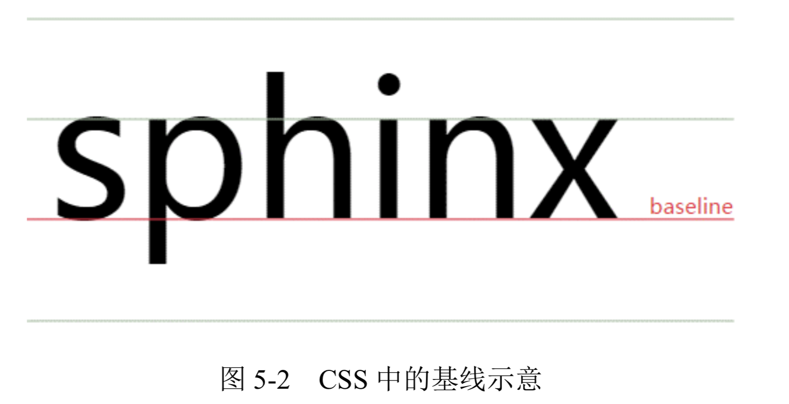

- [字母 X -- CSS 世界中隐匿的举足轻重的角色](#%E5%AD%97%E6%AF%8D-x----css-%E4%B8%96%E7%95%8C%E4%B8%AD%E9%9A%90%E5%8C%BF%E7%9A%84%E4%B8%BE%E8%B6%B3%E8%BD%BB%E9%87%8D%E7%9A%84%E8%A7%92%E8%89%B2)
  - [字母 x 与 CSS 世界的基线](#%E5%AD%97%E6%AF%8D-x-%E4%B8%8E-css-%E4%B8%96%E7%95%8C%E7%9A%84%E5%9F%BA%E7%BA%BF)
  - [字母 x 与 CSS 中的 x-height](#%E5%AD%97%E6%AF%8D-x-%E4%B8%8E-css-%E4%B8%AD%E7%9A%84-x-height)
  - [字母x与CSS中的ex](#%E5%AD%97%E6%AF%8Dx%E4%B8%8Ecss%E4%B8%AD%E7%9A%84ex)

# 字母 X -- CSS 世界中隐匿的举足轻重的角色
我们这里的字母 x 就是 26 个英文字母中的 x。由于自身形态的一些特殊性，这个小小的不起眼的字母担当大任，在 CSS 世界中扮演了一个重要的角色。

可能有人的第一反应是:“我知道，可以模拟关闭按钮的那个叉叉效果!”

这位朋友思维很活跃，但是，我们这里说的并不是字母 x 在 CSS 世界中的奇技淫巧，而是正统的术语上的紧密联系。

## 字母 x 与 CSS 世界的基线
**在各种内联相关模型中，凡是涉及垂直方向的排版或者对齐的，都离不开最基本的基线 (baseline)。例如，line-height 行高的定义就是两基线的间距，vertical-align 的默认值就是基线，其它中线顶线一类的定义也离不开基线，基线甚至衍生出了很多其它基线概念** (如图 5-1 所示)。

那大家知道基线又是如何定义的吗?基线的定义就离不开本文的主角 x。

字母 x 的下边缘(线)就是我们的基线。

对，是字母 x，不是 s 之类下面有尾巴的字母，参见如图 5-2 所示的标示。

## 字母 x 与 CSS 中的 x-height
字母 x 与 CSS 的故事远不止基线这么简单。CSS 中有一个概念叫作 x-height，指的是字母x的高度。

有人可能会有疑问了:“一个字母的高度跟 CSS 布局排版有什么关系啊?”实际上关系可大了。

**首先需要了解一下 x-height 的含义。通俗地讲，x-height 指的就是小写字母 x 的高度，术语描述就是基线和等分线(mean line)(也称作中线，midline)之间的距离。**

+ ascender height: 上下线高度。
+ cap height: 大写字母高度。
+ median: 中线。
+ descender height: 下行线高度。

**CSS 中有些属性值的定义就和这个 x-height 有关，最典型的代表就是 vertical-align:middle。这里的 middle 是中间的意思。注意，跟上面的 median(中线)不是一个 意思。在CSS世界中，middle指的是基线往上1/2 x-height高度。我们可以近似理解为字母 x 交叉点那个位置。**

**由此可见，vertical-align:middle 并不是绝对的垂直居中对齐，我们平常看到的 middle 效果只是一种近似效果。原因很简单，因为不同的字体在行内盒子中的位置是不一样的，比如，“微软雅黑”就是一个字符下沉比较明显的字体，所有字符的位置都比其他字体要偏下一点儿。也就是说，“微软雅黑”字体的字母 x 的交叉点是在容器中分线的下面一点。此时，我们就不难理解为什么 vertical-align:middle 不是相对容器中分线对齐的了，因为在毕竟 CSS 世界中文字内容是主体，所以，对于内联元素垂直居中应该是对文字，而非居外部的块级容器所言。**

## 字母x与CSS中的ex
字母 x 衍生出了 x-height 概念，并在这个基础上深耕细作，进一步衍生出了 ex。注意， 这里的 ex 是 CSS 中地地道道的一个尺寸单位。

大家可能都听过和用过 em、px 和 rem，但对连 IE6 都老早支持的 ex 单位却很陌生。

ex 是 CSS 中的一个相对单位，指的是小写字母 x 的高度，没错，就是指 x-height。

那这个单位有什么实际用途呢?存在必有价值!用得少，并不表示其没有作用，只是因为我们并没有好好地理解它、挖掘它。我们细细思考字母 x 在 CSS 世界中扮演的角色，就会发现 ex 的价值所在。

注意，虽然说 em、px 这类单位的主要作用是限定元素的尺寸，但是，由于字母 x 受字体等 CSS 属性影响大，不稳定，因此 ex 不太适合用来限定元素的尺寸。那问题来了:ex 连自己的本职工作都做不好，难道还指望其副业开挂?

没错，ex 的价值就在其副业上—不受字体和字号影响的内联元素的垂直居中对齐效果。

我们都知道，内联元素默认是基线对齐的，而基线就是 x 的底部，而 1ex 就是一个 x 的高度。设想一下，假如图标高度就是 1ex，同时背景图片居中，岂不是图标和文字天然垂直居中，而且完全不受字体和字号的影响?因为 ex 就是一个相对于字体和字号的单位。

👉 [example](https://demo.cssworld.cn/5/1-1.php)