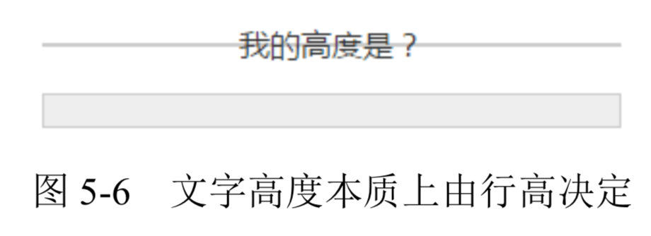
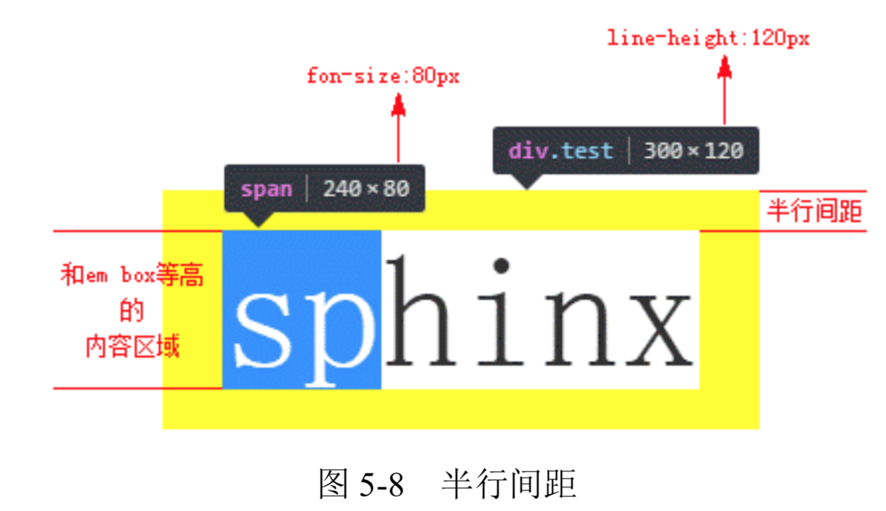
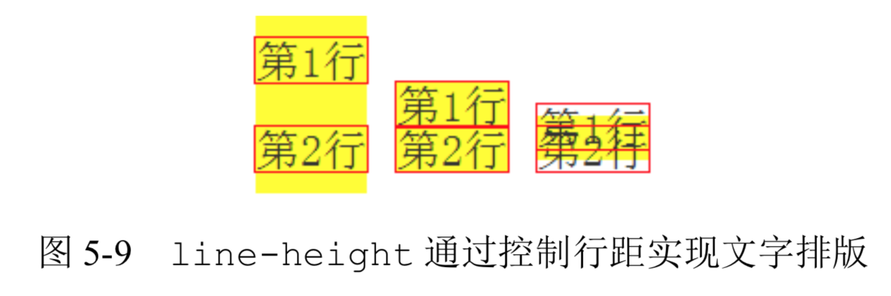
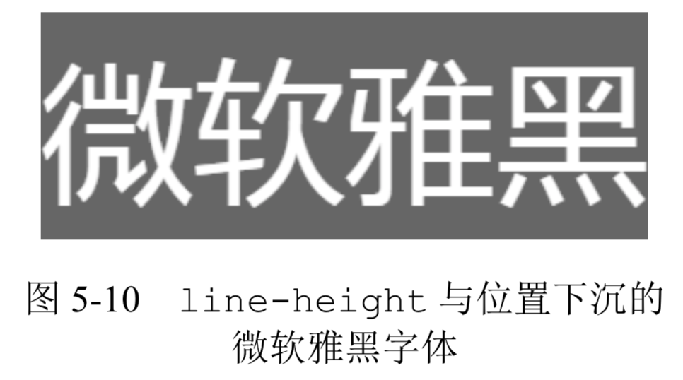
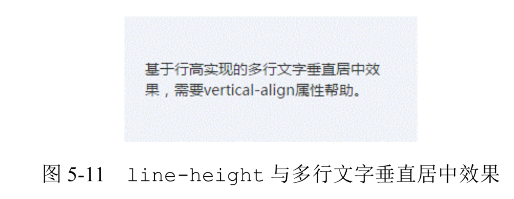
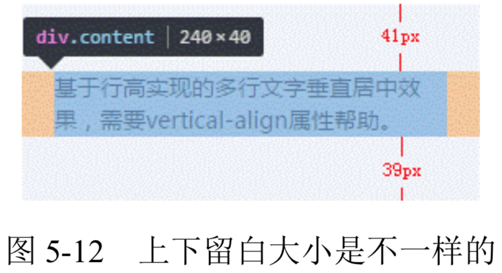
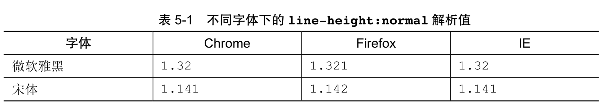
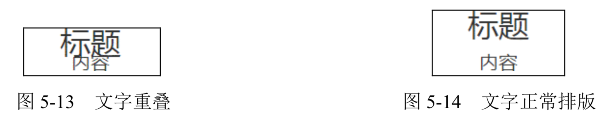
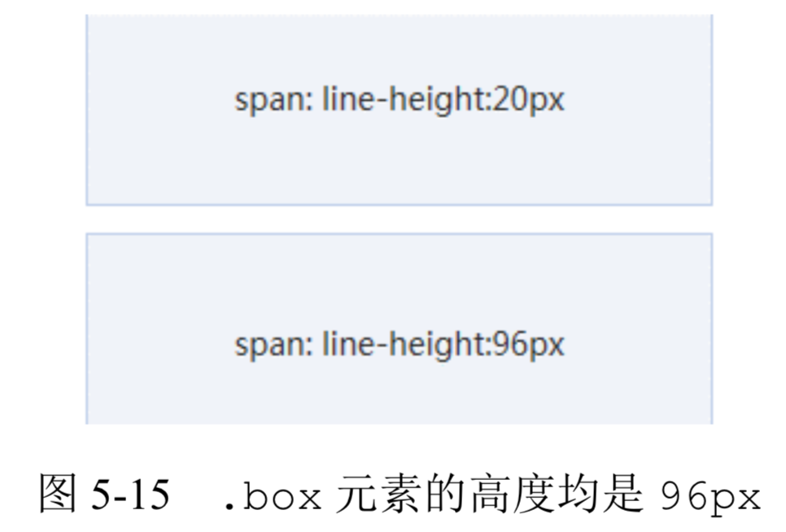
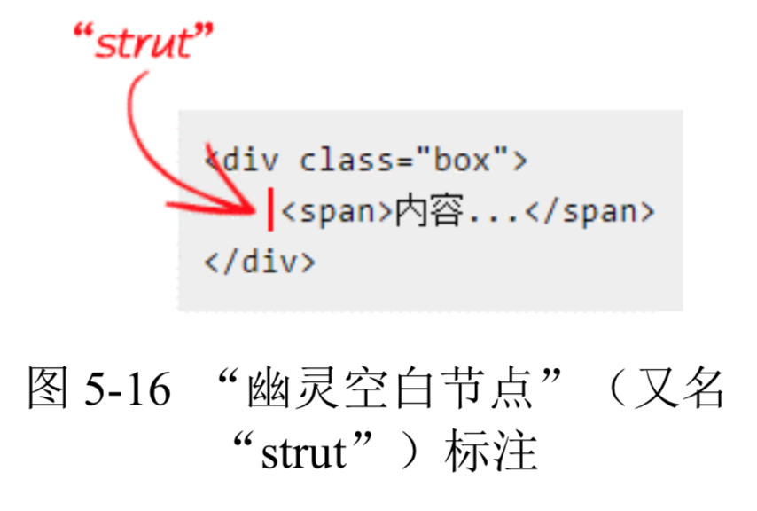

- [内联元素的基石 line-height](#%E5%86%85%E8%81%94%E5%85%83%E7%B4%A0%E7%9A%84%E5%9F%BA%E7%9F%B3-line-height)
  - [内联元素的高度之本— line-height](#%E5%86%85%E8%81%94%E5%85%83%E7%B4%A0%E7%9A%84%E9%AB%98%E5%BA%A6%E4%B9%8B%E6%9C%AC-line-height)
  - [为什么 line-height 可以让内联元素“垂直居中”](#%E4%B8%BA%E4%BB%80%E4%B9%88-line-height-%E5%8F%AF%E4%BB%A5%E8%AE%A9%E5%86%85%E8%81%94%E5%85%83%E7%B4%A0%E5%9E%82%E7%9B%B4%E5%B1%85%E4%B8%AD)
  - [深入 line-height 的各类属性值](#%E6%B7%B1%E5%85%A5-line-height-%E7%9A%84%E5%90%84%E7%B1%BB%E5%B1%9E%E6%80%A7%E5%80%BC)
  - [内联元素 line-height 的“大值特性”](#%E5%86%85%E8%81%94%E5%85%83%E7%B4%A0-line-height-%E7%9A%84%E5%A4%A7%E5%80%BC%E7%89%B9%E6%80%A7)

# 内联元素的基石 line-height
本节中 line-height 的内容会涉及很多内联盒模型的知识，因此，务必先要掌握 3.4.2 节关于内联盒模型的知识。另外，下文中所有的“行高”指的就是 line-height。

## 内联元素的高度之本— line-height
先思考下面这个问题:默认空div高度是 0，但是一旦里面写上几个文字，div高度就有了，请问这个高度由何而来，或者说是由哪个 CSS 属性决定的?

**如果仅仅通过表象来确认，估计不少人会认为div高度是由里面的文字撑开的，也就是 font-size 决定的，但本质上是由 line-height 属性全权决定的，尽管某些场景确实与 font-size 大小有关。**

我们不妨设计一个简单的例子来看看真相究竟是什么。例如:

```html
<div class="test1">我的高度是?</div>
<style>
.test1 {
    font-size: 16px;
    line-height: 0;
    border: 1px solid #ccc;
    background: #eee;
}
</style>

/* 和 */

<div class="test2">我的高度是?</div>
<style>
.test1 {
  font-size: 0;
  line-height: 16px;
  border: 1px solid #ccc;
  background: #eee;
}
</style>
```

这两段代码的区别在于一个 line-height 行高为 0，一个 font-size 字号为 0。结果，第一段代码，最后元素的高度只剩下边框那么丁点儿，而后面一段代码，虽然文字小到都看不见了，但是 16px 的内部高度依然坚挺，如图 5-6 所示。



**很显然，从上面这个例子可以看出，div高度是由行高决定的，而非文字。**

👉 [example](https://demo.cssworld.cn/5/2-1.php)

**`下面要说一些很有意思的结论，对于非替换元素的纯内联元素，其可视高度完全由 line-height 决定。注意这里的措辞—“完全”，什么padding、border 属性对可视高度是没有任何影响的，这也是我们平常口中的“盒模型”约定俗成说的是块级元素的原因。`**

**因此，对于文本这样的纯内联元素，line-height 就是高度计算的基石，用专业说法就是指定了用来计算行框盒子高度的基础高度。比方说，line-height 设为16px，则一行文字高度是 16px，两行就是 32px，三行就是 48px，所有浏览器渲染解析都是 这个值，1 像素都不差。**

那如果是替换元素，又或者是块级元素，line-height 在其中又扮演什么角色呢?

在回答这个问题之前，我们最好先把 line-height 作用于内联元素的细节给搞明白。

通常，line-height 的高度作用细节都是使用“行距”和“半行距”来解释的。那么什么是“行距”，什么又是“半行距”呢?

首先大家需要明确这一点:字体设计以及文字排版是门很深入的学问，英文和中文又有很多不同之处，但是，我们平常构建页面无须如此事无巨细的知识。因此，这里只简单介绍部分知识，方便大家理解某些行为和特性，更多内容会在第 8 章中披露。

**我个人是这么认为的:内联元素的高度由固定高度和不固定高度组成，这个不固定的部分就是这里的“行距”。换句话说，line-height 之所以起作用，就是通过改变“行距”来 实现的。**

中国古代四大发明之一的活字印刷术使用的是雕刻好的胶泥字模，大家可以回忆一下北京奥运会开幕式上活字印刷术表演中那些凸起的方块，它使用的字体是宋体，注意，是宋体。然而，如果这些方块都是密密麻麻无缝隙铺在一起，印出来的文字就是方方正正的一团，那么我们会无法一眼看出应该横着读还是竖着念。要知道古人的排版是竖排的，但我们去看古人的印刷作品却不会错误地横着看，为什么呢?因为印出来的文字垂直方向确实一个接着一个，但是，水平方向，列与列之间却有着明显的间隙，这个间隙其实就是“行距”。

**所以，“行距”的作用是可以瞬间明确我们的阅读方向，让我们阅读文字更轻松。在 CSS 世界中，“行距”其实也是类似的东西，但还是有些差别的。以水平阅读流举例，传统印刷的“行距” 是上下两行文字之间预留的间隙，是个独立的区域，也就意味着第一行文字的上方是没有“行距”的;但是在 CSS 中，“行距”分散在当前文字的上方和下方，也就是即使是第一行文字，其上方也是有“行距”的，只不过这个“行距”的高度仅仅是完整“行距”高度的一半，因此，也被称为“半行距”。**

人总是先入为主，尤其是前端人员，排版知识的获取基本上都是从 CSS 实际工作中来，就会很自然地认为“间距就是应该上下等分啊”，实际上太天真了，且先不说传统印刷的“行距” 在中间，著名的排版软件 Adobe InDesign 的“行距”就是加在文字上方的，所以没有什么理所当然。

**现在知道了 CSS 的“半行距”，那么哪里到哪里才是“半行距”的高度范围呢?一般业界的共识是:行距 = 行高− em-box。`转换成 CSS 语言就是:行距 = line-height - font-size`。 其中 em-box 是 CSS 世界中比较虚的一个概念，说“虚”并不是胡编乱造的意思，而是我们无法有效感知这个盒子具体的位置在哪里，但是有一点可以明确，就是其高度正好就是 1em。em 是一个相对 font-size 大小的 CSS 单位，因此 1em 等用于当前一个 font-size 大小，这就是“行距 = line-height - font-size”这个公式的由来。有了“行距”，我们一分为二，就有了“半行距”，分别加在 em-box 上面和下面就构成了文字的完整高度了。话虽这么讲，但 一旦不弄清楚 em-box 究竟在什么位置，我们就无法在脑中形成关于行高的具象认知，知识很容易遗忘。**

人很容易被肉眼所见的东西迷惑，因此，很多人会把文字图形区域看成是 em-box 范围，实际上这是不正确的，比方说，一些带尾巴的英文字符 q 或者 g，其小尾巴是在 em-box 范围之外的，而对于汉字，很多字体图形高度实际上要小于 em-box 高度的。

**此时，就轮到内容区域(content area)出马了。在本书中，内容区域可以近似理解为 Firefox/IE 浏览器下文本选中带背景色的区域。这么理解的重要原因之一就是可见，这对于我们深入理解内联元素知识非常有帮助。**

**大多数场景下，内容区域和 em-box 是不一样的，内容区域高度受 font-family 和 font-size 双重影响，而 em-box 仅受 font-size 影响，通常内容区域高度要更高一些。除了下面这种情况，也就是“当我们的字体是宋体的时候，内容区域和 em-box 是等同的”，因为宋体是一种正统的印刷字体，方方正正，所以千万不要小看宋体。**

于是，利用我们平常不待见的宋体，就能准确揪出“半行距”的藏身之所了，测试代码如下:

```html
<style>
 .test {
    font-family: simsun;
    font-size: 24px;
    line-height: 36px;
    background-color: yellow;
}
.test > span {
    background-color: white;
}
</style>

<div class="test">
    <span>sphinx</span>
</div>
```

此时，平常虚无的 em-box 借助内容区域(图 5-8 中字符 sp 的选中区域)暴露出了庐山真面目，“半行距”也准确显现出来了，如图 5-8 右侧标注。



👉 [example](https://demo.cssworld.cn/5/2-2.php)

学习基础理论知识的好处之一就是可以更准确地进行技术实践，比方说这里，我们知道“半行距”的位置和范围，就可以更准确地帮助我们还原设计。

**可能是由于 CSS 开发人员不够专注细致，外加规范设计本身的原因，设计师往往会对各个元素间的距离间隙标注得很清晰。但是，设计师并不是开发人员，他们并没有把网页中无处不在行间距考虑在内，所有与文字相关的间距都是从文字的上边缘和下边缘开始标注的。除非我们全局行高设置为 line-height:1，否则这些标注的距离和我们使用的 margin 间距都是不一致的。**

**但是，如果我们理解了半行距，结合我们网页中的设置的 line-height 大小，就能根据标注获取准确的间距值。举个例子，`假设 line-height 是 1.5，font-size 大小是 14px，那么我们的半行距大小就是(套用上面的行距公式再除以2):(14px * 1.5 - 14px) / 2 = 14px * 0.25 = 3.5px。border以及line-height等传统CSS属性并没有小数像素的概念(从 CSS3 动画的细腻程度可以看出)，因此，这里的 3.5px 需要取整处理，如果标注的是文字上边距，则向下取整;如果是文字下边距，则向上取整，因为绝大多数的字体在内容区域中都是偏下的。`所以，假设设计师标注了文字字形上边缘到图片下边缘间距20px，则我们实际的 margin-top 值应该是 17px，因为 3.5px 向下取整是 3px。**

**下面回到最初的问题，line-height 如何通过改变行距实现文字排版?当 line-height 设为 2 的时候，半行距是一半的文字大小，两行文字中间的间隙差不多一个文字尺寸大小;如果 line-height 大小是 1 倍文字大小，则根据计算，半行距是 0，也就是两行文字会紧密依偎在一起;如果 line-height 值是 0.5，则此时的行距就是负值，虽然 line-height 不支持负值，但是行距可以为负值，此时，两行文字就是重叠纠缠在一起。** 具体表现如图 5-9 所示。



说完了内联元素，下面轮到替换元素和块级元素了。

**关于替换元素的高度与 line-height 的关系首先需要弄明白这个问题:line-height 可以影响替换元素(如图片的高度)吗?答案是，不可以!**

可能有人会反驳了，不会呀，你看下面这个例子:

```html
<style>
.box {
    line-height: 256px;
}
</style>
<div class="box">
    
</div>
```

div元素中，就一张图片，其他什么都没有，但此时.box 元素高度却是 256px，难道不是 line-height 把图片占据的高度变高了吗?

**不是的，不是 line-height 把图片占据高度变高了，而是把“幽灵空白节点”的高度变高了。图片为内联元素，会构成一个“行框盒子”，而在 HTML5 文档模式下，每一个“行框盒子”的前面都有一个宽度为 0 的“幽灵空白节点”，其内联特性表现和普通字符一模一样，所以，这里的容器高度会等于 line-height 设置的属性值 256px。**

实际开发的时候，图文和文字混在一起是很常见的，那这种内联替换元素和内联非替换元素在一起时的高度表现又是怎样的呢?

**由于同属内联元素，因此，会共同形成一个“行框盒子”，line-height 在这个混合元素的“行框盒子”中扮演的角色是决定这个行盒的最小高度，听上去似乎有点儿尴尬，对于纯文本元素，line-height 非常威风，直接决定了最终的高度。但是，如果同时有替换元素，则 line-height 的表现一下子弱了很多，只能决定最小高度，对最终的高度表现有望尘莫及之感。为什么会这样呢? 一是替换元素的高度不受line-height影响，二是vertical-align 属性在背后作祟。**

对于这种混合替换元素的场景，line-height 要想一统江山，需要值足够大才行。但是，实际开发的时候，我们给 line-height 设置的值总是很中规中矩，于是，就会出现类似下面 的场景:明明文字设置了line-height 为 20px，但是，如果文字后面有小图标，最后“行 框盒子”高度却是 21px 或是 22px。这种现象背后最大的黑手其实是 vertical-align 属性，我们会在下一章好好深入剖析为什么会有这样的表现。

**对于块级元素，line-height 对其本身是没有任何作用的，我们平时改变 line-height，块级元素的高度跟着变化实际上是通过改变块级元素里面内联级别元素占据的高度实现的。**

比方说，一个p元素中有 10 行图文内容，则这个p元素的高度就是由这 10 行内容产生的 10 个“行框盒子”高度累加而成;一个article元素中可能会有 20 个p元素，则这个article元素又是由这 20 个块级p元素高度累加而成，同时块级元素还可以通过 height 和 min-height 以及盒模型中的 margin、padding 和 border 等属性改变占据的高度，所有这一切就构成了 CSS 世界完整的高度体系。

**因为 line-height 几乎无处不在的继承特性，并且 CSS 世界是为了更好地图文展示，所以line-height 不仅是内联元素高度的基石，而且还是整个 CSS 世界高度体系的基石。**

## 为什么 line-height 可以让内联元素“垂直居中”
坊间流传着这么一种说法:“要想让单行文字垂直居中，只要设置 line-height 大小和height 高度一样就可以了。”类似下面这样的代码:

```css
.title {
   height: 24px;
   line-height: 24px;
}
```

从效果上看，似乎验证了这种说法的正确性。但是，实际上，上面的说法对 CSS 初学者会产生两个严重的误导，同时，语句本身也存在不严谨的地方!

**误区之一:要让单行文字垂直居中，只需要 line-height 这一个属性就可以，与 height 一点儿关系都没有。** 也就是说，我们直接:

```css
.title {
    line-height: 24px;
}
```

就可以了。坊间传闻的说法会误导大小一定要同时设置 height 属性才可以。

**误区二:行高控制文字垂直居中，不仅适用于单行，多行也是可以的。准确的说法应该是 “line-height 可以让单行或多行元素近似垂直居中”。稍等，这里有个词似乎和上面的表述有点儿微妙的差异，“近似垂直居中”?没错，一定要加上“近似”二字，这样的说法才足够严谨。换句话说，我们通过 line-height 设置的垂直居中，并不是真正意义上的垂直居中!究竟是怎么一回事?**

这里，其实要解答的是两个问题，一个是为何可以“垂直居中”，另一个是为何是“近似”。

**正如上一节所说的，没有什么理所当然，行高可以实现“垂直居中”原因在于 CSS 中“行距的上下等分机制”，如果行距的添加规则是在文字的上方或者下方，则行高是无法让文字垂直居中的。**

说“近似”是因为文字字形的垂直中线位置普遍要比真正的“行框盒子”的垂直中线位置低，譬如我们拿现在用得比较多的微软雅黑字体举例:

```html
<style>
p{
    font-size: 80px;
    line-height: 120px; 
    background-color: #666; 
    font-family: 'microsoft yahei'; 
    color: #fff;
}
</style>
<p>微软雅黑</p>
```

结果，我都不需要标注，肉眼就能看出字形明显偏下，如图 5-10 所示。



**由于我们平时使用的 font-size 都比较小，12px~16px 很多，因此，虽然微软雅黑字体有下沉，但也就 1 像素的样子，所以我们往往觉察不到这种“垂直对齐”其实并不是真正意义上的垂直居中，只是感官上看上去像是垂直居中罢了。这也是我总是称line-height实现的单行文本垂直居中为“近似垂直居中”的原因。**

下面再来说说行高实现多行文本或者图片等替换元素的垂直居中效果实现。

**多行文本或者替换元素的垂直居中实现原理和单行文本就不一样了，需要 line-height 属性的好朋友 vertical-align 属性帮助才可以，** 示例代码如下:

```html
<style>
box {
    line-height: 120px;
    background-color: #f0f3f9;
}
.content {
    display: inline-block;
    line-height: 20px;
    margin: 0 20px;
    vertical-align: middle;
}
</style>
<div class="box">
    <div class="content">基于行高实现的...</div> 
</div>
```

👉 [example](https://demo.cssworld.cn/5/2-4.php)



实现的原理大致如下。
+ **多行文字使用一个标签包裹，然后设置 display 为 inline-block。好处在于既能重置外部的 line-height 为正常的大小，又能保持内联元素特性，从而可以设置vertical-align 属性，以及产生一个非常关键的“行框盒子”。我们需要的其实并不是这个 “行框盒子”，而是每个“行框盒子”都会附带的一个产物—“幽灵空白节点”，即一个宽度为 0、表现如同普通字符的看不见的“节点”。有了这个“幽灵空白节点”，我们的 line- height:120px 就有了作用的对象，从而相当于在.content 元素前面撑起了一个高度为120px 的宽度为 0 的内联元素。**
+ **因为内联元素默认都是基线对齐的，所以我们通过对.content 元素设置 vertical- align:middle 来调整多行文本的垂直位置，从而实现我们想要的“垂直居中”效果。如果是要借助 line-height 实现图片垂直居中效果，也是类似的原理和做法。**

**细心的读者可能发现，上面我解释原理的时候，“垂直居中”这 4 个字加了引号，莫非，这里的“垂直居中”又是“近似”?**

**你还真说对了，这里实现的“垂直居中”确实也不是真正意义上的垂直居中，也是“近似 垂直居中”。还是上面的多行文本垂直居中的例子，如果我们捕获到多行文本元素的尺寸空间，截个图，然后通过尺子工具一量就会发现，上面的留空是41px，下面的留空是 39px，对啦，原来不是完全的垂直居中，如图 5-12 所示。**



**不垂直居中与 line-height 无关，而是 vertical-align 导致的，** 具体原因我们将在 5.3 节讲解。

## 深入 line-height 的各类属性值
**line-height 的默认值是 normal，还支持数值、百分比值以及长度值。**

**首先了解一下这个看上去一般实际上不一般的 normal。为什么说 line-height 的默认值 normal 不一般呢?因为，本质上，这个 normal 实际上是一个变量。我想，很多人脑中的想法应该是这样的:normal 应该对应一个具体的行高值，按照经验差不多 1 倍多一 点儿的样子，具体值多少需要测试一下才知道。实际上非也!normal 实际上是一个和 font-family 有着密切关联的变量值。什么意思呢?比方说，一个div元素，有两段对比 CSS 如下:**

```css
div {
    line-height: normal;
    font-family: 'microsoft yahei';
}
div {
    line-height: normal;
    font-family: simsun;
}
```

此时两段 CSS 中 line-height 的属性值 normal 的计算值是不一样的，表 5-1 给出的是我在
几个桌面浏览器的测试数据。



**可以看到，只要字体确定，各个浏览器下的默认 line-height 解析值基本上都是一样的。然而，关键问题是，不同的浏览器所使用的默认中英文字体并不是一样的，并且不同操作系统的默认字体也不一样，换句话说，就是不同系统不同浏览器的默认 line-height 都是有差异的。因此，在实际开发的时候，对 line-height 的默认值进行重置是势在必行的。下面问题来了，line-height 应该重置为多大的值呢?是使用数值、百分比值还是长度值呢?**

要回答这个问题，我们需要先对这几种属性值有一定的了解才行。
+ **数值，如 line-height:1.5，其最终的计算值是和当前 font-size 相乘后的值。例如，假设我们此时的 font-size 大小为 14px，则 line-height 计算值是1.5*14px=21px。**
+ **百分比值，如 line-height:150%，其最终的计算值是和当前 font-size 相乘后的值。例如，假设我们此时的 font-size 大小为 14px，则 line-height 计算值是150% * 14px=21px。**
+ **长度值，也就是带单位的值，如 line-height:21px 或者 line-height:1.5em等，此处 em 是一个相对于 font-size 的相对单位，因此，line-height:1.5em 最终的计算值也是和当前 font-size 相乘后的值。例如，假设我们此时的 font-size 大小为 14px，则 line-height 计算值是 1.5*14px=21px。**

**乍一看，似乎 line-height:1.5、line-height:150%和line-height:1.5em 这3种用法是一模一样的 ，最终的行高大小都是和font-size计算值，但是，实际上，line-height:1.5和另外两个有一点儿不同，那就是继承细节有所差别。如果使用数值作为 line-height 的属性值，那么所有的子元素继承的都是这个值;但是，如果使用百分比值或者长度值作为属性值，那么所有的子元素继承的是最终的计算值。什么意思呢?比方说下面 3 段 CSS 代码:**

```css
body {
    font-size: 14px;
    line-height: 1.5;
}
body {
    font-size: 14px;
    line-height: 150%;
}
body {
    font-size: 14px;
    line-height: 1.5em;
}
```

对于body元素而言，上面 3 段 CSS 最终的行高计算值是 21px 是没有任何区别的，但是，如果同时还有子元素，例如:

```html
<style>
h3, p { margin: 0; }
h3 { font-size: 32px; }
p { font-size: 20px; }
</style>

<h3>标题</h3>
<p>内容</p>
```

结果 line-height:150%和 line-height:1.5em 的最终表现是“标题”文字和“内容”文字重叠在了一起，如图 5-13 所示。

俗话讲“没有对比就没有伤害”，我们来看看 line-height:1.5 的最终表现，排版令人舒畅，如图 5-14 所示。



👉 [example](https://demo.cssworld.cn/5/2-5.php)

**line-height:150%和 line-height:1.5em 代码下的文字重叠的 原因在于h3和p元素继承的并不是150%或者 1.5em，而是body元素的 line-height 计算值 21px，也就是说，h3和p元素的行高都是21px，考虑到h3的 font-size 大小为 32px，此时h3的半行间距就是-5.5px，因而“标题”文字和下面的“内容”文字发生重叠。**

**但是 line-height:1.5 的继承则不同，h3和p元素的 line-height 继承的不是计算值，而是属性值 1.5，因此，对于h3元素，此时的行高计算值是 1.5 * 32px=48px，p元素的行高计算值是 1.5 * 20px=30px，于是，间距合理，排版舒适。**

**实际上，line-height:150%、line-height:1.5em 要想有类似 line-height:1.5 的继承效果，也是可以实现的，类似下面的 CSS 代码:**

```css
* {
    line-height: 150%;
}
```

**就是使用通配符*匹配所有的元素。有人可能会疑问:既然 line-height 数值可以让元素天然继承相对计算特性，那这里的通配符岂不完全没必要?**

**其实非也，两者还是有差别的。HTML 中的很多替换元素，尤其表单类的替换元素，如输入框、按钮之类的，很多具有继承特性的 CSS 属性其自己也有一套，如 font-family、font-size 以及这里的 line-height。由于继承是属于最弱的权重，因此 body 中设置的 line-height 是无法影响到这些替换元素的，但是 * 作为一个选择器，就不一样了，会直接重置这些替换元素默认的 line-height，这其实是我们需要的，因此从道义上讲，使用 * 通配也是合理的。但又考虑到 * 的性能以及明明有继承却不好好利用的羞耻感，我们可以折中使用下面的方法:**

```css
body {
    line-height: 1.5;
}
input, button {
    line-height: inherit;
}
```

说这么多其实还是为了解决一开始的问题:line-height 应该重置为多大的值呢?是使用数值、百分比值还是长度值呢?

**下面是我的答案:如果我们做的是一个重图文内容展示的网页或者网站，如博客、论坛、公众号之类的，那一定要使用数值作为单位，考虑到文章阅读的舒适度，line-height 值可以设置在 1.6~1.8。如果是一个偏重布局结构精致的网站，则在我看来使用长度值或者数值都是可以的，因为，第一，我们的目的是为了兼容;第二，无论使用哪种类型值，都存在需要局部重置的场景。不过，根据我的统计，基本上各大站点都是使用数值作为全局的 line-height 值。不过，这并不表示使用数值就一定是最好的，如果网站内容的样式不是动态不可控的，有时候，固定的长度值反而更利于精确布局。因此，不要盲目跟风。那具体设置的值应该是多大呢?**

**如果使用的是长度值，我建议直接 line-height:20px，排版时候计算很方便。如果随大流使用的是数值，我建议最好使用方便计算的行高值，一种是 line-height 属性值本身方便计算，另一种是 line-height 的默认计算值方便计算。比方说，1.3、1.4、1.5 都有大型网站使用，我们就不妨使用 1.5，因为心算 1.4 * 16px 要比 1.5 * 16px 难多了，这就是第一种“属性值本身方便计算”;而另外一种“默认计算值方便计算”是我们先得到方便计算的 line-height 计算值，然后倒推 line-height 应该使用的数值是多大，例如 20px 是一个非常方便的计算值，如果body默认重置的 font-size 是 14px，则 line-height 数值应该 是 20px/14px≈1.4285714285714286 四舍五入的结果，于是得到:**

```css
body {
    line-height: 1.42857;
    font-size: 14px;
}
```

**不好意思，给大家下套子了。注意，在 CSS 中，计算行高的时候，行高值一定不要向下舍入，而要向上舍入。上面虽然 14*1.42857 计算机近乎是 20px，但在 Chrome 浏览器下，依然以 19px 的高度呈现，如果我们向上舍入取 1.42858，则最终所有浏览器行高计算值是 20px，代码示意如下:**

```css
body {
    line-height: 1.42858;
    font-size: 14px;
}
```

## 内联元素 line-height 的“大值特性”
理解了下面这个案例，就真正理解了内联元素 line-height。因此，放在最后算是对line-height的总结和知识测验吧。此例子 HTML 都是一样的:

```html
<div class="box">
    <span>内容...</span>
</div>
```

CSS 代码有所不同，分别为

```css
.box {
    line-height: 96px;
}
.box span {
    line-height: 20px;
}
/* 和 */
.box {
    line-height: 20px;
}
.box span {
    line-height: 96px;
}
```

也就是一个子元素行高是 20px，一个是 96px，假如文字就 1 行，.box 元素的高度分别是多少?

**按照我们以前考试做选择题的套路，非 A 即 B:按照经验，子元素行高覆盖父元素，应该 高度等于span元素的高度，分别是 20px、96px;但由于基本功不够扎实，并不确定内联元素是否支持 line-height，如果不支持，那应该跟着.box 元素的行高走，高度应该是 96px、20px。总之，肯定就这两个答案之间!**

**好，如果大家也有和上面类似的想法，那么建议还要再细细读一读前面的内容。正确的答案是:全都是 96px 高!**

👉 [example](https://demo.cssworld.cn/5/2-6.php)



**也就是说:无论内联元素 line-height 如何设置，最终父级元素的高度都是由数值大的那个 line-height 决定的，我称之为“内联元素 line-height 的大值特性”。**

可能很多人会有疑问:为什么会这样?逻辑上讲不通啊?

**首先，要明确一点:内联元素是支持 line-height 的span元素上的 line-height也确实覆盖了.box 元素，但是，在内联盒模型中，存在一些你看不到的东西，没错，就是多次提到的“幽灵空白节点”。**

**正好再次(也是最后一次)温习一下“内联盒模型”的知识。这里的span是一个内联元素，因此自身是一个“内联盒子”，本例就这一个“内联盒子”，只要有“内联盒子”在，就一定会有“行框盒子”，就是每一行内联元素外面包裹的一层看不见的盒子。然后，重点来了，在每个“行框盒子”前面有一个宽度为 0 的具有该元素的字体和行高属性的看不见的“幽灵空白节点”，如果套用本案，则这个“幽灵空白节点”就在span元素的前方，** 如图 5-16 所示。



于是，就效果而言，我们的 HTML 实际上等同于:

```html
<div class="box"> 
    字符<span>内容...</span>
</div>
```

**这下就好理解了，当.box 元素设置 line-height:96px 时，“字符”高度 96px;当设置line-height:20px 时，span元素的高度则变成了 96px，而行框盒子的高度是由高度最高的那个“内联盒子”决定的，这就是.box 元素高度永远都是最大的那个 line-height 的原因。**

**知道了原因也就能够对症下药，要避免“幽灵空白节点”的干扰，例如，设置span元素 display:inline-block，创建一个独立的“行框盒子”，这样span元素设置的 line-height:20px 就可以生效了，这也是多行文字垂直居中示例中这么设置的原因。**