# line-height 的好朋友 vertical-align
终于轮到 line-height 的好朋友 vertical-align 上场了，为什么说它们是好朋友呢?因为凡是 line-height 起作用的地方 vertical-align 也一定起作用，只是很多时候，vertical-align 默默地在背后起作用，你没有感觉到而已。

很多人都有这样一个错误的认知，认为对于单行文本，只要行高设置多少，其占据高度就是多少。比方说，对于下面非常简单的 CSS 和 HTML 代码:

```html
<style>
.box { line-height: 32px; }
.box > span { font-size: 24px; }
</style>
<div class="box">
    <span>文字</span>
</div>
```

.box 元素的高度是多少?

很多人一定认为是 32px:因为没有设置 height 等属性，高度就由 line-height 决定，与 font-size 无关，所以这里明摆着最终高度就是 32px。

但是事实上，高度并不是 32px，而是要大那么几像素(受不同字体影响，增加高度也不一样)，比方说 36px，如图 5-17 所示。

👉 [example](https://demo.cssworld.cn/5/3-1.php)

这里，之所以最终.box 元素的高度并不等于 line-height，就是因为行高的朋友属性 vertical-align 在背后默默地下了黑手。vertical-align 知识点比 line-height 要多，我们现在就来一点一点地揭开 vertical-align 属性的层层面纱。

## vertical-align 家族基本认识
抛开 inherit 这类全局属性值不谈，我把 vertical-align 属性值分为以下 4 类:
+ **线类，如 baseline(默认值)、top、middle、bottom;**
+ **文本类，如 text-top、text-bottom;**
+ **上标下标类，如 sub、super;**
+ **数值百分比类，如 20px、2em、20%等。**

**实际上，“数值百分比类”应该是两类，分别是“数值类”和“百分比类”，这里之所以把它们合在一起归为一类，是因为它们有不少共性，包括“都带数字”和“行为表现一致”。**

**“都带数字”略带戏谑之意，没什么好说的。“行为表现一致”表示具有相同的渲染规则，具体为:根据计算值的不同，相对于基线往上或往下偏移，到底是往上还是往下取决于 vertical- align 的计算值是正值还是负值，如果是负值，往下偏移，如果是正值，往上偏移。**

为了更好地演示 vertical-align 数值类属性值的表现

👉 [example](https://demo.cssworld.cn/5/3-2.php)

**由于 vertical-align 的默认值是 baseline，即基线对齐，而基线的定义是字母 x 的下边缘。因此，内联元素默认都是沿着字母 x 的下边缘对齐的。对于图片等替换元素，往往使用元素本身的下边缘作为基线，因此，进入上面的演示页面，看到的是图 5-18 所示的图文排列 效果。**


**由于是相对字母 x 的下边缘对齐，而中文和部分英文字形的下边缘要低于字母 x 的下边缘，因此，会给人感觉文字是明显偏下的，一般都会进行调整。比方说，我们给文字内容设置 vertical- align:10px，则文字内容就会在当前基线位置再往上精确偏移 10px，效果如图 5-19 所示。**

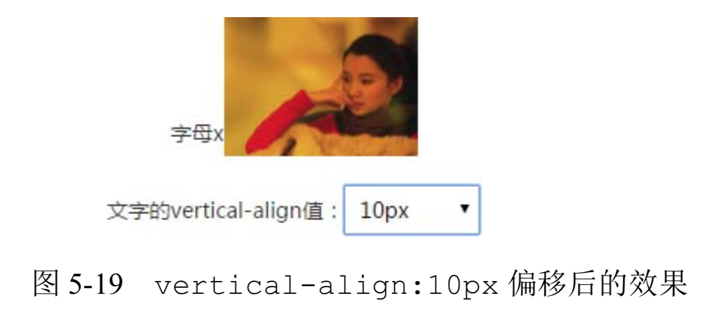

演示页面还提供了很多其他可供选择的 vertical-align 值，经过一番试验读者就会发现，正如上面所说，负值全部都是往下偏移，正值全部都是往上偏移，而且数值大小全部都是相对于基线位置计算的，因此，从这一点来看，vertical-align:baseline 等同于 vertical-align:0。

说到这里，我就忍不住多说两句。很多即使工作很多年的前端开发人员，也可能不知道 vertical-align 的属性值支持数值，更不知道支持负值，这着实让我很意外。如果实用性差那还好理解，关键是 vertical-align 的数值属性值在实际开发的时候实用性非常强。

**一是其兼容性非常好。在之前，vertical-align 属性的兼容性被开发人员诟病已久，因为需要兼容 IE6 和 IE7 浏览器，而这些浏览器的 vertical-align 关键字属性值(如 middle、text-top 等)的渲染规则和其他浏览器大相径庭，很多人不知道 vertical-align 还可以使用数值作为属性值，结果 CSS hack 满天飞。实际上，vertical-align 有一些属性值的渲染一直都很兼容，一个是默认的基线对齐，另一个就是相对于基线的“数值百分比类” 属性值偏移定位。也就是说，如果我们使用类似 vertical-align:10px 这样的定位，是不会有任何兼容性问题的，也不需要写 CSS hack。**

**二是其可以精确控制内联元素的垂直对齐位置。vertical-align 属性的规范和统一从 IE8 浏览器开始，由于我们现在都不需要兼容 IE8 以前的浏览器，middle、text-top 等关键字属性值可以畅快使用，但是这些关键字有一个严重的不足，就是垂直对齐位置是固定的，往往最后并不是我们想要的像素级精确对齐效果，此时，还是需要借助“数值百分比类”属性值才可以。**

我们不妨看一个简单的小图标对齐的例子。

假设有一个 display 值为 inline-block 的尺寸为 20 像素×20 像素的小图标，默认状态下，文字是明显偏下的，类似图 5-20 中“请选择”三个字和后面三角图形的位置关系。

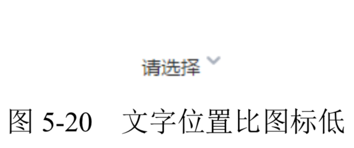

**这里，我们需要的是垂直居中对齐效果，所以很多人都使用具有强烈语义的 vertical-align:middle 控制图标的垂直位置，然而，由于 middle 并不是真正意义上的垂直居中，因此还是会有像素级别的误差，误差大小与字体和字号均有关。例如，在本例中，图标往下多偏移了 1 像素而导致容器的可视高度变成了 21 像素，如图 5-21 所示。**

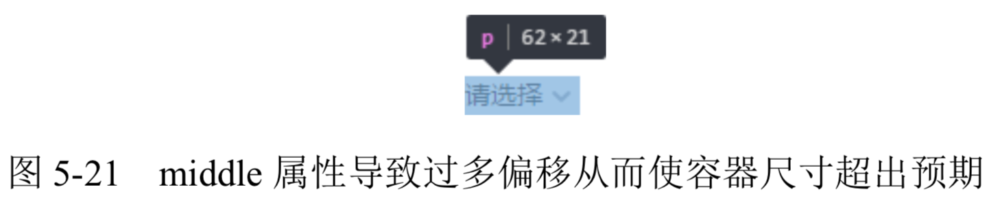

**但是，如果我们使用精确的数值，则一切尽在掌控之中。例如，设置 vertical-align: -5px，此时，图标和文字实现了真正意义上的垂直居中，此时容器的可视高度和当前行高 20 像素保持了一致，如图 5-22 所示。**

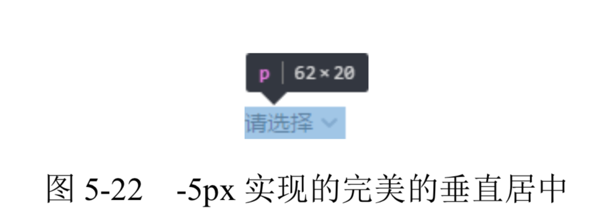

👉 [example](https://demo.cssworld.cn/5/3-3.php)

说完“数值类”和“百分比类”属性值的行为表现，下面再简单说说平时使用并不多的“百 分比类”属性值。

**在 CSS 世界中，凡是百分比值，均是需要一个相对计算的值，例如，margin 和 padding 是相对于宽度计算的，line-height 是相对于 font-size 计算的，而这里的 vertical- align 属性的百分比值则是相对于 line-height 的计算值计算的。可见，CSS 世界中的各类属性相互间有着紧密联系而非孤立的个体。**

**假设某元素的 line-height 是 20px，那么此时 vertical-align:-25%相当于设置 vertical-align:-5px。按照之前学到的知识，会发现百分比值无论什么时候都很实用，因此会给人感觉 vertical-align 的百分比属性值也会非常实用，但是事实上，平时开发中很少使用。原因在于，在如今的网页布局中，line-height 的计算值都是相对固定并且已知的，因此，直接使用具体的数值反而更方便。比方说上面小图标对齐的例子，我们肯定会直接 vertical-align:-5px，而不会使用 vertical-align:-25%，因为后者还要重新计算，并且很多时候是除不尽的，除了装门面以外，我是想不到还有其他使用的理由了。**

这就是为什么“百分比类”属性值“简单说说”的原因了。

## vertical-align 作用的前提
很多人，尤其 CSS 新手，会问这么一个问题:“为什么我设置了 vertical-align 却没任何作用?”

> 因为 vertical-align 起作用是有前提条件的，这个前提条件就是:只能应用于内联元素以及 display 值为 table-cell 的元素。

**换句话说，vertical-align 属性只能作用在 display 计算值为 inline、inline-block，inline-table 或 table-cell 的元素上。因此，默认情况下，span、strong、em等内联元素，img、button、input等替换元素，非 HTML 规范的自定义标签元素，以及td单元格，都是支持vertical-align 属性的，其他块级元素则不支持。**

**当然，现实世界是没有这么简单的。CSS 世界中，有一些 CSS 属性值会在背后默默地改变元素 display 属性的计算值，从而导致 vertical-align 不起作用。比方说，浮动和绝对定位会让元素块状化，因此，下面的代码组合 vertical-align 是没有理由出现的:**

```css
.example {
  float: left;
  vertical-align: middle; /* 没有作用 */
}
.example {
    position: absolute;
    vertical-align: middle; /* 没有作用 */
}
```

等等，我好像听到有人说:“不是 vertical-align 没有作用，而是下面这种情况。”

```html
<style>
.box {
   height: 128px;
}
.box > img {
    height: 96px;
    vertical-align: middle;
}
</style>
<div class="box">
    
</div>
```

此时图片顶着.box 元素的上边缘显示，根本没垂直居中，完全没起作用!

**这种情况看上去是 vertical-align:middle 没起作用，实际上，vertical-align 是在努力地渲染的，只是行框盒子前面的“幽灵空白节点”高度太小，如果我们通过设置一个足够大的行高让“幽灵空白节点”高度足够，就会看到 vertical-align:middle 起作用了**，CSS 代码如下:

```css
.box {
    height: 128px;
    line-height: 128px; /*关键CSS属性*/
}
.box > img {
    height: 96px;
    vertical-align: middle;
}
```

等等，我又听到有人说:“为什么 display:table-cell 却可以无视行高?”

**告诉你，那是因为对 table-cell 元素而言，vertical-align 起作用的是 table-cell 元素自身**。不妨看下面一段代码:

```html
<style>
.cell {
    height: 128px;
    display: table-cell;
}
.cell > img {
    height: 96px;
    vertical-align: middle;
}
</style>
<div class="cell">
    
</div>
```

结果图片并没有要垂直居中的迹象，还是紧贴着父元素的上边缘，如图 5-23 所示。

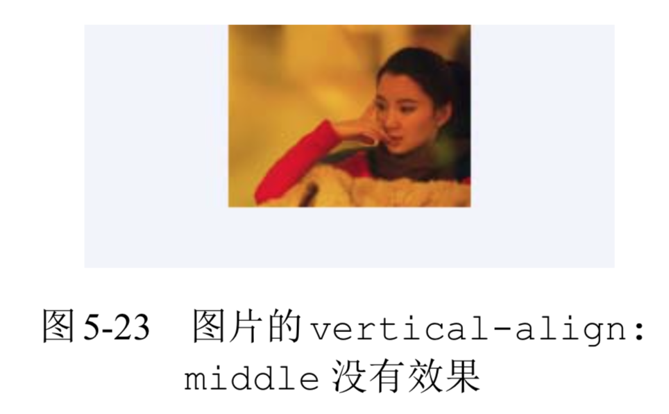

**但是，如果 vertical-align:middle 是设置在 table-cell 元素上**，CSS 代码如下:

```css
.cell {
    height: 128px;
    display: table-cell;
    vertical-align: middle;
}
.cell > img {
    height: 96px;
}
```

那么图片就有了明显的变化，如图 5-24 所示。

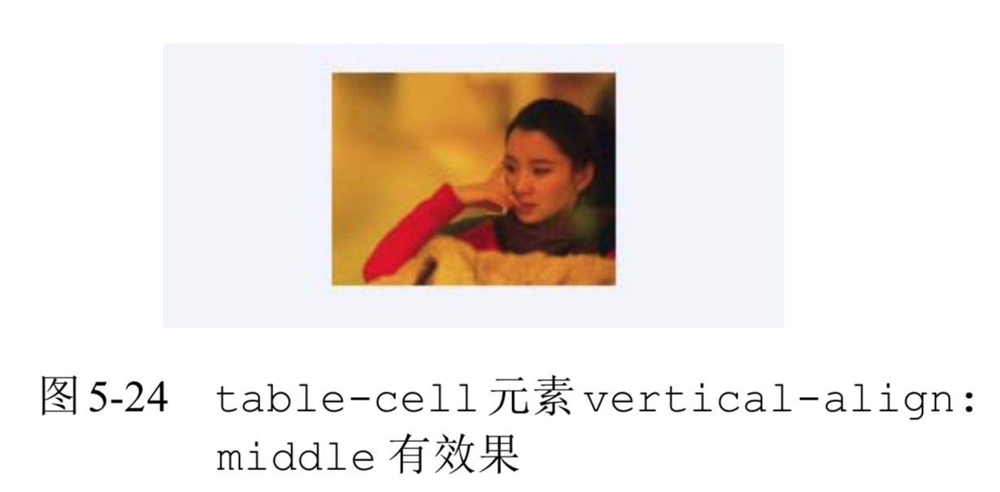

**所以，大家一定要明确，虽然就效果而言，table-cell 元素设置 vertical-align 垂直对齐的是子元素，但是其作用的并不是子元素，而是 table-cell 元素自身。就算 table-cell 元素的子元素是一个块级元素，也一样可以让其有各种垂直对齐表现。**

👉 [example](https://demo.cssworld.cn/5/3-4.php)

## vertical-align 和 line-height 之间的关系
vertical-align 和 line-height 之间的关系很明确，即“朋友”关系。

**最明显的就是 vertical-align 的百分比值是相对于 line-height 计算的，但表面所见的这点关系实际是只是冰山一角，实际是只要出现内联元素，这对好朋友一定会同时出现。**

还记不记得一开始容器高度不等于行高的[例子](https://demo.cssworld.cn/5/3-1.php)? 这就是这对好朋友搞的鬼。这里要为大家深入讲解一下为什么会出现这样的现象。首先，我们仔细看一下相关的代码:

```html
<style>
.box { line-height: 32px; }
.box > span { font-size: 24px; }
</style>
<div class="box">
    <span>文字</span>
</div>
```

**其中有一个很关键的点，那就是 24px 的 font-size 大小是设置在span元素上的，这就导致了外部div元素的字体大小和span元素有较大出入。**

大家一定还记得图 5-16。这里也是类似的，span标签前面实际上有一个看不见的类似字符的“幽灵空白节点”。看不见的东西不利于理解，因此我们不妨使用一个看得见的字符 x 占位，同时“文字”后面也添加一个 x，便于看出基线位置，于是就有如下 HTML:

```html
<div class="box"> 
    x<span>文字 x</span>
</div>
```

**此时，我们可以明显看到两处大小完全不同的文字。一处是字母 x 构成了一个“匿名内联 盒子”，另一处是“文字 x”所在的span元素，构成了一个“内联盒子”。由于都受 line-height:32px 影响，因此，这两个“内联盒子”的高度都是 32px。下面关键的来了，对字符而言，font-size 越大字符的基线位置越往下，因为文字默认全部都是基线对齐，所以当字号大小不一样的两个文字在一起的时候，彼此就会发生上下位移，如果位移距离足够大，就会超过行高的限制，而导致出现意料之外的高度，如图 5-25 所示。**

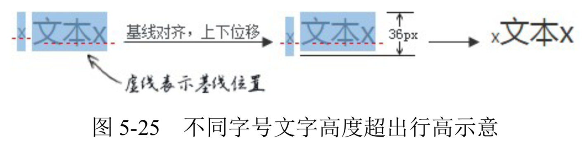

**图 5-25 非常直观地说明了为何最后容器的高度会是 36px，而非 line-height 设置的 32px。**

**知道了问题发生的原因，那问题就很好解决了。我们可以让“幽灵空白节点”和后面span元素字号一样大，也就是:**

```css
 .box {
    line-height: 32px;
    font-size: 24px;
}
.box > span { }
```

**或者改变垂直对齐方式，如顶部对齐，这样就不会有参差位移了:**

```css
.box { line-height: 32px; }
.box > span {
    font-size: 24px;
    vertical-align: top;
}
```

**搞清楚了大小字号文字的高度问题，对更为常见的图片底部留有间隙的问题的理解就容易多了。现象是这样的:任意一个块级元素，里面若有图片，则块级元素高度基本上都要比图片的高度高。例如:**

```html
<style>
 .box {
    width: 280px;
    outline: 1px solid #aaa;
    text-align: center;
}
.box > img {
    height: 96px;
}
</style>
<div class="box">
    
</div>
```

**结果.box 元素的高度可能就会像图 5-26 一样，底部平白无故多了 5 像素。**

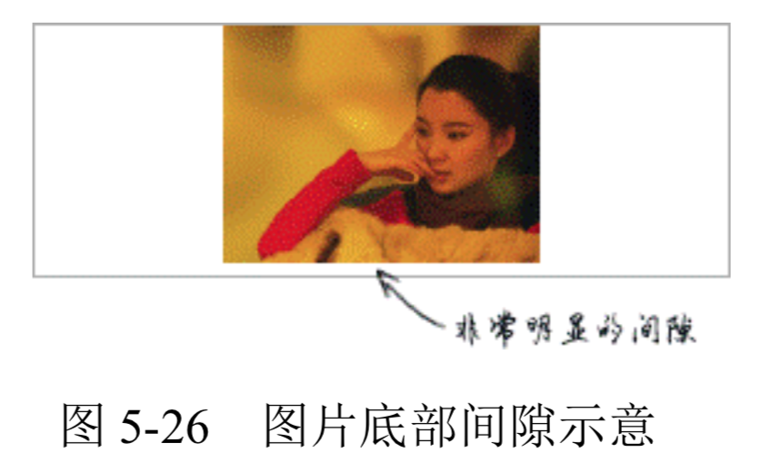

**间隙产生的三大元凶就是“幽灵空白节点”、line-height 和 vertical-align 属性。为了直观演示原理，我们可以在图片前面辅助一个字符 x 代替“幽灵空白节点”，并想办法通过背景色显示其行高范围，于是，大家就会看到如图 5-27 所示的现象。**


**当前 line-height 计算值是 20px，而 font-size 只有 14px，因此，字母 x 往下一定有至少 3px 的半行间距(具体大小与字体有关)，而图片作为替换元素其基线是自身的下边缘。根据定义，默认和基线(也就是这里字母 x 的下边缘)对齐，字母 x 往下的行高产生的多余的间隙就嫁祸到图片下面，让人以为是图片产生的间隙，实际上，是“幽灵空白节点”、line-height 和 vertical-align 属性共同作用的结果。**

知道了原理，要清除该间隙，就知道如何对症下药了。方法很多，具体如下。
+ **图片块状化。可以一口气干掉“幽灵空白节点”、line-height 和 vertical-align。**
+ **容器 line-height 足够小。只要半行间距小到字母 x 的下边缘位置或者再往上，自然就没有了撑开底部间隙高度空间了。比方说，容器设置 line-height:0。**
+ **容器 font-size 足够小。此方法要想生效，需要容器的 line-height 属性值和当前 font-size 相关，如 line-height:1.5 或者 line-height:150%之类;否则只会让下面的间隙变得更大，因为基线位置因字符 x 变小而往上升了。**
+ **图片设置其他 vertical-align 属性值。间隙的产生原因之一就 是基线对齐，所以我们设置 vertical-align 的值为 top、middle、bottom 中的任意一个都是可以的。**


在 4.3.5 节最后提到了一个“内联特性导致的 margin 无效”的案例，代码如下:

```html
<div class="box">
    
</div>
<style>
.box > img {
    height: 96px;
    margin-top: -200px;
}
</style>
```

**此时，按照理解，-200px 远远超过图片的高度，图片应该完全跑到容器的外面，但是，图片依然有部分在.box 元素中，而且就算 margin-top 设置成-99999px，图片也不会继续往上移动，完全失效。其原理和上面图片底部留有间隙实际上是一样的，图片的前面有个“幽 灵空白节点”，而在 CSS 世界中，非主动触发位移的内联元素是不可能跑到计算容器外面的，导致图片的位置被“幽灵空白节点”的 vertical-align:baseline 给限死了。我们不妨把看不见的“幽灵空白节点”使用字符 x 代替，原因就一目了然了，如图 5-28 所示。**

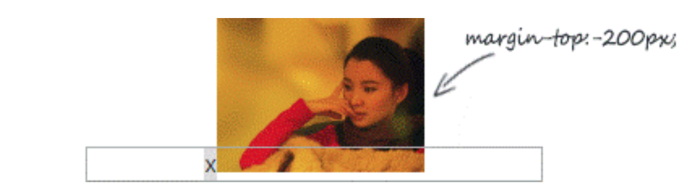

**因为字符 x 下边缘和图片下边缘对齐，字符 x 非主动定位，不可能跑到容器外面，所以图片就被限死在此问题，margin-top失效。**

最后，我们再看一个更为复杂的示例。text-align:jusitfy 声明可以帮助我们实现兼容的列表两端对齐效果，但是 text-align:jusitfy 两端对齐需要内容超过一行，同时为了让任意个数的列表最后一行也是左对齐排列，我们需要在列表最后辅助和列表宽度一样的空标签元素来占位，类似下面 HTML 代码的i标签:

```html
<style>
.box {
    text-align: justify;
}
.justify-fix {
    display: inline-block;
    width: 96px;
}
</style>
<div class="box">
    
    
    
    
    <i class="justify-fix"></i>
    <i class="justify-fix"></i>
    <i class="justify-fix"></i>
</div>
```

空的 inline-block 元素的高度是 0，按照通常的理解，下面应该是一马平川，结果却有非常大的空隙存在，如图 5-29 所示。

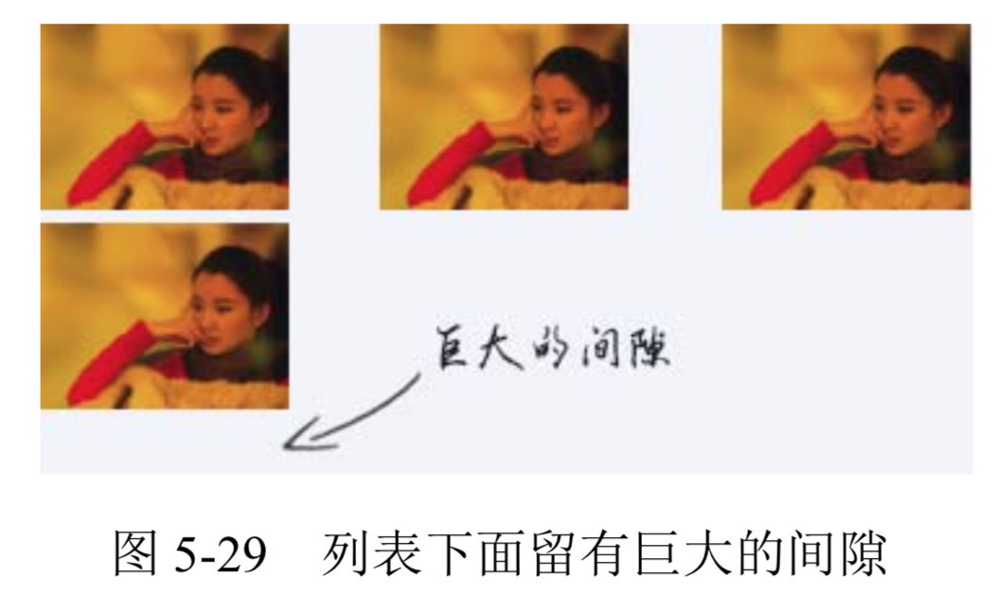

为了便于大家看个究竟，我把占位i元素的 outline 属性用虚外框标示一下，此时效 果如图 5-30 所示。

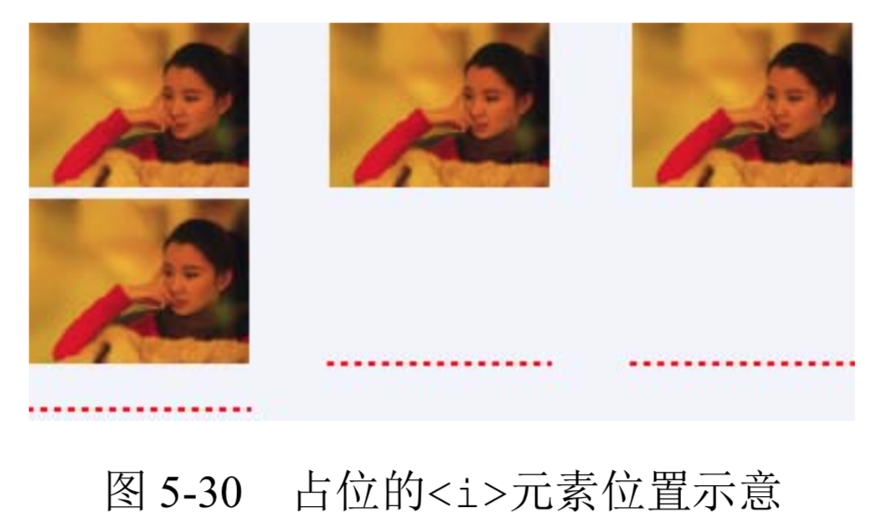

结果发现，上面巨大的空隙是由占位i元素上面和下面的间隙共同组成的。

于是，问题来了:上面的间隙是如何产生的?下面的间隙是如何产生的?如果去除这些间隙呢?

**很多时候，复杂问题是由简单问题组合而成的。实际上，这里的间隙现象和上面的图片间隙现象本质一样，都是 vertical-align 和 line-height 共同作用的结果。**

**按照之前解决问题的方法，我们可以直接给.box 元素来个 line-height:0 解决垂直间隙问题，结果，这样设置之后的效果却如图 5-31 所示。图片和图片之间的间隙是没有了，但是图片和最后的占位元素之间依然有几像素的间距，真有些让人抓狂了。这究竟是为什么?**

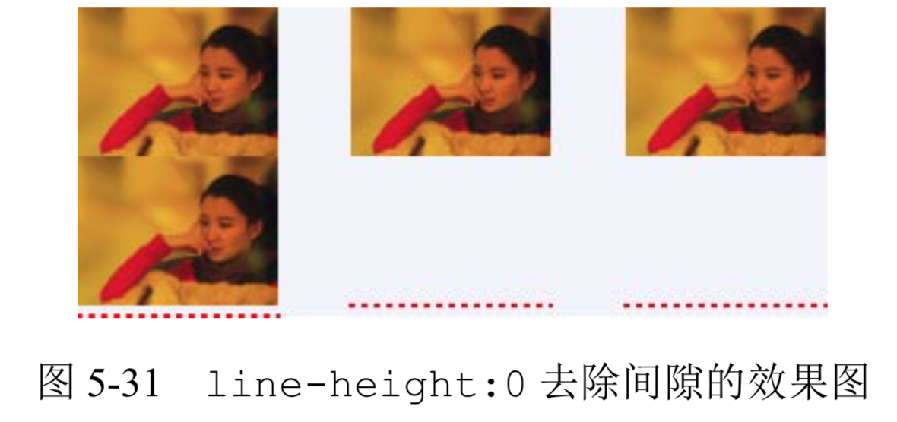

简单现象的背后往往有大的学问，要明白其原因，就需要说到 inline-block 元素和基线baseline 之间的一些纠缠的关系。

## 深入理解 vertical-align 线性类属性值

### inline-block 与 baseline