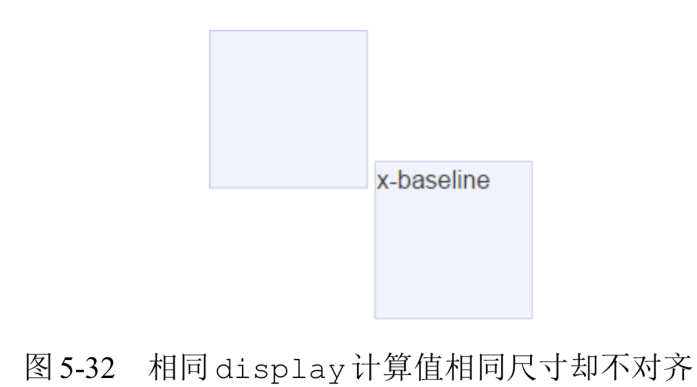
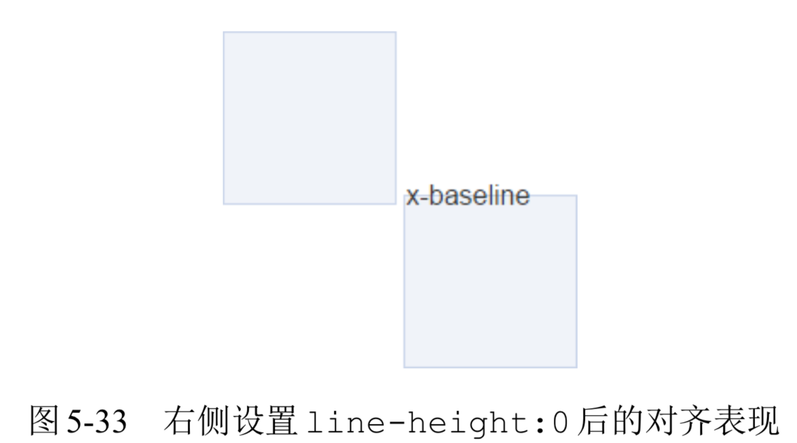
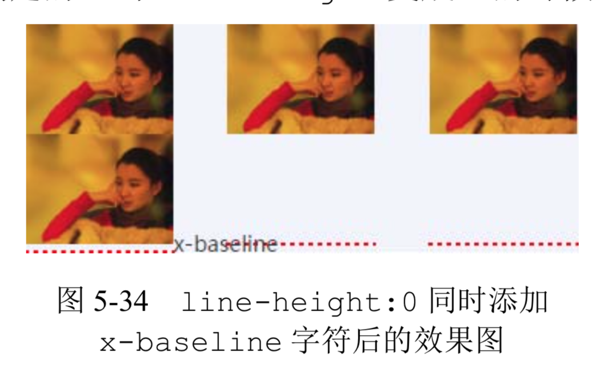
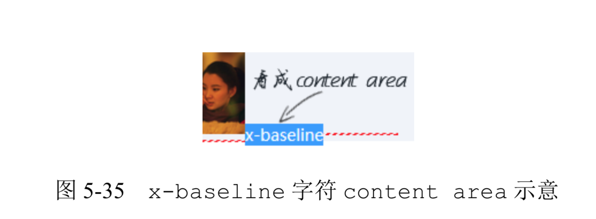
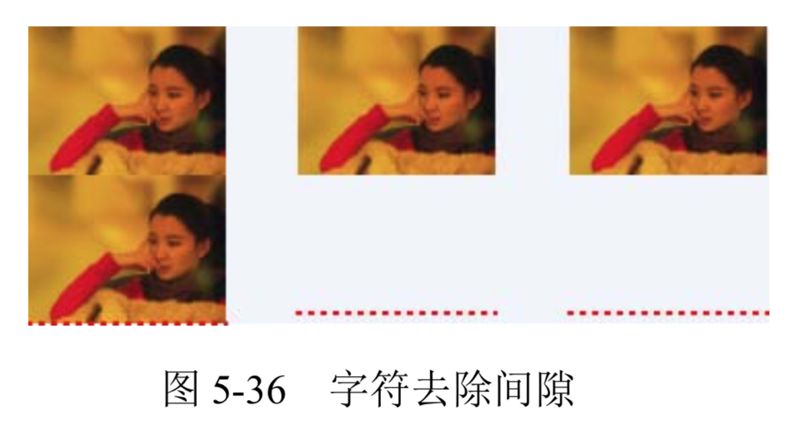
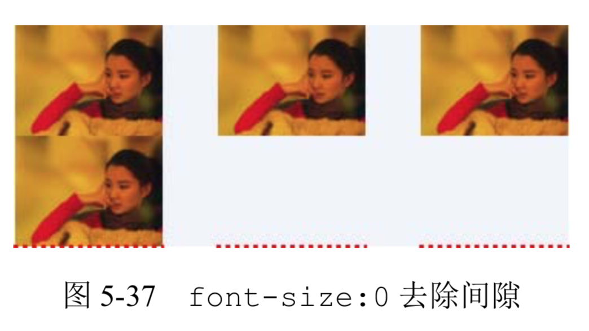

- [line-height 的好朋友 vertical-align](#line-height-%E7%9A%84%E5%A5%BD%E6%9C%8B%E5%8F%8B-vertical-align)
  - [vertical-align 家族基本认识](#vertical-align-%E5%AE%B6%E6%97%8F%E5%9F%BA%E6%9C%AC%E8%AE%A4%E8%AF%86)
  - [vertical-align 作用的前提](#vertical-align-%E4%BD%9C%E7%94%A8%E7%9A%84%E5%89%8D%E6%8F%90)
  - [vertical-align 和 line-height 之间的关系](#vertical-align-%E5%92%8C-line-height-%E4%B9%8B%E9%97%B4%E7%9A%84%E5%85%B3%E7%B3%BB)
  - [深入理解 vertical-align 线性类属性值](#%E6%B7%B1%E5%85%A5%E7%90%86%E8%A7%A3-vertical-align-%E7%BA%BF%E6%80%A7%E7%B1%BB%E5%B1%9E%E6%80%A7%E5%80%BC)
    - [inline-block 与 baseline](#inline-block-%E4%B8%8E-baseline)
    - [了解 vertial-align:top/bottom](#%E4%BA%86%E8%A7%A3-vertial-aligntopbottom)
    - [vertial-align:middle 与近似垂直居中](#vertial-alignmiddle-%E4%B8%8E%E8%BF%91%E4%BC%BC%E5%9E%82%E7%9B%B4%E5%B1%85%E4%B8%AD)
  - [深入理解 vertical-align 文本类属性值](#%E6%B7%B1%E5%85%A5%E7%90%86%E8%A7%A3-vertical-align-%E6%96%87%E6%9C%AC%E7%B1%BB%E5%B1%9E%E6%80%A7%E5%80%BC)
  - [简单了解 vertical-align 上标下标类属性值](#%E7%AE%80%E5%8D%95%E4%BA%86%E8%A7%A3-vertical-align-%E4%B8%8A%E6%A0%87%E4%B8%8B%E6%A0%87%E7%B1%BB%E5%B1%9E%E6%80%A7%E5%80%BC)
  - [无处不在的 vertical-align](#%E6%97%A0%E5%A4%84%E4%B8%8D%E5%9C%A8%E7%9A%84-vertical-align)
  - [基于 vertical-align 属性的水平垂直居中弹框](#%E5%9F%BA%E4%BA%8E-vertical-align-%E5%B1%9E%E6%80%A7%E7%9A%84%E6%B0%B4%E5%B9%B3%E5%9E%82%E7%9B%B4%E5%B1%85%E4%B8%AD%E5%BC%B9%E6%A1%86)

# line-height 的好朋友 vertical-align
终于轮到 line-height 的好朋友 vertical-align 上场了，为什么说它们是好朋友呢?因为凡是 line-height 起作用的地方 vertical-align 也一定起作用，只是很多时候，vertical-align 默默地在背后起作用，你没有感觉到而已。

很多人都有这样一个错误的认知，认为对于单行文本，只要行高设置多少，其占据高度就是多少。比方说，对于下面非常简单的 CSS 和 HTML 代码:

```html
<style>
.box { line-height: 32px; }
.box > span { font-size: 24px; }
</style>
<div class="box">
    <span>文字</span>
</div>
```

.box 元素的高度是多少?

很多人一定认为是 32px:因为没有设置 height 等属性，高度就由 line-height 决定，与 font-size 无关，所以这里明摆着最终高度就是 32px。

但是事实上，高度并不是 32px，而是要大那么几像素(受不同字体影响，增加高度也不一样)，比方说 36px，如图 5-17 所示。

👉 [example](https://demo.cssworld.cn/5/3-1.php)

这里，之所以最终.box 元素的高度并不等于 line-height，就是因为行高的朋友属性 vertical-align 在背后默默地下了黑手。vertical-align 知识点比 line-height 要多，我们现在就来一点一点地揭开 vertical-align 属性的层层面纱。

## vertical-align 家族基本认识
抛开 inherit 这类全局属性值不谈，我把 vertical-align 属性值分为以下 4 类:
+ **线类，如 baseline(默认值)、top、middle、bottom;**
+ **文本类，如 text-top、text-bottom;**
+ **上标下标类，如 sub、super;**
+ **数值百分比类，如 20px、2em、20%等。**

**实际上，“数值百分比类”应该是两类，分别是“数值类”和“百分比类”，这里之所以把它们合在一起归为一类，是因为它们有不少共性，包括“都带数字”和“行为表现一致”。**

**“都带数字”略带戏谑之意，没什么好说的。“行为表现一致”表示具有相同的渲染规则，具体为:根据计算值的不同，相对于基线往上或往下偏移，到底是往上还是往下取决于 vertical- align 的计算值是正值还是负值，如果是负值，往下偏移，如果是正值，往上偏移。**

为了更好地演示 vertical-align 数值类属性值的表现

👉 [example](https://demo.cssworld.cn/5/3-2.php)

**由于 vertical-align 的默认值是 baseline，即基线对齐，而基线的定义是字母 x 的下边缘。因此，内联元素默认都是沿着字母 x 的下边缘对齐的。对于图片等替换元素，往往使用元素本身的下边缘作为基线，因此，进入上面的演示页面，看到的是图 5-18 所示的图文排列 效果。**


**由于是相对字母 x 的下边缘对齐，而中文和部分英文字形的下边缘要低于字母 x 的下边缘，因此，会给人感觉文字是明显偏下的，一般都会进行调整。比方说，我们给文字内容设置 vertical- align:10px，则文字内容就会在当前基线位置再往上精确偏移 10px，效果如图 5-19 所示。**


演示页面还提供了很多其他可供选择的 vertical-align 值，经过一番试验读者就会发现，正如上面所说，负值全部都是往下偏移，正值全部都是往上偏移，而且数值大小全部都是相对于基线位置计算的，因此，从这一点来看，vertical-align:baseline 等同于 vertical-align:0。

说到这里，我就忍不住多说两句。很多即使工作很多年的前端开发人员，也可能不知道 vertical-align 的属性值支持数值，更不知道支持负值，这着实让我很意外。如果实用性差那还好理解，关键是 vertical-align 的数值属性值在实际开发的时候实用性非常强。

**一是其兼容性非常好。在之前，vertical-align 属性的兼容性被开发人员诟病已久，因为需要兼容 IE6 和 IE7 浏览器，而这些浏览器的 vertical-align 关键字属性值(如 middle、text-top 等)的渲染规则和其他浏览器大相径庭，很多人不知道 vertical-align 还可以使用数值作为属性值，结果 CSS hack 满天飞。实际上，vertical-align 有一些属性值的渲染一直都很兼容，一个是默认的基线对齐，另一个就是相对于基线的“数值百分比类” 属性值偏移定位。也就是说，如果我们使用类似 vertical-align:10px 这样的定位，是不会有任何兼容性问题的，也不需要写 CSS hack。**

**二是其可以精确控制内联元素的垂直对齐位置。vertical-align 属性的规范和统一从 IE8 浏览器开始，由于我们现在都不需要兼容 IE8 以前的浏览器，middle、text-top 等关键字属性值可以畅快使用，但是这些关键字有一个严重的不足，就是垂直对齐位置是固定的，往往最后并不是我们想要的像素级精确对齐效果，此时，还是需要借助“数值百分比类”属性值才可以。**

我们不妨看一个简单的小图标对齐的例子。

假设有一个 display 值为 inline-block 的尺寸为 20 像素×20 像素的小图标，默认状态下，文字是明显偏下的，类似图 5-20 中“请选择”三个字和后面三角图形的位置关系。


**这里，我们需要的是垂直居中对齐效果，所以很多人都使用具有强烈语义的 vertical-align:middle 控制图标的垂直位置，然而，由于 middle 并不是真正意义上的垂直居中，因此还是会有像素级别的误差，误差大小与字体和字号均有关。例如，在本例中，图标往下多偏移了 1 像素而导致容器的可视高度变成了 21 像素，如图 5-21 所示。**


**但是，如果我们使用精确的数值，则一切尽在掌控之中。例如，设置 vertical-align: -5px，此时，图标和文字实现了真正意义上的垂直居中，此时容器的可视高度和当前行高 20 像素保持了一致，如图 5-22 所示。**


👉 [example](https://demo.cssworld.cn/5/3-3.php)

说完“数值类”和“百分比类”属性值的行为表现，下面再简单说说平时使用并不多的“百 分比类”属性值。

**在 CSS 世界中，凡是百分比值，均是需要一个相对计算的值，例如，margin 和 padding 是相对于宽度计算的，line-height 是相对于 font-size 计算的，而这里的 vertical- align 属性的百分比值则是相对于 line-height 的计算值计算的。可见，CSS 世界中的各类属性相互间有着紧密联系而非孤立的个体。**

**假设某元素的 line-height 是 20px，那么此时 vertical-align:-25%相当于设置 vertical-align:-5px。按照之前学到的知识，会发现百分比值无论什么时候都很实用，因此会给人感觉 vertical-align 的百分比属性值也会非常实用，但是事实上，平时开发中很少使用。原因在于，在如今的网页布局中，line-height 的计算值都是相对固定并且已知的，因此，直接使用具体的数值反而更方便。比方说上面小图标对齐的例子，我们肯定会直接 vertical-align:-5px，而不会使用 vertical-align:-25%，因为后者还要重新计算，并且很多时候是除不尽的，除了装门面以外，我是想不到还有其他使用的理由了。**

这就是为什么“百分比类”属性值“简单说说”的原因了。

## vertical-align 作用的前提
很多人，尤其 CSS 新手，会问这么一个问题:“为什么我设置了 vertical-align 却没任何作用?”

> 因为 vertical-align 起作用是有前提条件的，这个前提条件就是:只能应用于内联元素以及 display 值为 table-cell 的元素。

**换句话说，vertical-align 属性只能作用在 display 计算值为 inline、inline-block，inline-table 或 table-cell 的元素上。因此，默认情况下，span、strong、em等内联元素，img、button、input等替换元素，非 HTML 规范的自定义标签元素，以及td单元格，都是支持vertical-align 属性的，其他块级元素则不支持。**

**当然，现实世界是没有这么简单的。CSS 世界中，有一些 CSS 属性值会在背后默默地改变元素 display 属性的计算值，从而导致 vertical-align 不起作用。比方说，浮动和绝对定位会让元素块状化，因此，下面的代码组合 vertical-align 是没有理由出现的:**

```css
.example {
  float: left;
  vertical-align: middle; /* 没有作用 */
}
.example {
    position: absolute;
    vertical-align: middle; /* 没有作用 */
}
```

等等，我好像听到有人说:“不是 vertical-align 没有作用，而是下面这种情况。”

```html
<style>
.box {
   height: 128px;
}
.box > img {
    height: 96px;
    vertical-align: middle;
}
</style>
<div class="box">
    
</div>
```

此时图片顶着.box 元素的上边缘显示，根本没垂直居中，完全没起作用!

**这种情况看上去是 vertical-align:middle 没起作用，实际上，vertical-align 是在努力地渲染的，只是行框盒子前面的“幽灵空白节点”高度太小，如果我们通过设置一个足够大的行高让“幽灵空白节点”高度足够，就会看到 vertical-align:middle 起作用了**，CSS 代码如下:

```css
.box {
    height: 128px;
    line-height: 128px; /*关键CSS属性*/
}
.box > img {
    height: 96px;
    vertical-align: middle;
}
```

等等，我又听到有人说:“为什么 display:table-cell 却可以无视行高?”

**告诉你，那是因为对 table-cell 元素而言，vertical-align 起作用的是 table-cell 元素自身**。不妨看下面一段代码:

```html
<style>
.cell {
    height: 128px;
    display: table-cell;
}
.cell > img {
    height: 96px;
    vertical-align: middle;
}
</style>
<div class="cell">
    
</div>
```

结果图片并没有要垂直居中的迹象，还是紧贴着父元素的上边缘，如图 5-23 所示。


**但是，如果 vertical-align:middle 是设置在 table-cell 元素上**，CSS 代码如下:

```css
.cell {
    height: 128px;
    display: table-cell;
    vertical-align: middle;
}
.cell > img {
    height: 96px;
}
```

那么图片就有了明显的变化，如图 5-24 所示。


**所以，大家一定要明确，虽然就效果而言，table-cell 元素设置 vertical-align 垂直对齐的是子元素，但是其作用的并不是子元素，而是 table-cell 元素自身。就算 table-cell 元素的子元素是一个块级元素，也一样可以让其有各种垂直对齐表现。**

👉 [example](https://demo.cssworld.cn/5/3-4.php)

## vertical-align 和 line-height 之间的关系
vertical-align 和 line-height 之间的关系很明确，即“朋友”关系。

**最明显的就是 vertical-align 的百分比值是相对于 line-height 计算的，但表面所见的这点关系实际是只是冰山一角，实际是只要出现内联元素，这对好朋友一定会同时出现。**

还记不记得一开始容器高度不等于行高的[例子](https://demo.cssworld.cn/5/3-1.php)? 这就是这对好朋友搞的鬼。这里要为大家深入讲解一下为什么会出现这样的现象。首先，我们仔细看一下相关的代码:

```html
<style>
.box { line-height: 32px; }
.box > span { font-size: 24px; }
</style>
<div class="box">
    <span>文字</span>
</div>
```

**其中有一个很关键的点，那就是 24px 的 font-size 大小是设置在span元素上的，这就导致了外部div元素的字体大小和span元素有较大出入。**

大家一定还记得图 5-16。这里也是类似的，span标签前面实际上有一个看不见的类似字符的“幽灵空白节点”。看不见的东西不利于理解，因此我们不妨使用一个看得见的字符 x 占位，同时“文字”后面也添加一个 x，便于看出基线位置，于是就有如下 HTML:

```html
<div class="box"> 
    x<span>文字 x</span>
</div>
```

**此时，我们可以明显看到两处大小完全不同的文字。一处是字母 x 构成了一个“匿名内联 盒子”，另一处是“文字 x”所在的span元素，构成了一个“内联盒子”。由于都受 line-height:32px 影响，因此，这两个“内联盒子”的高度都是 32px。下面关键的来了，对字符而言，font-size 越大字符的基线位置越往下，因为文字默认全部都是基线对齐，所以当字号大小不一样的两个文字在一起的时候，彼此就会发生上下位移，如果位移距离足够大，就会超过行高的限制，而导致出现意料之外的高度，如图 5-25 所示。**


**图 5-25 非常直观地说明了为何最后容器的高度会是 36px，而非 line-height 设置的 32px。**

**知道了问题发生的原因，那问题就很好解决了。我们可以让“幽灵空白节点”和后面span元素字号一样大，也就是:**

```css
 .box {
    line-height: 32px;
    font-size: 24px;
}
.box > span { }
```

**或者改变垂直对齐方式，如顶部对齐，这样就不会有参差位移了:**

```css
.box { line-height: 32px; }
.box > span {
    font-size: 24px;
    vertical-align: top;
}
```

**搞清楚了大小字号文字的高度问题，对更为常见的图片底部留有间隙的问题的理解就容易多了。现象是这样的:任意一个块级元素，里面若有图片，则块级元素高度基本上都要比图片的高度高。例如:**

```html
<style>
 .box {
    width: 280px;
    outline: 1px solid #aaa;
    text-align: center;
}
.box > img {
    height: 96px;
}
</style>
<div class="box">
    
</div>
```

**结果.box 元素的高度可能就会像图 5-26 一样，底部平白无故多了 5 像素。**


**间隙产生的三大元凶就是“幽灵空白节点”、line-height 和 vertical-align 属性。为了直观演示原理，我们可以在图片前面辅助一个字符 x 代替“幽灵空白节点”，并想办法通过背景色显示其行高范围，于是，大家就会看到如图 5-27 所示的现象。**


**当前 line-height 计算值是 20px，而 font-size 只有 14px，因此，字母 x 往下一定有至少 3px 的半行间距(具体大小与字体有关)，而图片作为替换元素其基线是自身的下边缘。根据定义，默认和基线(也就是这里字母 x 的下边缘)对齐，字母 x 往下的行高产生的多余的间隙就嫁祸到图片下面，让人以为是图片产生的间隙，实际上，是“幽灵空白节点”、line-height 和 vertical-align 属性共同作用的结果。**

知道了原理，要清除该间隙，就知道如何对症下药了。方法很多，具体如下。
+ **图片块状化。可以一口气干掉“幽灵空白节点”、line-height 和 vertical-align。**
+ **容器 line-height 足够小。只要半行间距小到字母 x 的下边缘位置或者再往上，自然就没有了撑开底部间隙高度空间了。比方说，容器设置 line-height:0。**
+ **容器 font-size 足够小。此方法要想生效，需要容器的 line-height 属性值和当前 font-size 相关，如 line-height:1.5 或者 line-height:150%之类;否则只会让下面的间隙变得更大，因为基线位置因字符 x 变小而往上升了。**
+ **图片设置其他 vertical-align 属性值。间隙的产生原因之一就 是基线对齐，所以我们设置 vertical-align 的值为 top、middle、bottom 中的任意一个都是可以的。**


在 4.3.5 节最后提到了一个“内联特性导致的 margin 无效”的案例，代码如下:

```html
<div class="box">
    
</div>
<style>
.box > img {
    height: 96px;
    margin-top: -200px;
}
</style>
```

**此时，按照理解，-200px 远远超过图片的高度，图片应该完全跑到容器的外面，但是，图片依然有部分在.box 元素中，而且就算 margin-top 设置成-99999px，图片也不会继续往上移动，完全失效。其原理和上面图片底部留有间隙实际上是一样的，图片的前面有个“幽 灵空白节点”，而在 CSS 世界中，非主动触发位移的内联元素是不可能跑到计算容器外面的，导致图片的位置被“幽灵空白节点”的 vertical-align:baseline 给限死了。我们不妨把看不见的“幽灵空白节点”使用字符 x 代替，原因就一目了然了，如图 5-28 所示。**


**因为字符 x 下边缘和图片下边缘对齐，字符 x 非主动定位，不可能跑到容器外面，所以图片就被限死在此问题，margin-top失效。**

最后，我们再看一个更为复杂的示例。text-align:jusitfy 声明可以帮助我们实现兼容的列表两端对齐效果，但是 text-align:jusitfy 两端对齐需要内容超过一行，同时为了让任意个数的列表最后一行也是左对齐排列，我们需要在列表最后辅助和列表宽度一样的空标签元素来占位，类似下面 HTML 代码的i标签:

```html
<style>
.box {
    text-align: justify;
}
.justify-fix {
    display: inline-block;
    width: 96px;
}
</style>
<div class="box">
    
    
    
    
    <i class="justify-fix"></i>
    <i class="justify-fix"></i>
    <i class="justify-fix"></i>
</div>
```

空的 inline-block 元素的高度是 0，按照通常的理解，下面应该是一马平川，结果却有非常大的空隙存在，如图 5-29 所示。


为了便于大家看个究竟，我把占位i元素的 outline 属性用虚外框标示一下，此时效 果如图 5-30 所示。


结果发现，上面巨大的空隙是由占位i元素上面和下面的间隙共同组成的。

于是，问题来了:上面的间隙是如何产生的?下面的间隙是如何产生的?如果去除这些间隙呢?

**很多时候，复杂问题是由简单问题组合而成的。实际上，这里的间隙现象和上面的图片间隙现象本质一样，都是 vertical-align 和 line-height 共同作用的结果。**

**按照之前解决问题的方法，我们可以直接给.box 元素来个 line-height:0 解决垂直间隙问题，结果，这样设置之后的效果却如图 5-31 所示。图片和图片之间的间隙是没有了，但是图片和最后的占位元素之间依然有几像素的间距，真有些让人抓狂了。这究竟是为什么?**


简单现象的背后往往有大的学问，要明白其原因，就需要说到 inline-block 元素和基线baseline 之间的一些纠缠的关系。

## 深入理解 vertical-align 线性类属性值

### inline-block 与 baseline
**vertical-align 属性的默认值 baseline 在文本之类的内联元素那里就是字符 x 的下边缘，对于替换元素则是替换元素的下边缘。但是，如果是 inline-block 元素，则规则要复杂了:一个 inline-block 元素，如果里面没有内联元素，或者 overflow 不是 visible，则该元素的基线就是其 margin 底边缘;否则其基线就是元素里面最后一行内联元素的基线。**

还是没反应过来?那看下面这个例子，应该就能知道什么意思了。

两个同尺寸的 inline-block 水平元素，唯一区别就是一个是空的，一个里面有字符，代码如下:

```html
<style>
.dib-baseline {
    display: inline-block;
    width: 150px; height: 150px;
    border: 1px solid #cad5eb;
    background-color: #f0f3f9;
}
</style>
<span class="dib-baseline"></span>
<span class="dib-baseline">x-baseline</span>
```

结果如图 5-32 所示。



**你会发现，明明尺寸、display 水平都是一样的，结果两个却不在一个水平线上对齐，为什么呢?上面的规范已经说明了一切。第一个框里面没有内联元素，因此基线就是容器的margin 下边缘，也就是下边框下面的位置;而第二个框里面有字符，纯正的内联元素，因此第二个框就是这些字符的基线，也就是字母 x 的下边缘了。于是，我们就看到了左边框框下边缘和右边框框里面字符 x 底边对齐的好戏。**

下面我们要做一件很有必要的事情，来帮助我们理解上面这个复杂的例子在 line-height 值为 0 后的表现。什么事情呢?同情境模拟，我们也设置右边框的 line-height 值为 0，于是，就有所图 5-33 所示的表现。



**因为字符实际占据的高度是由 line-height 决定的，当 line-height 变成 0 的时候，字符占据的高度也是 0，此时，高度的起始位置就变成了字符内容区域的垂直中心位置，于是文字就有一半落在框的外面了。由于文字字符上移了，自然基线位置(字母 x 的底边缘)也往上移动了，于是两个框的垂直落差就更大了。**

明白了这个简单例子，也就能明白上面的两端对齐的复杂例子。紧接着上面的复杂例子，如果我们在最后一个占位的i元素后面新增同样的 x-baseline 字符，则结果如图 5-34 所示。



这样大家是不是就可以明白为何i元素上面还有一点间隙了?

居然还有人皱眉头?那我再用文字解释下:现在行高 line-height 是 0，则字符 x-baseline 行间距就是-1em，也就是高度为 0，由于 CSS 世界中的行间距是上下等分的，因此，此时字符 x-baseline 的对齐点就是当前内容区域(可以看成文字选中背景区域，如图 5-35 所示，截自 Firefox 浏览器)的垂直中心位置。由于图 5-34 中的 x-baseline 使用的是微软雅黑字体，字形下沉明显，因此，内容区域的垂直中心位置大约在字符 x 的上面 1/4 处，而这个位置就是字符 x-baseline 和最后一行图片下边缘交汇的地方。



理解了x-baseline的垂直位置表现，间隙问题就很好理解了。由于前面的`<i class= "justify-fix"></i>`是一个 inline-block 的空元素，因此基线就是自身的底部，于是下 移了差不多 3/4 个 x 的高度，这个下移的高度就是上面产生的间隙高度。

好了，一旦知道了现象的本质，我们就能轻松对症下药了!要么改变占位i元素的基线，要么改造“幽灵空白节点”的基线位置，要么使用其他 vertical-align 对齐方式。

首先来个最有意思的方法，即改变占位i元素的基线。这个很简单，只要在空的i元素里面随便放几个字符就可以了。例如，塞一个空格&nbsp:

```html
<style>
.box {
    text-align: justify;
    line-height: 0;
}
</style>
<div class="box">
    
    
    
    
    <i class="justify-fix">&nbsp;</i>
    <i class="justify-fix">&nbsp;</i>
    <i class="justify-fix">&nbsp;</i>
</div>
```

这时会发现间隙没有了!为什么呢?因为此时i元素的基线是里面字符的基线，此基线 也正好和外面的“幽灵空白节点”的基线位置一致，没有了错位，自然就不会有间隙啦!效果 如图 5-36 所示。



改造“幽灵空白节点”的基线位置可以使用 font-size，当字体足够小时，基线和中线会重合在一起。什么时候字体足够小呢?就是 0。于是，如下 CSS 代码(line-height 如果是相对 font-size 的属性值，line-height:0 也可以省掉):

```css
 .box {
    text-align: justify;
    font-size: 0;
}
```

效果如图 5-37 所示。



看上去好像效果类似，都是没有间隙，但是font-size:0 下的各类对齐效果都更彻底。使用其他 vertical-align 对齐方式就是让i占位元素 vertical-align:top/bottom 之类，当前，前提还是先让容器 line-height:0，例如:

```css
.box {
    text-align: justify;
    line-height: 0;
}
.justify-fix {
    vertical-align: bottom; /* top、middle 都可以 */ 
}
```

👉 [example](https://demo.cssworld.cn/5/3-6.php)

准确了解 inline-block 与 baseline 之间多变的关系，除了便于理解一些令人抓狂的现象外，还可以专门利用其来简化我们的开发，比方说一 直很头疼的背景小图标和文字对齐的问题。我这里再给大家介绍一个 vertical-align 负值以外的其他处理技巧。

例如，要删除一个小图标，通常的做法无非是下面两种:

```html
<i class="icon-delete"></i> 删除
```

或者直接一个按钮图标，里面包含文本内容，保证可访问性:

```html
<i class="icon-delete">删除</i>
```

**而以上两种实现基本上图标元素的基线都是元素的下边缘，之前讲过 inline-block 元素的基线规则:一个 inline-block 元素，如果里面没有内联元素，或者 overflow 不是 visible，则该元素的基线就是其 margin 底边缘。**

**上面的第一种做法中，`<i class="icon-delete"></i>`是一个空标签，里面无内联元素，因此，基线是底边缘;而第二种做法中，虽然里面有文字，但是此文字是不显示的，因此 开发者习惯设overflow:hidden，这又导致基线是底边缘。而正是由于基线是元素底边缘，才导致图标和文字默认严重不对齐!但是，我们不妨反过来试想下，如果图标和后面的文字高度一致，同时图标的基线和文字基线一样，那岂不是图标和文字天然对齐，根本就不需要 margin 或 vertical-align 的垂直偏移了?**

完全可行，这里分享一下我总结的一套基于 20px 图标对齐的处理技巧，该技巧有下面 3 个要点。

+ **图标高度和当前行高都是 20px。很多小图标背景合并工具都是图标宽高多大生成的 CSS 宽高就是多大，这其实并不利于形成可以整站通用的 CSS 策略，我的建议是图标原图先扩展成统一规格，比方说这里的 20px×20px，然后再进行合并，可以节约大量 CSS 以及对每个图标对齐进行不同处理的开发成本。**
+ **图标标签里面永远有字符。这个可以借助:before 或:after 伪元素生成一个空格字符轻松搞定。**
+ **图标 CSS 不使用 overflow:hidden 保证基线为里面字符的基线，但是要让里面潜在的字符不可见。**

于是，最终形成的最佳图标实践 CSS 如下:

```css
 .icon {
    display: inline-block;
    width: 20px; height: 20px;
    background: url(sprite.png) no-repeat;
    white-space: nowrap;
    letter-spacing: -1em;
    text-indent: -999em;
}
.icon:before {
    content: '\3000';
}
/* 具体图标 */ 
.icon-xxx {
    background-position: 0 -20px;
}
```

现在，我们套用这里的 20px 处理的策略，看看上面两种删除小图标处理的对齐效果如何

👉 [example](https://demo.cssworld.cn/5/3-7.php)

**可以看到，小图标和文字对齐完全不受 font-size 大小的影响。可以说，整个网站所有小图标的对齐问题都可以解决了，节省了大量 CSS 代码，降低了大量开发和维护成本，是个好处非常明显的处理技巧。**

**最后有必要说明一下，这里 20px 只是一种经验取值，因为目前的常见站点的字号和行间距比较合乎这个大小。如果你的项目设计很大气，字号默认都是 16px，那么图标规格和默认行号可能 24px 会更合适一点。**

### 了解 vertial-align:top/bottom
vertial-align:top 和 vertial-align:bottom 基本表现类似，只是一个“上”一个“下”，因此合在一起讲。

顾名思义，vertial-align:top 就是垂直上边缘对齐，具体定义如下。
+ **内联元素:元素底部和当前行框盒子的顶部对齐。**
+ **table-cell 元素:元素底 padding 边缘和表格行的顶部对齐。**

**用更通俗的话解释就是:如果是内联元素，则和这一行位置最高的内联元素的顶部对齐;如果 display 计算值是 table-cell 的元素，我们不妨脑补成td元素，则和tr元素上边缘对齐。**

**vertial-align:bottom 声明与此类似，只是把“顶部”换成“底部”，把“上边缘”换成“下边缘”。**

> **需要注意的是，内联元素的上下边缘对齐的这个“边缘”是当前“行框盒子”的上下边缘，并不是块状容器的上下边缘。**

vertial-align 属性中的 top 和 bottom 值可以说是最容易理解的 vertial-align 属性值了，并且表现相当稳定，不会出现难以理解的现象，在实际开发的时候也相当常用。

末了，出个小题测试下大家:已知一个div元素中有两张图片，其中后面一张图片设置了 vertial-align:bottom，请问这两张图片的底边缘是对齐的吗?


答案:**不是不对齐的。因为图片所在行框盒子的最低点是“幽灵空白节点”的底部**，所以最后的表现会如图 5-39 所示。

### vertial-align:middle 与近似垂直居中
在 5.2 节已提到，line-height 和 vertial-align: middle 实现的多行文本或者图片的垂直居中全部都是“近似垂直居中”，原因与vertial- align:middle的定义有关。

+ **内联元素:元素的垂直中心点和行框盒子基线往上 1/2 x-height 处对齐。**
+ **table-cell 元素:单元格填充盒子相对于外面的表格行居中对齐。**

**table-cell 元素的 vertial-align:middle 中规中矩，没什么好说的，倒是内联元素的 vertial-align:middle 有很多说不完的故事。定义中“基线往上 1/2 x-height 处”，指的就是 middle 的位置，仔细品味一下，“基线”就是字符 x 底边缘，而 x-height 就是字符 x 的高度。考虑到大部分字体的字符 x 上下是等分的，因此，从“基线往上 1/2x-height 处”我们就可以看出是字符 x 中心交叉点的位置。换句话说就是，vertial-align:middle 可以让内联元素的真正意义上的垂直中心位置和字符 x 的交叉点对齐。**

**基本上所有的字体中，字符 x 的位置都是偏下一点儿的，font-size 越大偏移越明显，这才导致默认状态下的 vertial-align:middle 实现的都是“近似垂直居中”。**

👉 [example](https://demo.cssworld.cn/5/3-8.php)

演示页面有两条水平线，其中，图片上线显示的是图片垂直中心位置，而贯穿整个容器的线就是容器的垂直中心位置，可以看到，默认状态下，两根线就不在一个水平线上

**因为图片上的那根线趋向于和字符 x 的中心靠近，而不是容器的垂直中心。如果我们把 font-size 改大，如 48px，则效果更加明显**

> 如果想要实现真正意义上的垂直居中对齐，只要想办法让字符 x 的中心位置就是容器的垂直中心位置即可，通常的做法是设置 font-size:0，整个字符 x 缩小成了一个看不见的点，根据 line-height 的半行间距上下等分规则，这个点就正好是整个容器的垂直中心位置，这样就可以实现真正意义上的垂直居中对齐了。

**不过话又说回来，平常我们开发的时候，font-size可能就 12px 或 14px，虽然最终的效果是“近似垂直居中”，但偏差也就 1px~2px 的样子，普通用户其实是很难觉察到其中的差异的，因此，是否非要真正意义上垂直居中，还是要根据项目的实现情况权衡做出决策。**

## 深入理解 vertical-align 文本类属性值
文本类属性值指的就是 text-top 和 text-bottom，定义如下。
+ **vertical-align:text-top:盒子的顶部和父级内容区域的顶部对齐。**
+ **vertical-align:text-bottom:盒子的底部和父级内容区域的底部对齐。**

**其中，理解的难点在于“父级内容区域”，这是个什么东西呢?**

**内容区域从 3.4.2 节开始就有多次提及，在本书中，其可以看成是 Firefox/IE 浏览器文本选中的背景区域，或者默认状态下的内联文本的背景色区域。而所谓“父级内容区域”指的就是在父级元素当前 font-size 和 font-family 下应有的内容区域大小。**

**因此，这个定义又可以理解为(以 text-top 举例):假设元素后面有一个和父元素 font-size、font-family 一模一样的文字内容，则 vertical-align:text-top 表示元素和这个文字的内容区域的上边缘对齐。**

👉 [example](https://demo.cssworld.cn/5/3-9.php)

**此演示页面有 3 个不同 font-size，分别是 16px、24px 和 32px。父元素默认是 16px，我们可以清晰地看到图片的上边缘和 16px 文字的内容区域的上边缘对齐了。点击其他单选按钮，改变父级元素的
font-size 大小，如 24px，就会看到图片上边缘(对齐线)和 24px 字号大小的文字的内容区域的上边缘对齐了。**

好了，现在我们深入理解了文本类属性值的表现规则，这对我们实际开发有什么用呢?我这里郑重地告诉大家:没有任何作用。准确地讲，应该是其和其他垂直定位属性相比没有任何的优势，尽管理论上讲其特点明确，并且具有以下几个明显的优势。

## 简单了解 vertical-align 上标下标类属性值
vertical-align 上标下标类属性值指的就是 sub 和 super 两个值，分别表示下标和上标。在 HTML 代码中，有两个标签语义就是下标和上标，分别是上标sup和下标sub，因为这两个 HTML 标签长得很类似，所以很多人经常记不清到底哪个是上标哪个是下标。我告诉大家一个记忆方法，就是看 p 和 b 两个字母的圈圈位置，如果圈圈在上面，就是“上标”，如果圈圈在下面，就是“下标”。

## 无处不在的 vertical-align
**本节算是对之前内容的一个必要的总结。对于内联元素，如果大家遇到不太好理解的现象，请一定要意识到，有个“幽灵空白节点”以及无处不在的 vertical-align 属性。**

> **虽然同属线性类属性值，但是 top/bottom 和 baseline/middle 却是完全不同的两个帮派，前者对齐看边缘看行框盒子，而后者是和字符 x 打交道。因此，细细考究，两者的行为表现实则大相径庭，一定要注意区分。**

**vertical-align 属性值的理解可以说是 CSS 世界中的最难点。首先，需要深入了解内联盒模型;其次，不同属性值定义完全不同，且很多属性 table-cell 元素有着不同的定义; 同时最终表现与字符 x、line-height，和 font-size、font-family 属性密切相关，如果要通透，需要对这些属性都有比较深入的了解，因此，本章的内容是值得反复研读的。**

本章目前给出的所有示例都是展示单属性值和默认值baseline如何作用的，但是实际开发的时候，经常会出现前后两个内联元素同时设置 baseline 以外属性值的情况，有些人可能会手足无措，毕竟单个属性值的理解就够呛，多个属性一起岂不脑子都转不过来?实际上，根据我的反复测试和确认，vertical-align 各类属性值不存在相互冲突的情况，虽然某个 vertical-align 属性值确实会影响其他元素的表现，但是这种作用并不是直接的。所以，在分析复杂场景的时候，仅需要套用定义分析当前 vertical-align 值的作用就可以了。

## 基于 vertical-align 属性的水平垂直居中弹框
最后，推荐一个我自己觉得非常棒的 vertical-align 属性实践，就是使用纯 CSS 实现大小不固定的弹框永远居中的效果，并且如果伪元素换成普通元素，连 IE7 浏览器都可以兼容。

其 HTML 结构很简单，一个 container，显示半透明背景，然后里面的子元素就是弹框主体，假设类名是.dialog，则 HTML 如下:

```html
<div class="container">
    <div class="dialog"></dialog>
</div>
```

核心 CSS 代码如下:

```css
.container {
      position: fixed;
      top: 0; right: 0; bottom: 0; left: 0;
      background-color: rgba(0,0,0,.5);
      text-align: center;
      font-size: 0;
      white-space: nowrap;
      overflow: auto;
    }
    .container:after {
      content: '';
      display: inline-block;
      height: 100%;
      vertical-align: middle;
}
.dialog {
      display: inline-block;
      vertical-align: middle;
      text-align: left;
      font-size: 14px;
      white-space: normal;
}
```

👉 [example](https://demo.cssworld.cn/5/3-10.php)

此时，无论浏览器尺寸是多大，也无论弹框尺寸是多少，我们的弹框永远都是居中的。

目前主流实现，尤其传统 PC 端页面，几乎都是根据浏览器的尺寸和弹框大小使用 JavaScript 精确计算弹框的位置。相比传统的 JavaScript 定位，这里的方法优点非常明显。

+ **节省了很多无谓的定位的 JavaScript 代码，也不需要浏览器 resize 事件之类的处理，当弹框内容动态变化的时候，也无须重新定位。**
+ **性能更改、渲染速度更快，毕竟浏览器内置 CSS 的即时渲染显然比 JavaScript 的处理要更好。**
+ **可以非常灵活控制垂直居中的比例**，比方说设置:
    ```css
    .container:after {
        height: 90%;
    }
    ```
    则弹框不是垂直居中对齐，而是近似上下 2:3 这种感觉的对齐，反而会让人有视觉上居中的 感觉。
+ **容器设置 overflow:auto 可以实现弹框高度超过一屏时依然能看见屏幕外的内容，传统实现方法则比较尴尬。**

然后，这里的技巧还有一个关键点是半透明黑色蒙层和弹框元素是在一起的父子关系。所以，上面的示例代码中，半透明黑色蒙层效果借助 rgba 半透明背景色实现，对于不支持 rgba 的 IE8 浏览器，我建议制作一个例如 10 像素×10 像素的同等效果的半透明 PNG 图片，然后作为 base64 URL 地址直接使用，可参考上面的演示 3-10，或者也可以使用 IE 的渐变滤镜实现。然后，这里的技巧还有一个关键点是半透明黑色蒙层和弹框元素是在一起的父子关系。所以，上面的示例代码中，半透明黑色蒙层效果借助 rgba 半透明背景色实现，对于不支持 rgba 的 IE8 浏览器，我建议制作一个例如 10 像素×10 像素的同等效果的半透明 PNG 图片，然后作为 base64 URL 地址直接使用，可参考上面的演示 3-10，或者也可以使用 IE 的渐变滤镜实现。

此方法实现的原理关键就是两个 vertical-align:middle，前面“图片近似垂直居中”那里只图片一个元素 vertical-align:middle 就实现了垂直居中，原因就是 line-height 大小设置得恰到好处，但是对于弹框，高度不确定，显然不能使用某个具体的行高值创建足够高的内联元素。于是，这里借助伪元素创建了一个和外部容器一样高的宽度为 0 的 inline-block 元素。有种“幽灵空白节点”的感觉。

下面是原理作用的关键部分，在 5.3.7 节讲过如何分析多个 vertical-align 的作用，根据定义专注当前元素即可。vertical-align:middle 定义是元素的中线和字符 x 中心点对齐。

+ 在本例中，由于 font-size 设置为 0，所以 x 中心点位置就是.container 的上边缘，此时，高度 100%的宽度为 0 的伪元素和这个中心点对齐。如果中心点位置不动，这个伪元素上面一半的位置应该在.container 的外面，但是 CSS 中默认是左上方排列对齐的，所以，伪元素和这个原本在容器上边缘的 x 中心点一起往下移动了半个容器高度，也就是此时 x 中心点就在容器的垂直中心线上。
+ 弹框元素.dialog也设置了 vertical-align:middle。根据定义，弹框的垂直中心位置和 x 中心点位置对齐，此时，x 中心点就在容器的垂直中心位置，于是.dialog 元素就和容器的垂直中心位置对齐了，从而实现了垂直居中效果。
+ 水平居中就 text-align:center 实现，非常好理解。

按照初衷，块级元素负责布局，内联元素设置内容。但是，这里的弹框居中却是把块级元素内联化，利用一些内联属性实现垂直居中效果，这也是不得已而为之，因为 vertical-align 等内联属性确实比块级属性强悍，也正因为 CSS 世界在布局上的弱势，后来多栏布局、弹性盒子布局以及栅格布局一个一个都出来补强了。