- [魔鬼属性float](#%E9%AD%94%E9%AC%BC%E5%B1%9E%E6%80%A7float)
  - [float 的本质与特性](#float-%E7%9A%84%E6%9C%AC%E8%B4%A8%E4%B8%8E%E7%89%B9%E6%80%A7)
    - [包裹性](#%E5%8C%85%E8%A3%B9%E6%80%A7)
  - [float 的作用机制](#float-%E7%9A%84%E4%BD%9C%E7%94%A8%E6%9C%BA%E5%88%B6)
  - [float 更深入的作用机制](#float-%E6%9B%B4%E6%B7%B1%E5%85%A5%E7%9A%84%E4%BD%9C%E7%94%A8%E6%9C%BA%E5%88%B6)
  - [float 与流体布局](#float-%E4%B8%8E%E6%B5%81%E4%BD%93%E5%B8%83%E5%B1%80)

# 魔鬼属性float

CSS 世界中正常的流内容或者流布局虽然也足够强大，但是实现的总是方方正正、规规矩矩的效果，有时候我们希望有一些特殊的布局表现，例如，文字环绕效果，或者元素固定在某个位置，要实现这样的效果，正常的流就有些捉襟见肘。因此，CSS 中有一类属性，专门通过破坏正常的“流”来实现一些特殊的样式表现。当然，所谓生生相克，既然有破坏，就有保护其他元素不被破坏的属性，本章就来介绍那些“破坏流”和“保护流”的 CSS 属性。

## float 的本质与特性
CSS 世界中的 float 属性是一个年代非常久远的属性。说这句话是什么意思呢?有时候，要了解某一事物，最好先弄清楚其诞生的时代背景。对于新手 CSS 开发人员，尤其桌面端 Web 产品开发人员，float 属性可以说是用得最频繁的布局属性了，所以他们很可能会对 float 属性有误解，认为 float 属性就是为各种块状布局而设计的，实际上不是的。在 Web 诞生之初，带宽就那么一点点，我们能够做到的也只是展示文字以及零星图片而已，怎么可能浮动设计的目的就是为了实现各种砖头式的复杂布局呢?那个年代复杂布局都是用table实现的。既然这样，那 float 属性设计的目的究竟是什么呢?

**很简单，一句话:浮动的本质就是为了实现文字环绕效果。而这种文字环绕，主要指的就是文字环绕图片显示的效果。** 前文多次提到，CSS2 属性的设计都是为图文展示服务的，float 也是如此。所以，大家应该也多少对为什么老 IE 浏览器与浮动相关的 bug 一火车都装不下有些了解了吧!人家的功能本来就很单纯，只是让文字可以绕着图片跑，你偏要各种布局，结果撑不住了吧!

很显然，从 float 属性的设计初衷来看，当下那些漫天飞舞的浮动属性完全就是滥用了。

这其实不难理解。当你手中只有一把锤子的时候，你往往会把一切问题都看成钉子。浮动属性用来布局非常符合现实世界的认知，什么认知呢?就是搭积木或者说垒砖头砌墙，反映在代码实现上就是把元素一个一个定宽定高，通过浮动一个一个堆积起来，理论上一个 float:left 声明几乎就可以把整个页面结构都弄出来(如图 6-1 所示)，而且内联元素的间隙 问题、margin 合并问题都没有，对于新手而言，不知道多开心!易学又好用，比“流”这种 玄玄乎乎的东西靠谱多了。

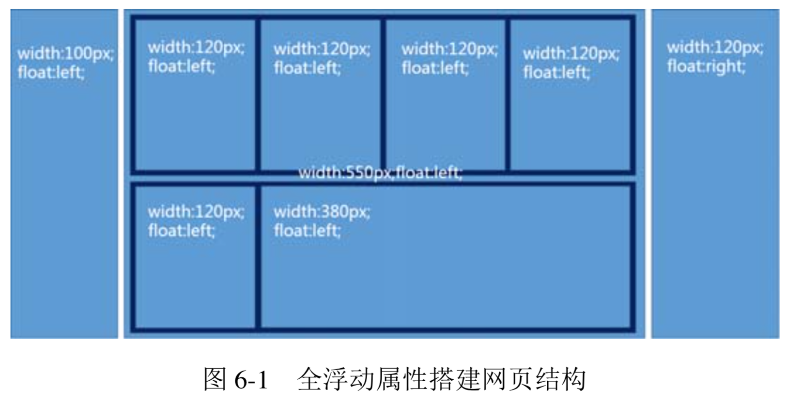

乍一看，float 好像也能满足我们布局页面的需求，但是实际上，这种砌砖头式的布局方式就像妙脆角，一碰就碎，主要在于其缺少弹性。举个例子，一旦某个列表高度变高了，则下面的列表就可能发生不愿看到的布局错位，抑或是日后我们需要增加某个元素的宽度，则牵一发而动全身，其他元素也必须跟着调整，否则样式必乱，也就是说布局的容错性很糟糕。

**说这么多就是要告诉大家:浮动是魔鬼，少砌砖头、少浮动，要更多地去挖掘 CSS 世界本身的“流动性”和“自适应性”，以构建能够适用于各种环境的高质量的网页布局。**

我们在移动端开发的时候，不可避免要面对各种设备尺寸的问题，加上横竖屏切换，其可变的外部环境非常之多，尤其在初期，很多人有这样的想法:固定宽度 320 像素，然后左右留白;抑或是 320 像素布局，然后根据比例缩放整个页面以100%填满屏幕宽度。这些想法最大的问题在于思维方式还是“刚”式思维。记住，CSS 设计的初衷就是表现如水流，富有弹性，“砖头式思维”是逆道而行，是绝不可取的。

如果进一步深究，“刚”式思维的主要原因还在于开发人员对 CSS 的了解不够深入，没有能够了解到其表层属性之下更深入的流动性和自适应性。这其实是一个很大的问题，因为虽然前端从业人员众多，但是仍有很大一部分人不会得到这些深入的知识和技能，也就很难跳出这些固定布局的思维方式。好在 CSS 的设计总是因需求而生，CSS2 的设计是面向图文展示，CSS3 的设计则是为了更绚丽的视觉效果和更丰富的网页布局，所以，CSS3 出现了类似 flex 弹性盒 子布局这种更表层、更上层、更浅显、更直白的 CSS 属性，以另外一种更加简单的方式让大家不得不以自适应的方式去实现布局。

**在第 3 章介绍 width 属性时曾提到过我总结的一套“鑫三无准则”，即“无宽度，无图片，无浮动”!之所以要“无浮动”，一个原因是纯浮动布局容错性差，容易出现比较严重的布局问题，还有一个原因就是 float 本身就是魔鬼属性，容易出现意料之外的情况，这里的意料之外除了 float 属性自身特性(如父元素高度塌陷)导致的布局问题外，还包括诸多兼容性问题。千万不要以为只要不用管 IE6 和 IE7 浏览器就可以高枕无忧了，实际上，当下 float 属性还是存在一些兼容性问题的(6.5 节中会有演示)。**

如果更进一步深入分析我们就会发现，float 属性的种种归根结底还是由于自身各种特性导致的。float 都有哪些有意思的特性呢?具体如下:

+ 包裹性;
+ 块状化并格式化上下文;
+ 破坏文档流;
+ 没有任何 margin 合并;

### 包裹性
在 3.2.1 节有详细阐述，可能很多人都忘记了，这里再简单提一下。**所谓“包裹性”，由“包裹”和“自适应性”两部分组成。**

+ **包裹**。假设浮动元素父元素宽度 200px，浮动元素子元素是一个 128px 宽度的图片，则此时浮动元素宽度表现为“包裹”，就是里面图片的宽度 128px，代码如下:
    ```html
    <style>
    .father { width: 200px; }
    .float { float: left; }
    .float img { width: 128px; }
    </style>
    <div class="father">
      <div class="float">
        
      </div>
    </div>
    ```
+ **自适应性**。如果浮动元素的子元素不只是一张 128px 宽度的图片，还有一大波普通的文字，例如:
    ```html
    <div class="father">
      <div class="float">
        我是帅哥，好巧啊，我也是帅哥，原来看这本书的人都是帅哥~ </div>
    </div>
    ```
    则此时浮动元素宽度就自适应父元素的 200px 宽度，最终的宽度表现也是 200px。

    当然，要想最大宽度自适应父元素宽度，一定是在浮动元素的“首选最小宽度”比父元素的宽度要小的前提下，比方说上面示意的“我是帅哥”等文字全是一连串超长的英文字母，则浮动元素的宽度显然就不是 200px 了。如果还不理解，建议再次深入 3.2 节的内容，这里不再赘述。
+ **块状化**的意思是，元素一旦 float 的属性值不为 none，则其 display 计算值就是 block 或者 table。举个例子，打开浏览器控制台，输入如下 JavaScript 代码:
    ```javascript
    var span = document.createElement('span');
    document.body.appendChild(span);
    console.log('1. ' + window.getComputedStyle(span).display); 
    // 设置元素左浮动
    span.style.cssFloat = 'left';
    console.log('2. ' + window.getComputedStyle(span).display);
    ```
    结果如图 6-2 所示。

    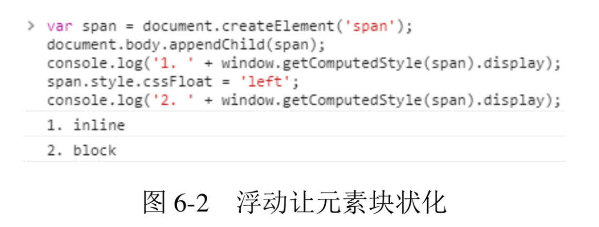

    **因此，没有任何理由出现下面的样式组合:**

    ```css
    span {
        display: block;
        float: left;
    }
    span {
        float: left;
        vertical-align: middle;
    }
    ```
    **也不要指望使用 text-align 属性控制浮动元素的左右对齐，因为 text-align 对块级元素是无效的。**

    float 属性与 display 属性值转换关系如表 6-1-1 所示。

    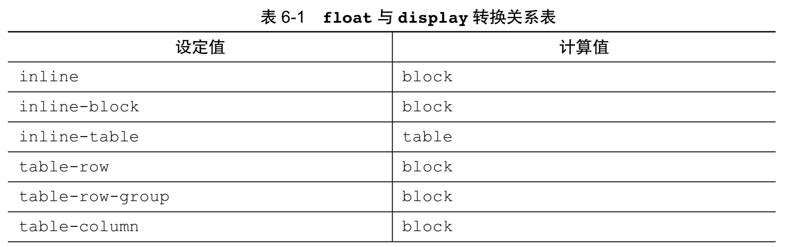

    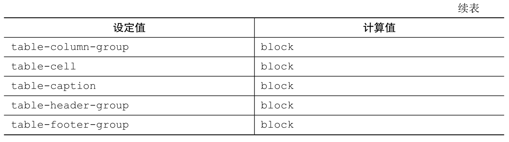

    **除了 inline-table 计算为 table 外，其他全都是 block。** 至于 float 元素的块状格式化上下文特性，参见 6.3 节。

    最后着重讲一下 float 特性的精髓—“破坏文档流”，这可以说是 float 属性的万恶之源，但也是 float 属性的立命之本，是其作用机制之所在。

## float 的作用机制
**float 属性有个著名的特性表现，就是会让父元素的高度塌陷，大多数场景下，这种特性会影响“正常的”布局，这里我特意把“正常的”三个字加了引号，因为站在 CSS 属性的角度讲，我们希望的结果反而是一种不正常，高度塌陷才是正常。甚至有些人会问这样的问题:“如何解决浮动让父元素高度塌陷的 bug?”**

bug?别逗了。一定要明确这一点，浮动使高度塌陷不是bug，而是标准!有人可能会有疑问了:怎么会有规范让人“干坏事”的?

还记不记得上面说过的 **float 属性的原本作用“只是为了实现文字环绕效果”?** 所以，假如你是 CSS 世界的设计者，你会如何利用古老的 CSS 盒模型规则实现文字环绕效果?

CSS 的设计者就想到了“破坏文档流”这一招，具体招式可参见下面的图例讲解，故事的背景是这样的:我们的男主人公不仅人长得帅，而且心地非常善良，总是去外面给流浪的小猫小狗喂食，但是给小动物喂食非常耗费时间，影响学业，因此主人公的父亲把男主锁在家里，就像图 6-3 所示这样，一个框把男主人公给限制住了。HTML 结构如下:

```html
<div class="father">
  
</div>
<p class="animal">小猫1，小猫2，...</p>
```

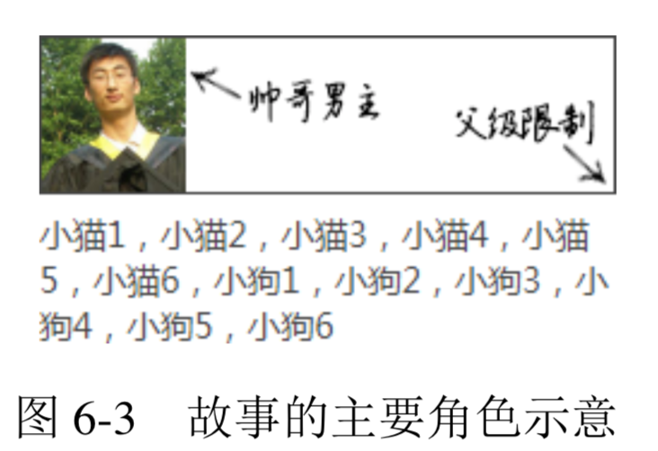

但是，天天学习谁也受不了，为了摆脱父亲的限制，**男主附加了魔鬼属性 float，这种属性的作用之一就是可以使父元素的高度塌陷** (如图 6-4 所示)，于是男主就这么摆脱了父亲的限制。没有了父亲的限制，男主就可以和外面的小动物接触了，如图 6-5 所示。

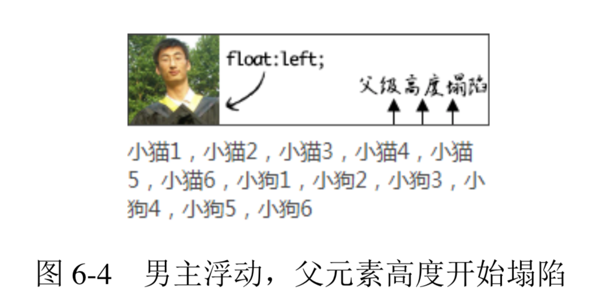

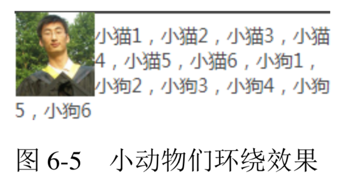

**从上面的故事可以看出，float 属性让父元素高度塌陷的原因就是为了实现文字环绕效果。但是，后来事情的发展超出了 CSS 设计者的意料，图文展示只是新时代 Web 展示的一小部分，而文字环绕这种上世纪风格的效果现在已然不流行了，于是 float 很少发挥其原本的作用，反而被大肆使用满屏布局。显然，布局的时候是不需要父元素塌陷的。于是，高度塌陷这种特性反而成为了 float 属性一个不得不重视的坑。**

**然而，“高度塌陷”只是让跟随的内容可以和浮动元素在一个水平线上，但这只是实现“环绕效果”的条件之一，要想实现真正的“环绕效果”，就需要另外一个平时大家不太在意的特性，那就是“`行框盒子和浮动元素的不可重叠性`”，也就是“`行框盒子如果和浮动元素的垂直高度有重叠，则行框盒子在正常定位状态下只会跟随浮动元素，而不会发生重叠`”。**

**注意，这里说的是“行框盒子”，也就是每行内联元素所在的那个盒子，而非外部的块状盒子。实际上，由于浮动元素的塌陷，块状盒子是和图片完全重叠的，例如，我们给环绕的p元素设置个背景色，同时把图片搞透明，则效果如图 6-6 所示。**

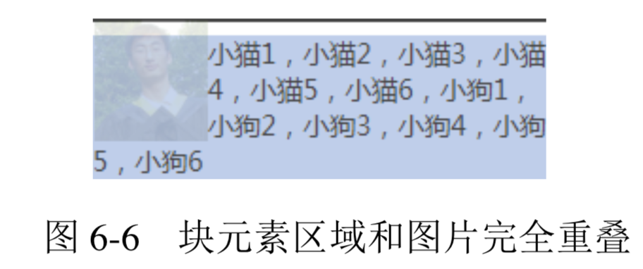

**但是，块状盒子中的“行框盒子”却被浮动元素限制，没有任何的重叠，我们可以借助::first-line 伪元素暴露第一行的“行框盒子”区域，CSS 代码如下:**

```css
.animal:first-line {
  background: red;
  color: white;
}
```

结果如图 6-7 所示。

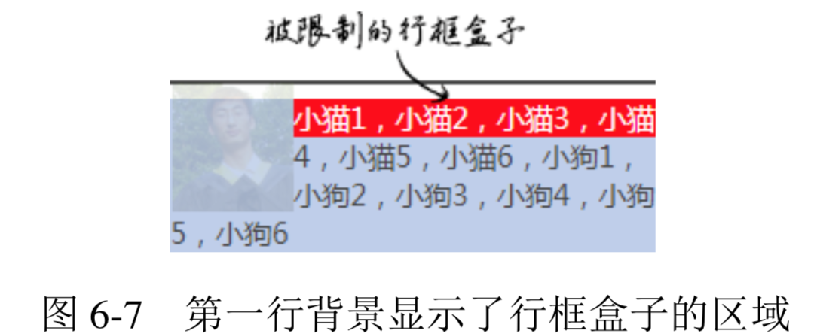

**这种“限制”是根深蒂固的，也就是“行框盒子”的区域永远就这么大，只要不改变当前布局方式，我们是无法通过其他 CSS 属性改变这个区域大小的。这就是在 4.3 节提到的浮动后面元素 margin 负无穷大依然无效的原因。例如，这里再新增如下 CSS 代码:**

```css
.animal {
  margin-left: -100px;
}
```

**就会发现，只有外部的块状容器盒子尺寸变大，而和浮动元素垂直方向有重叠的“行框盒子” 依然被限死在那里，如图 6-8 所示。**

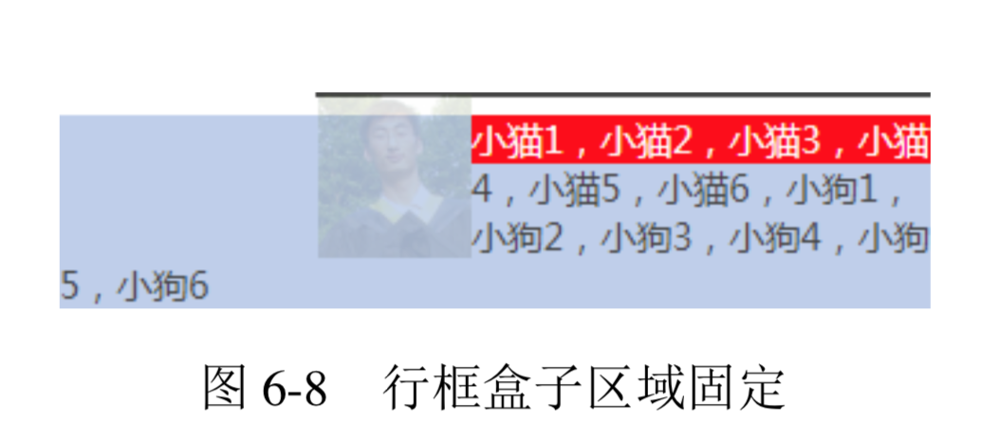

至此，浮动作用的基本机制算是介绍完了。那么了解 float 属性的作用机制有什么用呢? 很有用，除了下一节会着重介绍基于 float 属性的流体布局之外，还有很有用的一点就是让我们一下子知道一些意料之外场景发生的原因以及如何快速对症下药。

我们不妨看下面这个很有学习价值的例子。很多人会有这样的想法，就是认为一个元素只要设置了具体的高度值，就不需要担心 float 属性造成的高度塌陷的问题了，既然有了高度，何来“高度塌陷”。这句话对不对呢?是对的。但是，其中也隐含了陷阱，因为“文字环绕效果” 是由两个特性(即“父级高度塌陷”和“行框盒子区域限制”)共同作用的结果，定高只能解决“父级高度塌陷”带来的影响，但是对“行框盒子区域限制”却没有任何效果，结果导致的问题 是浮动元素垂直区域一旦超出高度范围，或者下面元素 margin-top 负值上偏移，就很容易使 后面的元素发生“环绕效果”，代码示意如下:

```html
<div class="father">
  <div class="float">
    
  </div>
我是帅哥，好巧啊，我也是帅哥，原来看这本书的人都是帅哥~ 
</div>
<div>虽然你很帅，但是我对你不感兴趣。</div>
<style>
.father {
  height: 64px;
  border: 1px solid #444;
}
.float {
  float:left;
}
.float img {
  width: 60px; height: 64px;
}
</style>
```

从这段代码可以看出父级元素.father 高度设置的和图片高度一模一样，都是 64px。按道理，下面的“虽然你很帅，但是我对你不感兴趣。”这些文字应该居左显示，但最后的结果却是图 6-9 所示的这样。

口口声声说“不感兴趣”，最后却依旧环绕在帅哥图片 周围。为什么会出现这种现象呢?

**虽然肉眼看上去容器和图片一样高，但是，大家都读过5.3 节，应该都知道内联状态下的图片底部是有间隙的，也就是.float 这个浮动元素的实际高度并不是 64px，而是要比 64px 高几像素，带来的问题就是浮动元素的高度超出.father 几像素。于是，下面的文字就遭殃了，因为“虽然你很帅......”这段文字所在的“行框盒子”和浮动元素在垂直位置有了重叠，尽管就那么几像素。于是，区域被限制**

👉 [example](https://demo.cssworld.cn/6/1-1.php)

因此，当使用浮动元素的时候，比较稳妥的做法还是采用一些手段干净地清除浮动带来的影响，以避免很多意料之外的样式问题的发生。

## float 更深入的作用机制
实际项目开发中不可能总是浮动元素在正常流元素的前面，下面来看一个例子。例如，有一个标题，代码如下:

```html
<h3>标题</h3>
```

一直用得好好的，突然来了一个需求，要在右侧加一个“更多”链接，于是 HTML 变成下面这样(我们这里先忽略语义是否得当的问题):

```html
<h3>标题<a href="#">更多</a></h3>
```

请问:我们直接让a元素 float:right 可不可以?

考虑到本书的目标浏览器是 IE8 及以上版本浏览器，因此，答案是:可以。但是，如果你的项目很不幸还需要兼容 IE7 之类的浏览器，则不能这样处理，因为“更多”文字会浮动在下 一行内容的右边，而非标题的右边。

以前不少人问我为什么 IE6 和 IE7 浮动元素会下一行显示，但却没有人问为什么 IE8 及以上版本浏览器是在一行显示，可见，似乎同行显示更符合大家的直观认知。好在规范也确实约定了浮动元素和内联元素在一行显示，但是，如果我问大家具体的作用机制是什么，恐怕鲜有人能回答清楚!

单靠感性认知而非具体原理理解 CSS 的样式表现很多时候是不靠谱的。比方说，还是这个例子，假设这里的“标题”内容非常长，超过了一行内容，请问:这里的“更多”a链接元素该如何显示?是图 6-10 所示的这样吗?答案是:不是的。正确表现应该如图 6-11 所示。

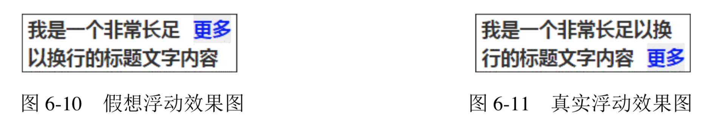

为什么呢?要想解释透彻，那话又多了。首先，我们需要了解两个和 float 相关的术语，一是“浮动锚点”(float anchor)，二是“浮动参考”(float reference)。
+ 浮动锚点是 float 元素所在的“流”中的一个点，这个点本身并不浮动，就表现而言更像一个没有 margin、border 和 padding 的空的内联元素。
+ 浮动参考指的是浮动元素对齐参考的实体。

**在 CSS 世界中，float 元素的“浮动参考”是“行框盒子”，也就是 float 元素在当前“行框盒子”内定位。再强调一遍，是“行框盒子”，不是外面的包含块盒子之类的东西，因为CSS 浮动设计的初衷仅仅是实现文字环绕效果。在 CSS 新世界中，float 被赋予了更多的作用和使命，“浮动参考”就不仅仅是“行框盒子”了，不过此非本书重点，就不展开了。**

正是因为 float 定位参考的是“行框盒子”，所以“更多”才会在第二行显示。还没理解? 那再具体解释一下:每一行内联元素都有一个“行框盒子”，这个例子中标题文字比较多，两行 显示了，因此有上下两个“行框盒子”，而“更多”所在的a元素是在标题文字后面，位于第 二行，因此，这里设置了 float:right 的a元素是相对于第二行的“行框盒子”对齐的， 也就是图 6-11 所示的效果。

趁热打铁，假如说我们的标题文字再多两个字，正好两行，请问:“更多”两字又当如何 显示呢?估计不少人已经可以脑补出最终的样式表现了，“更 多”会孤零零地显示在第三行的右边，但容器高度仍然是两行文字的高度，如图 6-12 所示。

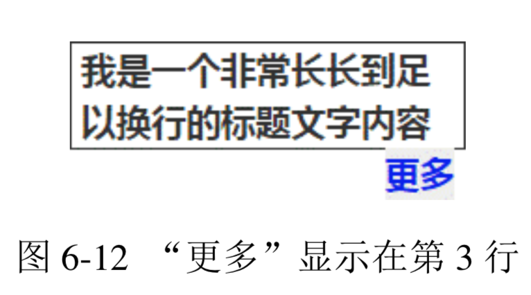

然而，上面的解释有一个很大的漏洞就是，如果 float 元素前后全是块元素，那根本没有“行框盒子”，何来对齐的说法? 此时，就需要上面提到的“浮动锚点”出马了。“浮动锚点”这个术语名称本身很具有欺骗性，看上去应该与 float 的定位位置有关，实际上关系浅薄，在我看来，其作用就是产生“行框盒子”，因为“浮动锚点”表现如同一个空的内联元素，有内联元素自然就有“行框盒子”，于是，float 元素对齐的参考实体“行框盒子”对于块状元素也同样适用了，只不过这个“行框盒子”由于没有任何内容，所以无尺寸，看不见也摸不着罢了。

## float 与流体布局
float 通过破坏正常 CSS 流实现 CSS 环绕，带来了烦人的“高度塌陷”的问题，然而，凡事都具有两面性，只要了解透彻，说不定就可以变废为宝、化腐朽为神奇。例如。我们可以利用 float 破坏 CSS 正常流的特性，实现两栏或多栏的自适应布局。

还记不记得之前小动物环绕的例子?其实我们稍加改造，就能变成一侧定宽的两栏自适应布局，HTML 和 CSS 代码如下:

```html
<div class="father">
  
  <p class="animal">小猫1，小猫2，...</p>
</div>
<style>
.father {
  overflow: hidden;
}
.father > img {
  width: 60px; height: 64px;
  float: left;
}
.animal {
  margin-left: 70px;
}
</style>
```

和文字环绕效果相比，区别就在于.animal 多了一个 margin-left:70px，也就是所有小动物都要跟男主保持至少 70px 的距离，由于图片宽度就 60px，因此不会发生环绕，自适应效果达成。

**原理其实很简单，.animal 元素没有浮动，也没有设置宽度，因此，流动性保持得很好，设置margin-left、border-left或者padding-left都可以自动改变content box的尺寸，继而实现了宽度自适应布局效果。**

我们不妨对比一下环绕效果的背景区域和这里自适应效果的背景区域(见图 6-13)，理解起来应该会更加直白。

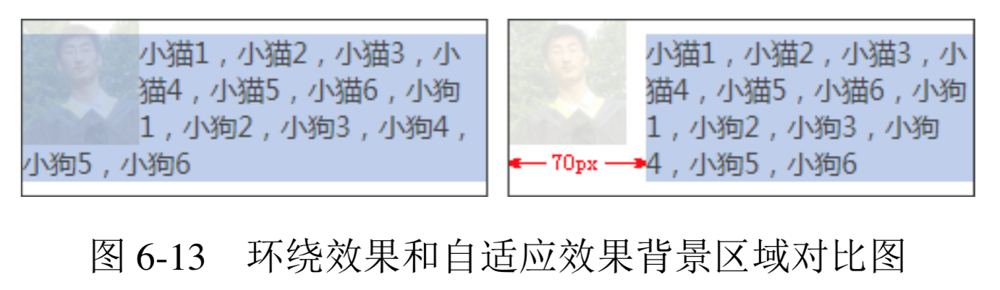

没有对比就没有震撼。很多人实现这样的效果会采用下面这样的砖头式的浮动布局:

```css
.animal {
  width: 170px;
  float: right;
}
```

**乍一看，效果一样，但是实际上这容错性和可拓展性就差远了。一旦我们的容器宽度发生了变化，那么这个布局就基本作废，宽度小了，两栏内容上下错位，宽度变大，中间间隙宽到可以撑船，就是因为浮动和宽度破坏了 CSS 的流动性。这种感觉就像是把记忆合金变成了死板砖头。在我看来，这类布局是没有任何理由使用这种“砌砖头”式的技术方案的。一个简简单单的 margin-left 岂不比需要计算、代码量多、可维护性差的一堆 CSS 代码好很多!**

👉 [example](https://demo.cssworld.cn/6/1-2.php)

一般而言，上面的技巧适用于一侧定宽一侧自适应:如果是宽度不固定，也有办法处理，这会在 6.3.2 节中介绍。如果是百分比宽度，则也是可以的，例如:

```css
.left {
  float: left;
  width: 50%;
}
.right {
  margin-left: 50%;
}
```

如果是多栏布局，也同样适用，尤其图 6-14 所示的这种布局。

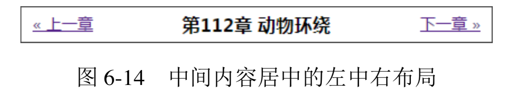

假设 HTML 结构如下:

```html
<div class="box">
<a href class="prev">&laquo; 上一章</a> 
<a href class="next">下一章 &raquo;</a> 
<h3 class="title">第112章动物环绕</h3>
</div>
```

则 CSS 可以如下:

```css
.prev {
  float: left;
}
.next {
  float: right;
}
.title {
  margin: 0 70px;
  text-align: center;
}
```

也就是说，.title 所在的h3标题元素直接左右 margin，借助流体特性，保证不会和两个
文字链接重叠。