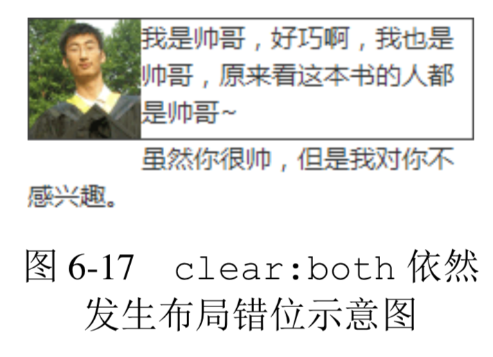

- [float 的天然克星 clear](#float-%E7%9A%84%E5%A4%A9%E7%84%B6%E5%85%8B%E6%98%9F-clear)
  - [什么是 clear 属性](#%E4%BB%80%E4%B9%88%E6%98%AF-clear-%E5%B1%9E%E6%80%A7)
  - [成事不足败事有余的 clear](#%E6%88%90%E4%BA%8B%E4%B8%8D%E8%B6%B3%E8%B4%A5%E4%BA%8B%E6%9C%89%E4%BD%99%E7%9A%84-clear)

# float 的天然克星 clear

## 什么是 clear 属性
生生相克，float 这个魔鬼属性也不例外。CSS 有一个专门用来处理 float 属性带来的高度塌陷等问题的属性，这个属性就是 clear。其语法如下:

 clear: none | left | right | both

**如果单看字面意思，clear:left 应该是“清除左浮动”，clear:right 应该是“清除右浮动”的意思，实际上，这种解释是有问题的，因为浮动一直还在，并没有清除。没错，并没有清除。**

**官方对 clear 属性的解释是:“元素盒子的边不能和前面的浮动元素相邻。”**

**虽然有些拗口，但是有一点是可以体会出来的，就是设置了 clear 属性的元素自身如何如何，而不是让 float 元素如何如何，有种“己所不欲勿施于人”的意味在里面。因此，我对 clear 属性值的理解是下面这样的。**
+ none:默认值，左右浮动来就来。
+ left:左侧抗浮动。
+ right:右侧抗浮动。
+ both:两侧抗浮动。

大家有没有发现，我们平时除了 clear:both 这个声明比较多以外，left 和 right 这两个属性值几乎无人问津，是因为 left 和 right 这两个值没有作用吗?

我的答案非常直白:没错，确实没有什么用!凡是 clear:left 或者 clear:right 起作用的地方，一定可以使用 clear:both 替换!

举个例子，假设容器宽度足够宽，有 10 个li元素，设置了如下 CSS 代码:

```css
li {
    width: 20px; height: 20px;
    margin: 5px;
    float: left;
}
li:nth-of-type(3) {
    clear: both;
}
```

也就是说，第三个li设置了 clear:both，请问表现是怎样的?或者这么问吧:列表最后是 1 行显示、2 行显示，还是 3 行显示呢?

我们很容易被 both 这个单词误导，因为其字面意思是“同时”，所以很多人会认为是 3 行，但实际上只会显示 2 行，如图 6-15 所示。


**原因在于，clear 属性是让自身不能和前面的浮动元素相邻，注意这里“前面的”3 个字，也就是 clear 属性对“后面的”浮动元素是不闻不问的，因此才 2 行显示而非 3 行。**

更进一步，考虑到 float 属性要么就 left 要么就 right，不可能同时存在，同时由于 clear 属性对“后面的”浮动元素不闻不问，因此，当 clear:left 有效的时候，clear:right 必定无效，也就是此时 clear:left 等同于设置 clear:both;同样地，clear:right 如果有效也是等同于设置 clear:both。由此可见，clear:left 和 clear:right 这两个声明就没有任何使用的价值，至少在 CSS 世界中是如此，直接使用 clear:both 吧。

## 成事不足败事有余的 clear
**clear 属性只有块级元素才有效的，而::after 等伪元素默认都是内联水平，这就是借助伪元素清除浮动影响时需要设置 display 属性值的原因。**

```css
.clear:after {
    content: '';
    display: table; // 也可以是'block'，或者是'list-item'
    clear: both;
}
```

然而，利用伪元素或者直接使用下面 HTML，有时候也会产生一些意想不到的问题:

继续前面那个小动物环绕的例子，如果我们在右侧自适应内容里面使用了类似这样的样式，则可能会发生右边的内容跑到图片下边的情况，HTML 代码如下:

```html
<div class="father">
    
    <div class="animal">
小猫 1，小猫 2，
<div class="clear"></div> 小猫 3，小猫 4，...
    </div>
</div>
```

👉 [example](https://demo.cssworld.cn/6/2-1.php)

**由于 clear:both 的作用本质是让自己不和 float 元素在一行显示，并不是真正意义上的清除浮动，因此 float 元素一些不好的特性依然存在，于是，会有类似下面的现象。**

+ 如果 clear:both 元素前面的元素就是 float 元素，则 margin-top 负值即使设成-9999px，也不见任何效果。
+ clear:both 后面的元素依旧可能会发生文字环绕的现象。举个例子，如下 HTML 和 CSS:
    ```html
    <div class="father">
         我是帅哥，好巧啊，我也是帅哥，原来看这本书的人都是帅哥~
    </div>
    <div>虽然你很帅，但是我对你不感兴趣。</div>
    <style>
    .father:after {
        content: '';
        display: table;
        clear: both;
    }
    .father img {
    float:left;
        width: 60px; height: 64px;
    }
    .father + div {
        margin-top: -2px;
    }
    </style>
    ```

    虽然.father 父元素的最后设置了 clear:both 来阻止浮动对后面元素的影响，但是最后结果错位依然发生了，如图 6-17所示。

    

    由此可见，clear:both 只能在一定程度上消除浮动的影响，要想完美地去除浮动元素的影响，还需要使用其他 CSS 声明。那应该使用哪些 CSS 声明呢?请看 6.3 节。