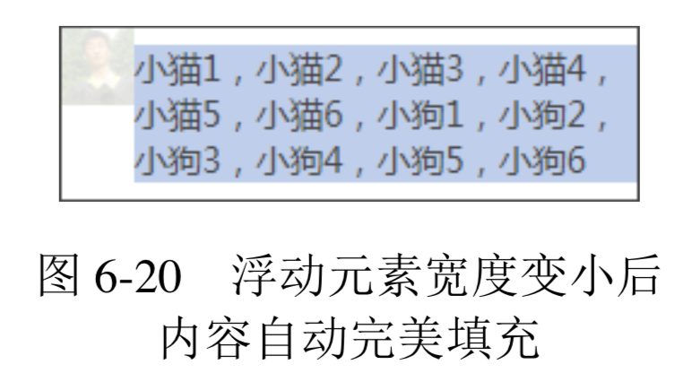
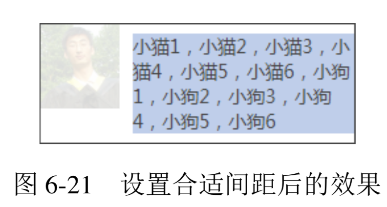
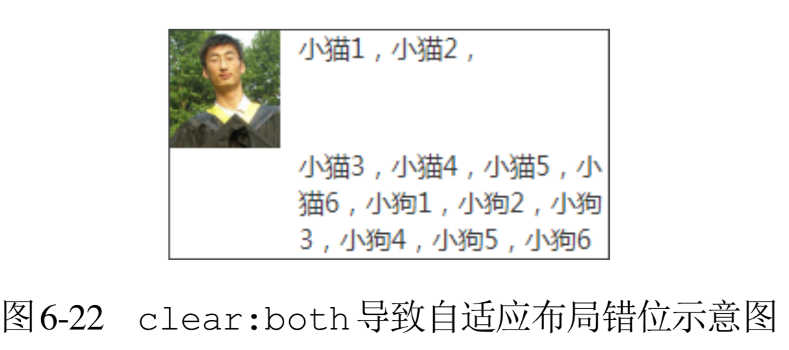
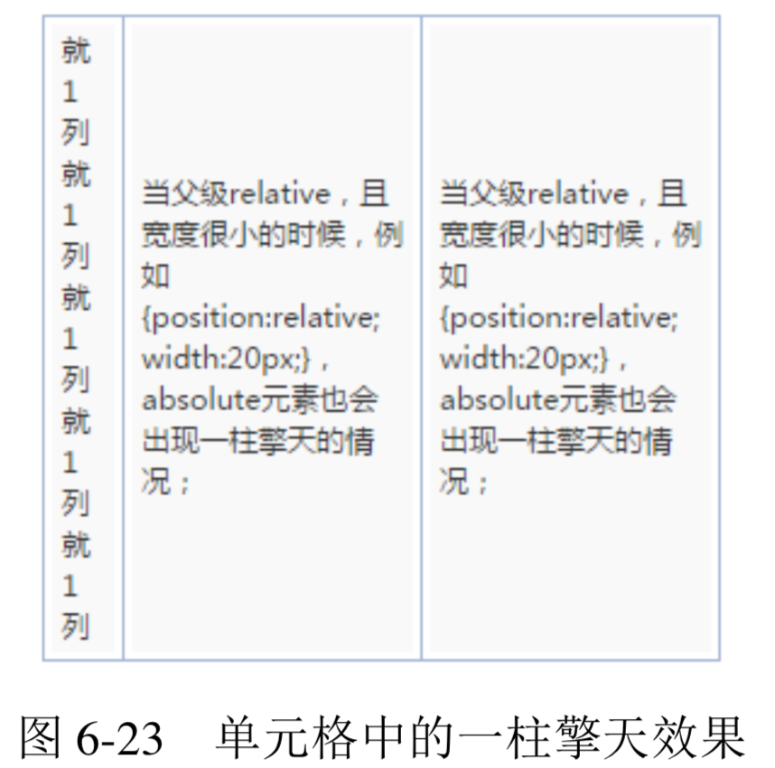

- [CSS 世界的结界——BFC](#css-%E4%B8%96%E7%95%8C%E7%9A%84%E7%BB%93%E7%95%8Cbfc)
  - [BFC 的定义](#bfc-%E7%9A%84%E5%AE%9A%E4%B9%89)
  - [BFC 与流体布局](#bfc-%E4%B8%8E%E6%B5%81%E4%BD%93%E5%B8%83%E5%B1%80)

# CSS 世界的结界——BFC

## BFC 的定义
**BFC全称为block formatting context，中文为“块级格式化上下文”。相对应的还有IFC，也就是inline formatting context，中文为“内联格式化上下”**。不过IFC作用和影响比较隐晦，我们就不介绍了，我们将学习重点放在 BFC 上。

关于 BFC 各种特性什么的，说起来很啰嗦，而我喜欢用“CSS 世界的结界”这种称谓概括 BFC 的特性。“结界”这个词大家应该都理解的，指通过一些特定的手段形成的封闭空间，里面的人出不去，外面的人进不来，具有极强的防御力。BFC 的特性表现如出一辙。

**大家请记住下面这个表现原则:如果一个元素具有 BFC，内部子元素再怎么翻江倒海、翻 云覆雨，都不会影响外部的元素。所以，BFC 元素是不可能发生 margin 重叠的，因为 margin 重叠是会影响外面的元素的;BFC 元素也可以用来清除浮动的影响，因为如果不清除，子元素浮动则父元素高度塌陷，必然会影响后面元素布局和定位，这显然有违 BFC 元素的子元素不会影响外部元素的设定。**

那什么时候会触发 BFC 呢?常见的情况如下:
+ html根元素;
+ float 的值不为 none;
+ overflow 的值为 auto、scroll 或 hidden;
+ display 的值为 table-cell、table-caption 和 inline-block 中的任何一个;
+ position 的值不为 relative 和 static。

**换言之，只要元素符合上面任意一个条件，就无须使用 clear:both 属性去清除浮动的影响了。因此，不要见到一个div元素就加个类似.clearfix 的类名，否则只能暴露你孱弱的 CSS 基本功。**

## BFC 与流体布局
**BFC 的结界特性最重要的用途其实不是去 margin 重叠或者是清除 float 影响，而是实现更健壮、更智能的自适应布局。**

我们还是从最基本的文字环绕效果说起。还是那个小动物环绕的例子:

```html
<div class="father">
    
    <p class="animal">小猫1，小猫2，...</p>
</div>
<style>
    img { float: left; }
</style>
```

**效果如图 6-18 所示。此时.animal 的内容显然受到了设置了 float 属性值的图片的影响而被环绕了。此时如果我们给.animal 元素设置具有 BFC 特性的属性，如 overflow:hidden，如下:**


```css
.animal { overflow: hidden; }
```

**则根据 BFC 的表现原则，具有 BFC 特性的元素的子元素不会受外部元素影响，也不会影响外部元素。于是，这里的.animal 元素为了不和浮动元素产生任何交集，顺着浮动边缘形成自己的封闭上下文，如图 6-19 所示(垂直虚线为辅助示意)。**


**也就是说，普通流体元素在设置了 overflow:hidden 后，会自动填满容器中除了浮动元素以外的剩余空间，形成自适应布局效果，而且这种自适应布局要比纯流体自适应更加智能。比方说，我们让图片的尺寸变小或变大，右侧自适应内容无须更改任何样式代码，都可以自动填满剩余的空间。例如，我们把图片的宽度从 60px 改成 30px，结果如图 6-20 所示。**



**实际项目开发的时候，图片和文字不可能靠这么近，如果想要保持合适的间距，那也很简单，如果元素是左浮动，则浮动元素可以设置 margin-right 成透明 border-right 或 padding-right;又或者右侧 BFC 元素设置成透明 border-left 或者padding-left，但不包括 margin-left，因为如果想要使用 margin-left，则其值必须 是浮动元素的宽度加间隙的大小，就变成动态不可控的了，无法大规模复用。因此，套用上面例子的 HTML，假设我们希望间隙是 10px，则下面这几种写法都是可以的:**
+ img { margin-right: 10px; }
+ img { border-right: 10px solid transparent; }
+ img { padding-right: 10px; }
+ .animal { border-left: 10px solid transparent; }
+ .animal { padding-right: 10px; }

一般而言，我喜欢通过在浮动元素上设置 margin 来控制间距，也就是下面的 CSS 代码:

```css
img {
    float: left;
    margin-right: 10px;
}
.animal {
    overflow: hidden;
}
```

布局效果如图 6-21 所示。



和基于纯流体特性实现的两栏或多栏自适应布局相比，基于 BFC 特性的自适应布局有如下优点。
+ **自适应内容由于封闭而更健壮，容错性 更强。比方说，内部设置 clear:both 不会与 float 元素相互干扰而导致错位**，也就不会发生类似于图 6-22 所示的问题。
    
+ **自适应内容自动填满浮动以外区域，无须关心浮动元素宽度，可以整站大规模应用**。比方说，抽象几个通用的布局类名，如:
    ```css
    .left { float: left; }
    .right { float: right; }
    .bfc { overflow: hidden; }
    ```

    于是，只要遇到两栏结构，直接使用上面的结构类名就可以完成基本的布局。HTML 示意如下:
    ```html
    <div class="bfc">
        
        <p class="bfc">小猫1，小猫2，...</p>
    </div>
    ```

    上面的类名只是示意，具体可根据自己项目的规范设定，甚至直接用.l 或者.r 这样的极短命名也是可以的。

    而纯流体布局需要大小不确定的 margin 或 padding 等值撑开合适间距，无法 CSS 组件化。例如，前面出现的 70px，其他类似布局可能就是 90px，无法大规模复用:

    ```css
    .animal { margin-left: 70px; }
    ```

    两种不同原理的自适应布局策略的高下一看便知。甚至可以这么说，有了 BFC 自适应布局，纯流体特性布局基本上没有了存在的价值。然而，只是理论上如此。如果 BFC 自适应布局真那么超能，那为何并没有口口相传呢?

那我们就得进一步深入理解了。

**理论上，任何 BFC 元素和 float 元素相遇的时候，都可以实现自动填充的自适应布局。但是，由于绝大多数的触发 BFC 的属性自身有一些古怪的特性，所以，实际操作的时候，能兼顾流体特性和 BFC 特性来实现无敌自适应布局的属性并不多。下面我们一个一个来看，每个 CSS 属性选一个代表来进行说明。**

+ **float:left。浮动元素本身 BFC 化，然而浮动元素有破坏性和包裹性，失去了元素本身的流体自适应性，因此，无法用来实现自动填满容器的自适应布局。不过，其因兼容性还 算良好，与搭积木这种现实认知匹配，上手简单，因此在旧时代被大肆使用，也就是常说的“浮动布局”，也算阴差阳错地开创了自己的一套布局。**
+ **position:absolute。这个脱离文档流有些严重，过于清高，和非定位元素很难玩到一块儿去，我就不说什么了。**
+ **overflow:hidden。这个超棒!不像浮动和绝对定位，玩得有点儿过。其本身还是一个很普通的元素，因此，块状元素的流体特性保存得相当完好，附上 BFC 的独立区域特性，可谓如虎添翼、宇宙无敌!而且 overflow:hidden 的 BFC 特性从 IE7 浏览器开始就支持，兼容性也很不错。唯一的问题就是容器盒子外的元素可能会被隐藏掉，一定程度上限制了这种特性的大规模使用。不过，溢出隐藏的交互场景比例不算很高，所以它还是可以作为常用 BFC 布局属性使用的。**
+ **display:inline-block。这是 CSS 世界最伟大的声明之一，但是用在这里，就有 些捉襟见肘了。display:inline-block 会让元素尺寸包裹收缩，完全就不是我们想要的 block 水平的流动特性。只能是一声叹息舍弃掉!然而，峰回路转，世事难料。大家应该知道， IE6 和 IE7 浏览器下，block 水平的元素设置 display:inline-block 元素还是 block 水 平，也就是还是会自适应容器的可用宽度显示。于是，对于 IE6 和 IE7 浏览器，我们会阴差阳 错得到一个比 overflow:hidden 更强大的声明，既 BFC 特性加身，又流体特性保留。**
    ```css
    .float-left {
      float: left;
    }
    .bfc-content {
      display: inline-block;
    }
    ```
    当然，*zoom: 1也是类似效果，不过只适用于低级的IE浏览器，如IE7。
+ **display:table-cell。其让元素表现得像单元格一样，IE8 及以上版本浏览器才支持。跟 display:inline-block 一样，它会跟随内部元素的宽度显示，看样子也是不合适的命。但是，单元格有一个非常神奇的特性，就是宽度值设置得再大，实际宽度也 不会超过表格容器的宽度。第 3 章单元格一柱擎天的例子利 用的就是这种特性，如图 6-23 所示。**

    

    因此，如果我们把 display:table-cell 这个 BFC 元素宽度设置得很大，比方说 3000px，那其实就跟 block 水平元素自动适应容器空间效果一模一样了，除非你的容器 宽度超过 3000px。实际上，一般 Web 页面不会有 3000px 宽的模块，所以，要是实在不放心，设个 9999px 好了!

    ```css
    .float-left {
      float: left;
    }
    .bfc-content {
      display: table-cell; width: 9999px;
    }
    ```

    看上去好像还不错。但是，还是有两点制约，一是需要 IE8 及以上版本的浏览器;二是应付连续英文字符换行有些吃力。但是，总体来看，其适用的场景要比 overflow:hidden 更为广泛。
+ display:table-row。对 width 无感，无法自适应剩余容器空间。
+ display:table-caption。此属性一无是处。

还有其他声明对这里的自适应布局效果而言也都是一无是处，就不全部展开了。

总结一下，我们对 BFC 声明家族大致过了一遍，能担任自适应布局重任的也就是以下几个。
+ overflow:auto/hidden，适用于 IE7 及以上版本浏览器;
+ display:inline-block，适用于 IE6 和 IE7;
+ display:table-cell，适用于 IE8 及以上版本浏览器。

最后，我们可以提炼出两套 IE7 及以上版本浏览器适配的自适应解决方案。
+ 借助 overflow 属性，如下:
    ```css
    .lbf-content { overflow: hidden; }
    ```
+ 融合 display:table-cell 和 display:inline-block，如下:
    ```css
    .lbf-content {
    display: table-cell; width: 9999px; /* 如果不需要兼容 IE7，下面样式可以省略 */ *display: inline-block; *width: auto;
    }
    ```

**这两种基于 BFC 的自适应方案均支持无限嵌套，因此，多栏自适应可以通过嵌套方式实现。这两种方案均有一点不足，前者如果子元素要定位到父元素的外面可能会被隐藏，后者无法直接让连续英文字符换行。所以，大家可以根据实际的项目场景选择合适的技术 方案。**

最后，关于 display:table-cell 元素内连续英文字符无法换行的问题，事实上是可以解决的，就是使用类似下面的 CSS 代码:

```css
.word-break {
    display: table;
    width: 100%;
    table-layout: fixed;
    word-break: break-all;
}
```