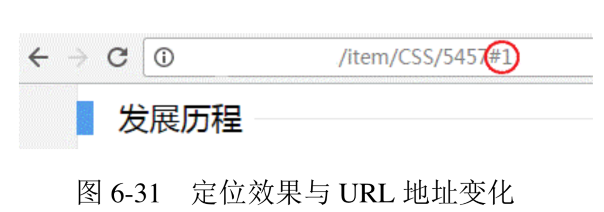
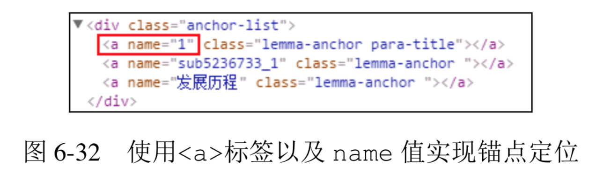
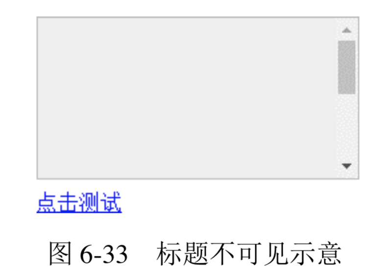
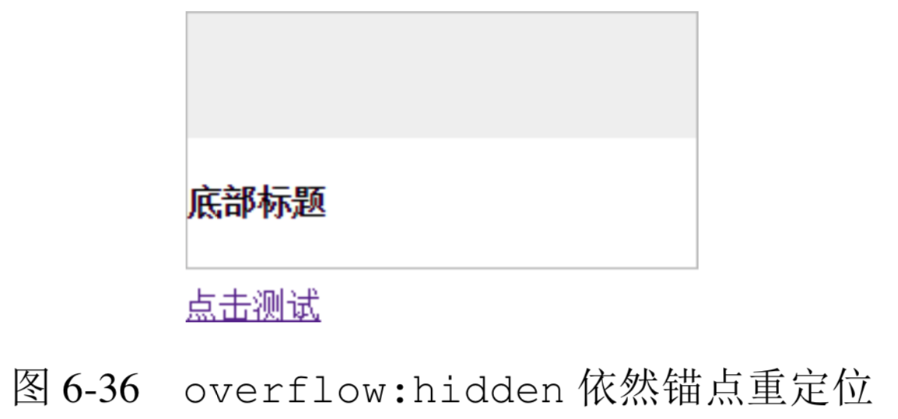
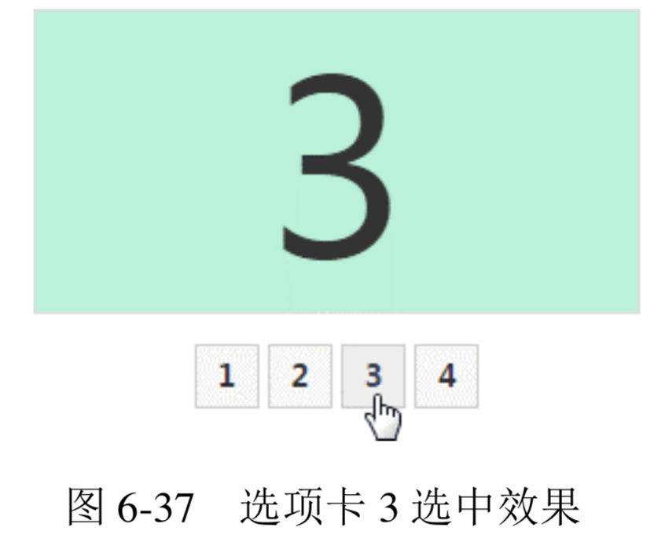
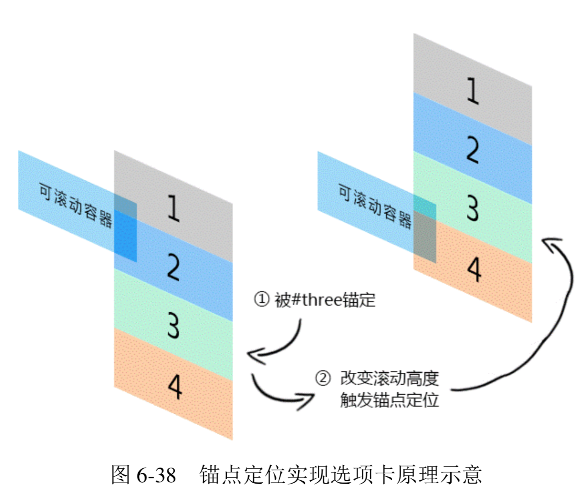

- [最佳结界 overflow](#%E6%9C%80%E4%BD%B3%E7%BB%93%E7%95%8C-overflow)
  - [overflow 剪裁界线 border box](#overflow-%E5%89%AA%E8%A3%81%E7%95%8C%E7%BA%BF-border-box)
  - [了解 overflow-x 和 overflow-y](#%E4%BA%86%E8%A7%A3-overflow-x-%E5%92%8C-overflow-y)
  - [overflow 与滚动条](#overflow-%E4%B8%8E%E6%BB%9A%E5%8A%A8%E6%9D%A1)
  - [依赖 overflow 的样式表现](#%E4%BE%9D%E8%B5%96-overflow-%E7%9A%84%E6%A0%B7%E5%BC%8F%E8%A1%A8%E7%8E%B0)
  - [overflow 与锚点定位](#overflow-%E4%B8%8E%E9%94%9A%E7%82%B9%E5%AE%9A%E4%BD%8D)

# 最佳结界 overflow
**要想彻底清除浮动的影响，最适合的属性不是 clear 而是 overflow。一般使用 overflow:hidden，利用 BFC 的“结界”特性彻底解决浮动对外部或兄弟元素的影响。虽然有很多其他 CSS 声明也能清除浮动，但基本上都会让元素的宽度表现为“包裹性”，也就是会影响原来的样式布局，而 overflow:hidden 声明不会影响元素原先的流体特性或宽度表现，因此在我看来是最佳“结界”。**

**不过话又说回来，overflow 属性原本的作用指定了块容器元素的内容溢出时是否需要裁剪，也就是“结界”只是其衍生出来的特性，“剪裁”才是其本职工作。**

## overflow 剪裁界线 border box
一个设置了overflow:hidden声明的元素，假设同时存在border属性和padding属性，类似于下面的 CSS 代码:

```css
.box {
    width: 200px; height: 80px;
    padding: 10px;
    border: 10px solid;
    overflow: hidden;
}
```

**则当子元素内容超出容器宽度高度限制的时候，剪裁的边界是 border box 的内边缘，而非 padding box 的内边缘，**

👉 [example](https://demo.cssworld.cn/6/4-1.php)

**如果想实现元素剪裁同时四周留有间隙的效果的话，可以试试使用透明边框，此时内间距 padding 属性是无能为力的。这里举这个实例并不只是为了传授这个小技能，也是为了以此为契机，`深入探讨一下 overflow 属性的一个很经典的不兼容问题，即 Chrome 浏览器下，如果容器可滚动(假设是垂直滚动)，则 padding-bottom 也算在滚动尺寸之内，IE 和 Firefox 浏览器忽略 padding-bottom`。例如，上面的.box，我们把 overflow 属性值改成 auto(亦可点击 实例页面图片)，滚动到底部会发现，Chrome 浏览器下面是有 10 像素的空白的，如图 6-25 所示。 Firefox 和 IE 却没有，Firefox 浏览器呈现的效果如图 6-26 所示。**


曾经有人写邮件和我交流过这个问题，认为 Chrome 浏览器的解析是正确的，IE 和 Firefox 浏览器则是不准确的。在我看来，Chrome 浏览器的解析反而是不准确的，只是 Chrome 浏览器的渲染表现是我们开发所需要的，我们就会偏心地认为 Chrome 是正确的。但是，正如一开始的例子所展示的，overflow的剪裁或者滚动的边界是border box的内边缘，而非padding box 的内边缘，因此，忽略 padding-bottom 才是符合解析规则的渲染行为。

**但是事已至此，争辩到底谁对谁错其实并没有多大的意义，重要的是我们知道了这种不兼容性，所以我们在实际项目开发的时候，要尽量避免滚动容器设置 padding-bottom 值，除了样式表现不一致外，还会导致scrollHeight 值不一样，这往往会给开发带来难以察觉的麻烦，需要引起注意。**

## 了解 overflow-x 和 overflow-y
自 IE8 以上版本的浏览器开始，overflow 属性家族增加了两个属性，就是这里的 overflow-x 和 overflow-y，分别表示单独控制水平或垂直方向上的剪裁规则。

**支持的属性值和 overflow 属性一模一样。**
+ visible:默认值。
+ hidden:剪裁。
+ scroll:滚动条区域一直在。
+ auto:不足以滚动时没有滚动条，可以滚动时滚动条出现。

**这种相似性很容易让大家产生一个误区，认为只要 overflow-x 和 overflow-y 设置了上面的属性值，就一定会是这样的表现，实际上 overflow-x 和 overflow-y 的表现规则要比看上去复杂些:如果 overflow-x 和 overflow-y 属性中的一个值设置为 visible 而另外一个设置为 scroll、auto 或 hidden，则 visible 的样式表现会如同 auto。也就是说，除非 overflow-x 和 overflow-y 的属性值都是 visible，否则 visible 会当成 auto 来解析。换句话说，永远不可能实现一个方向溢出剪裁或滚动，另一方向内容溢出显示的效果。**

因此，下面 CSS 代码中的 overflow-y:auto 是多余的:

```css
html {
    overflow-x: hidden; 
    overflow-y: auto; /* 多余 */
}
```

但是，scroll、auto 和 hidden 这 3 个属性值是可以共存的。

## overflow 与滚动条
**HTML 中有两个标签是默认可以产生滚动条的，一个是根元素html，另一个是文本域textarea。之所以可以出现滚动条，是因为这两个标签默认的 overflow 属性值不是 visible，从 IE8 浏览器开始，都使用 auto 作为默认的属性值。这也就意味着，从 IE8 浏览器开始，默认状态下是没有滚动栏的，尺寸溢出才会出现，对于 IE7 浏览器，其样式表现就好像设置了 overflow-y:scroll 一般。**

关于浏览器的滚动条，有以下几个小而美的结论。
+ **在 PC 端，无论是什么浏览器，默认滚动条均来自html，而不是body标签。验证很简单，新建一个空白页面，此时body标签的默认 margin 值是.5em，如果滚动条是由body标签产生的，那么效果应该如图 6-27 所示这般边缘留有间隙。但是最后实现结果却是 图 6-28 所示的这样没有间隙。**

    

    

    所以，如果我们想要去除页面默认滚动条，只需要:

    ```css
    html { overflow: hidden; }
    ```

    而没必要把body也拉下水:

    ```css
    html, body { overflow: hidden; }
    ```

    **注意，上述规则只对 PC 端有效，对于移动端并不一定适用。例如，在 PC 端，对html标签设置overflow:hidden可以隐藏滚动条禁止滚动，但是在移动端基本上无效。在PC端，窗体滚动高度可以使用 document.documentElement.scrollTop 获取，但是在移动端，可能就要使用document.body.scrollTop 获取。**
+ **滚动条会占用容器的可用宽度或高度。假设一个元素的宽度是 400px，CSS 代码如下:**
    ```css
    .box {
        width: 400px; 
        height: 100px;
        overflow: auto;
    }
    ```

    **当子元素高度超过 100px 出现滚动条的时候，子元素可用的实际宽度实际上要小于 400px，因为滚动条(准确地说应该是滚动栏)占据了一定的宽度。当然这还要看操作系统，比方说在移动端就不会有这样的问题，因为移动端的屏幕尺寸本身就有限，滚动条一般都是悬浮模式，不会占据可用宽度，但是在 PC 端，尤其 Windows 操作系统下，几乎所有浏览器的滚动栏都会占据宽度，而且这个宽度大小是固定的。我通过在Windows 7系统下的测试和对比发现，IE7及以上版本IE、Chrome、Firefox 浏览器滚动栏所占据的宽度均是 17px，注意，很精准的是 17px，我不知道网上那些误人子弟的 20px、14px 是从哪里来的。当然，随着以后操作系统的升级，滚动栏的宽度发生变化也是有可能的。**

    要知道自己浏览器的滚动栏宽度是多少其实很简单，代码如下:

    ```html
    <style>
    .box { width: 400px; overflow: scroll; }
    </style>
    <div class="box">
      <div id="in" class="in"></div>
    </div>
    <script>
    console.log(400 - document.getElementById("in").clientWidth);
    </script>
    ```

    这种滚动栏占据宽度的特性有时候会给我们的布局带来不小的麻烦。比方说，布局直接错位，如宽度设定死的浮动布局;又或者布局不对齐，如我们希望实现一个表格头固定、表格主体可以滚动的效果，常见的实现方法是使用双table，表格头是一个独立的table，主体也是一个独立的table元素，放在一个 overflow:auto 的div元素中，这种实现，如果滚动条不出现还好，两个表格的表格列可以完美对齐，但是一旦滚动条出现，主题表格可用宽度被压缩，表格列往往就无法完美对齐了。

    常用的解决方法有下面两种:一种是table元素使用固定的宽度值，但是距离右侧留有 17px 的间隙，这样即使滚动条出现，也不会产生任何的宽度影响;另一种就是表格的最后一列不设定宽度(文字最好左对齐)，前面每一列都定死宽度，这样最后一列就是自适应结构，就算滚动条出现，也只是自身有一些宽度变小，对整体对齐并无多大影响。

    **然而，滚动栏占据宽度的特性最大的问题就是页面加载的时候水平居中的布局可能会产生晃动，因为窗体默认是没有滚动条的，而 HTML 内容是自上而下加载的，就会发生一开始没有滚动条，后来突然出现滚动条的情况，此时页面的可用宽度发生变化，水平居中重新计算，导致页面发生晃动，这个体验是非常不好的。比较简单的做法是设置如下 CSS:**

    ```css
    html {
      overflow-y: scroll;
    }
    ```

    如果页面注定会很高，这种做法也是可以接受的，但是如果是 404 页面这种不足一屏高度的页面，右侧也依然有个滚动栏，那就有种回到解放前的感觉了。

    这里分享一个可以让页面滚动条不发生晃动的小技巧，即使用如下 CSS 代码:

    ```css
    html {
        overflow-y: scroll; /* for IE8 */
    }
    :root {
        overflow-y: auto;
        overflow-x: hidden;
    }
    :root body {
        position: absolute;
    }
    body {
        width: 100vw;
        overflow: hidden;
    }
    ```

    基本上药到病除，而且后遗症非常少，大家不妨试试!

滚动条是可以自定义的。因为 IE 浏览器的自定义效果实在是比原生的还要难看，就不浪费 大家时间了，就此打住。

倒是支持-webkit-前缀的浏览器可以说说。例如，对于 Chrome 浏览器:
+ **整体部分，::-webkit-scrollbar;**
+ **两端按钮，::-webkit-scrollbar-button;**
+ **外层轨道，::-webkit-scrollbar-track;**
+ **内层轨道，::-webkit-scrollbar-track-piece;**
+ **滚动滑块，::-webkit-scrollbar-thumb;**
+ **边角，::-webkit-scrollbar-corner。**

但是我们平时开发中只用下面 3 个属性:

```css
::-webkit-scrollbar { 
    /* 血槽宽度 */ 
    width: 8px; 
    height: 8px;
}
::-webkit-scrollbar-thumb { 
  /* 拖动条 */
  background-color: rgba(0,0,0,.3);
  border-radius: 6px;
}
::-webkit-scrollbar-track {
  background-color: #ddd;
  border-radius: 6px;
}
```

在目标浏览器下的滚动条效果就会如图 6-29 所示这般。

## 依赖 overflow 的样式表现
在 CSS 世界中，很多属性要想生效都必须要有其他 CSS 属性配合，其中有一种效果就离不开 overflow:hidden 声明，即单行文字溢出点点点效果。虽然效果的核心是 text-overflow:ellipsis，效果实现必需的3个声明如下:

```css
.ell {
    text-overflow: ellipsis;
    white-space: nowrap;
    overflow: hidden;
}
```

这 3 个声明缺一不可。

目前，对-webkit-私有前缀支持良好的浏览器还可以实现多行文字打点效果，但是却无须依赖 overflow:hidden。比方说，最多显示 2 行内容，再多就打点的核心 CSS 代码如下:

```css
.ell-rows-2 {
    display: -webkit-box;
    -webkit-box-orient: vertical;
    -webkit-line-clamp: 2;
}
```

## overflow 与锚点定位
锚点，通俗点的解释就是可以让页面定位到某个位置的点。其在高度较高的页面中经常见到，如百度百科页面中标题条目的快速定位效果，如图 6-30 所示。点击其中任意一个标题链接，比如说“发展历程”，页面就会快速定位到“发展历程”这一块内容，同时地址栏中的 URL 地 址最后多了一个#1，如图 6-31 所示。




我所知道的基于 URL 地址的锚链(如上面的#1，可以使用 location.hash 获取)实现锚点跳转的方法有两种，一种是a标签以及 name 属性，还有一种就是使用标签的 id 属性。百度百科就是使用a标签的 name 属性实现锚点跳转的，其代码如图 6-32 所示。



使用更精练的代码表示就是:

```html
<a href="#1">发展历程></a>
<a name="1"></a>
```

就我个人而言，我更喜欢使用下面的做法，也就是利用标签的 id 属性，因为 HTML 会显得更干净一些，也不存在任何兼容性问题:

```html
<a href="#1">发展历程></a>
<h2 id="1">发展历程</h2>
```

下面思考这两个问题:锚点定位行为是基于什么条件触发的? 锚点定位作用的发生本质上是什么在起作用?
+ 1.锚点定位行为的触发条件
    下面两种情况可以触发锚点定位行为的发生:
    + URL 地址中的锚链与锚点元素对应并有交互行为;
    + 可 focus 的锚点元素处于 focus 状态。

    上面百度百科的例子就是基于 URL 地址的锚链与锚点实现的，定位效果的发生需要行为触发。比方说，点击一个链接，改变地址栏的锚链值，或者新打开一个链接，后面带有一个锚链值，当然前提是这个锚链值可以找到页面中对应的元素，并且是非隐藏状态，否则不会有任何的定位行为发生。如果我们的锚链就是一个很简单的#，则定位行为发生的时候，页面是定位到顶部的，所以我们一般实现返回顶部效果都是使用这样的 HTML:

    ```html
    <a href="#">返回顶部></a>
    ```

    然后配合 JavaScript 实现一些动效或者避免点击时候 URL 地址出现#，而很多人实现返回顶部效果的时候使用的是类似下面的 HTML:

    ```html
   <a href="javascript:">返回顶部></a>
    ```

    然后使用 JavaScript 实现定位或者加一些平滑动效之类。显然我是推荐上面那种做法的，因为锚点定位行为的发生是不需要依赖 JavaScript 的，所以即使页面 JavaScript 代码失效或者加载缓慢，也不会影响正常的功能体验，也就是用户无论在什么状态下都能准确地返回顶部。

    “focus 锚点定位”指的是类似链接或者按钮、输入框等可以被 focus 的元素在被 focus 时发生的页面重定位现象。

    举个很简单的例子，在 PC 端，我们使用 Tab 快速定位可 focus 的元素的时候，如果我们 的元素正好在屏幕之外，浏览器就会自动重定位，将这个屏幕之外的元素定位到屏幕之中。再 举一个例子，一个可读写的input输入框在屏幕之外，则执行类似下面的 JavaScript 代码的 时候:

    ```javascript
    document.querySelector('input').focus();
    ```

    这个输入框会自动定位在屏幕之中，这些就是“focus 锚点定位”。

    同样，“focus 锚点定位”也不依赖于 JavaScript，是浏览器内置的无障碍访问行为，并且所有浏览器都是如此。

    虽然都是锚点定位，但是这两种定位方法的行为表现还是有差异的，“URL 地址锚链定位”是让元素定位在浏览器窗体的上边缘，而“focus 锚点定位”是让元素在浏览器窗体范围内显 示即可，不一定是在上边缘。
+ 2.锚点定位作用的本质
    锚点定位行为的发生，本质上是通过改变容器滚动高度或者宽度来实现的。由于平时大多数页面都是垂直滚动，且水平滚动与之类似，因此接下来的内容我都是以垂直滚动示意。

    注意，这里说的是容器的滚动高度，而不是浏览器的滚动高度，这一点小小区分非常重要。没错，非常重要。由于我们平常接触锚点定位都是浏览器窗体滚动条级别的，因此很容易被一 些表象迷惑而产生一些错误的认识。

    首先，锚点定位也可以发生在普通的容器元素上，而且定位行为的发生是由内而外的。什 么意思呢?例如，我们的页面上有一个div元素设置了 overflow:auto，且子元素高度超 出其自身高度限制，代码示意 CSS 和 HTML 如下:

    ```html
    <style>
    .box {
      height: 120px;
      border: 1px solid #bbb;
      overflow: auto;
    }
    .content {
    height: 200px;
    background-color: #eee;
    }
    </style>
    <div class="box">
    <div class="content"></div> <h4 id="title">底部标题</h4>
    </div>
    <p><a href="#title">点击测试</a></p>
    ```

    由于.content 元素高度超过.box 容器，因此h4元素必然不可见，如图 6-33 所示。然后，我们点击下面的“点击测试”链接，则滚动条位置变化(实际上改变了 scrollTop 值)，“底部标题”自动出现了，如图 6-34 所示。

    

    

    “由内而外”指的是，普通元素和窗体同时可滚动的时候，会由内而外触发所有可滚 动窗体的锚点定位行为。继续上面的例子，假设我们的浏览器窗体也是可滚动的，则点击“点击测试”链接后，“底部标题”先触发.box 容器的锚点定位，也就是滚动到底部，然后再触发窗体的锚点定位，“底部标题”和浏览器窗口的上边缘对齐，如图 6-35 所示(图中最上方一条线就是浏览 器窗体上边缘)。

    

    **其次就是设置了 overflow:hidden 的元素也是可滚动的，这也是本小节的核心。说得更干脆点儿就是:overflow:hidden 跟 overflow:auto 和 overflow:scroll 的差别就在于有没有那个滚动条。元素设置了 overflow:hidden 声明，里面内容高度溢出的时候，滚动依然存在，仅仅滚动条不存在!**

    有人肯定会反驳:不会呀，元素设置了 overflow:hidden，同时高度溢出，我的鼠标无论怎么滚，都没有滚动行为发生啊!

    对，你说的那是表现，表面看起来确实是那样，但是如果发生锚点定位，你就会发现滚动发生了。还是上面的例子，假设.box元素的CSS变成下面这样，overflow属性值不是auto，而是 hidden:

    ```css
    .box {
        height: 120px;
        border: 1px solid #bbb;
        overflow: hidden;
    }
    ```

    我们点击下面的“点击测试”链接时，标题同样发生了重定位，如图 6-36 所示。

    

    锚点定位本质上是改变了 scrollTop 或scrollLeft 值，因此，上面的定位效果等同于执行了下面的javascript代码：

    ```javascript
    document.querySelector('.box').scrollTop = 200; // 随便一个足够大的值即可
    ```

什么?浏览器的锚点定位实现了类似 JavaScript 的效果?那岂不是我们可以利用这种兼容的浏览器行为实现更复杂的无 JavaScript 的交互效果?例如，实现选项卡切换效果，这个示例是基于 URL 地址的锚链触发锚点定位实现的选项卡切换效果。例如，点击切换按钮 3，效果如图 6-37 所示。



👉 [example](https://demo.cssworld.cn/6/4-2.php)

```html
<div class="box">
  <div class="list" id="one">1</div>
  <div class="list" id="two">2</div>
  <div class="list" id="three">3</div>
  <div class="list" id="four">4</div>
</div>
<div class="link">
  <a href="#one">1</a>
  <a href="#two">2</a>
  <a href="#three">3</a>
  <a href="#four">4</a>
</div> 
<style>
.box {
   height: 10em;
   border: 1px solid #ddd;
   overflow: hidden;
}
.list {
   line-height: 10em;
   background: #ddd;
}
</style>
```

**容器设置了 overflow:hidden，且每个列表高度和容器的高度一样高，这样保证永远只显示一个列表。当我们点击按钮，如第三个按钮，会改变 URL 地址的锚链为#three，从而触发 id 为 three 的第三个列表发生的锚点定位，也就是改变容器滚动高度让列表 3 的上 边缘和滚动容器上边缘对齐，从而实现选项卡效果。我自己画了个简单的原理图，如图 6-38 所示。**



此效果乍一看很酷，但却有不少不足之处:其一，容器高度需要固定;其二，也是最麻烦的，就是“由内而外”的锚点定位会触发窗体的重定位，也就是说，如果页面也是可以滚动的，则点击选项卡按钮后页面会发生跳动，这种体验显然是非常不好的。那有没有什么解决办法呢?

有，还记不记得前面提过有两种方法可以触发锚点定位，其中有一种方法就是“focus 锚点定位”，只要定位的元素在浏览器窗体中，就不会触发窗体的滚动，也就是选项卡切换的时候页面不会发生跳动。

访问基于“focus 锚点定位”实现的无 JavaScript 选项卡切换效果实例页面

👉 [example](https://demo.cssworld.cn/6/4-3.php)

可以发现，就算页面窗体就有滚动条，绝大多数情况下，也都不会发生跳动现象，HTML和核心 CSS 代码如下:

```html
<div class="box">
    <div class="list"><input id="one">1</div>
    <div class="list"><input id="two">2</div>
    <div class="list"><input id="three">3</div>
    <div class="list"><input id="four">4</div>
</div>
<div class="link">
    <label class="click" for="one">1</label>
    <label class="click" for="two">2</label>
    <label class="click" for="three">3</label>
    <label class="click" for="four">4</label>
</div> 
<style>
.box {
    height: 10em;
    border: 1px solid #ddd;
    overflow: hidden;
}
.list {
    height: 100%;
    background: #ddd;
    position: relative;
}
.list > input {
    position: absolute; top:0;
    height: 100%; width: 1px;
    border:0; padding: 0; margin: 0;
    clip: rect(0 0 0 0);
}
</style>
```

原理其实很简单，就是在每个列表里塞入一个肉眼看不见的input输入框，然后选项卡按钮变成label元素，并通过 for 属性与input输入框的 id 相关联，这样，点击选项按钮会触发输入框的 focus 行为，触发锚点定位，实现选项卡切换效果。

这种原理实现的选项卡还有一个优点就是，我们可以直接使用 Tab 键来切换、浏览各个选项面板的内容，传统的选项卡实现并没有如此便捷的可访问性。