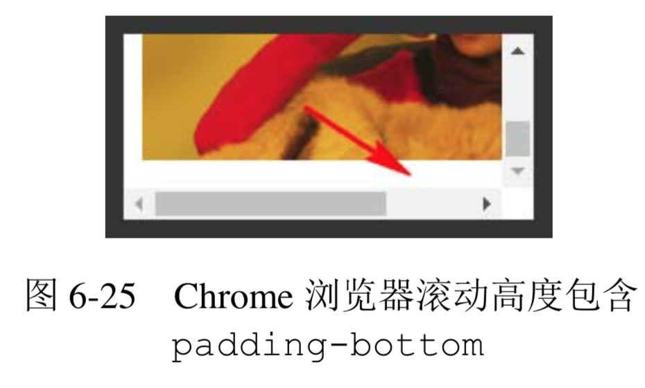
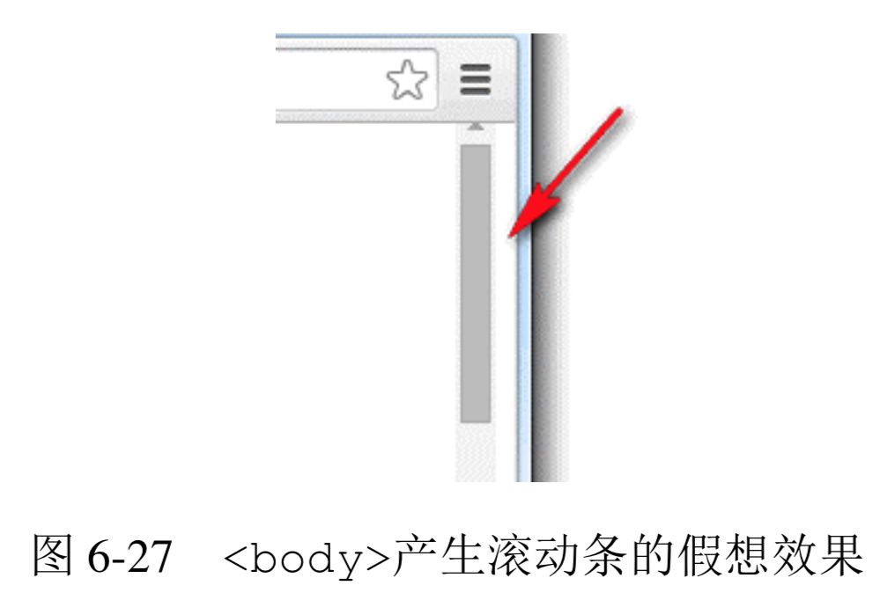
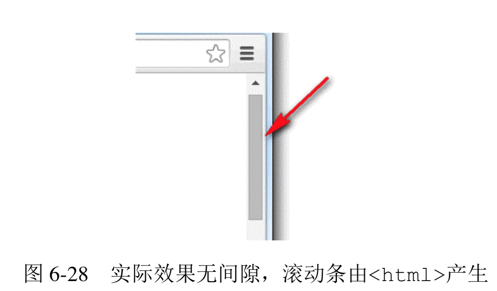

# 最佳结界 overflow
**要想彻底清除浮动的影响，最适合的属性不是 clear 而是 overflow。一般使用 overflow:hidden，利用 BFC 的“结界”特性彻底解决浮动对外部或兄弟元素的影响。虽然有很多其他 CSS 声明也能清除浮动，但基本上都会让元素的宽度表现为“包裹性”，也就是会影响原来的样式布局，而 overflow:hidden 声明不会影响元素原先的流体特性或宽度表现，因此在我看来是最佳“结界”。**

**不过话又说回来，overflow 属性原本的作用指定了块容器元素的内容溢出时是否需要裁剪，也就是“结界”只是其衍生出来的特性，“剪裁”才是其本职工作。**

## overflow 剪裁界线 border box
一个设置了overflow:hidden声明的元素，假设同时存在border属性和padding属性，类似于下面的 CSS 代码:

```css
.box {
    width: 200px; height: 80px;
    padding: 10px;
    border: 10px solid;
    overflow: hidden;
}
```

**则当子元素内容超出容器宽度高度限制的时候，剪裁的边界是 border box 的内边缘，而非 padding box 的内边缘，**

👉 [example](https://demo.cssworld.cn/6/4-1.php)

**如果想实现元素剪裁同时四周留有间隙的效果的话，可以试试使用透明边框，此时内间距 padding 属性是无能为力的。这里举这个实例并不只是为了传授这个小技能，也是为了以此为契机，`深入探讨一下 overflow 属性的一个很经典的不兼容问题，即 Chrome 浏览器下，如果容器可滚动(假设是垂直滚动)，则 padding-bottom 也算在滚动尺寸之内，IE 和 Firefox 浏览器忽略 padding-bottom`。例如，上面的.box，我们把 overflow 属性值改成 auto(亦可点击 实例页面图片)，滚动到底部会发现，Chrome 浏览器下面是有 10 像素的空白的，如图 6-25 所示。 Firefox 和 IE 却没有，Firefox 浏览器呈现的效果如图 6-26 所示。**




曾经有人写邮件和我交流过这个问题，认为 Chrome 浏览器的解析是正确的，IE 和 Firefox 浏览器则是不准确的。在我看来，Chrome 浏览器的解析反而是不准确的，只是 Chrome 浏览器的渲染表现是我们开发所需要的，我们就会偏心地认为 Chrome 是正确的。但是，正如一开始的例子所展示的，overflow的剪裁或者滚动的边界是border box的内边缘，而非padding box 的内边缘，因此，忽略 padding-bottom 才是符合解析规则的渲染行为。

**但是事已至此，争辩到底谁对谁错其实并没有多大的意义，重要的是我们知道了这种不兼容性，所以我们在实际项目开发的时候，要尽量避免滚动容器设置 padding-bottom 值，除了样式表现不一致外，还会导致scrollHeight 值不一样，这往往会给开发带来难以察觉的麻烦，需要引起注意。**

## 了解 overflow-x 和 overflow-y
自 IE8 以上版本的浏览器开始，overflow 属性家族增加了两个属性，就是这里的 overflow-x 和 overflow-y，分别表示单独控制水平或垂直方向上的剪裁规则。

**支持的属性值和 overflow 属性一模一样。**
+ visible:默认值。
+ hidden:剪裁。
+ scroll:滚动条区域一直在。
+ auto:不足以滚动时没有滚动条，可以滚动时滚动条出现。

**这种相似性很容易让大家产生一个误区，认为只要 overflow-x 和 overflow-y 设置了上面的属性值，就一定会是这样的表现，实际上 overflow-x 和 overflow-y 的表现规则要比看上去复杂些:如果 overflow-x 和 overflow-y 属性中的一个值设置为 visible 而另外一个设置为 scroll、auto 或 hidden，则 visible 的样式表现会如同 auto。也就是说，除非 overflow-x 和 overflow-y 的属性值都是 visible，否则 visible 会当成 auto 来解析。换句话说，永远不可能实现一个方向溢出剪裁或滚动，另一方向内容溢出显示的效果。**

因此，下面 CSS 代码中的 overflow-y:auto 是多余的:

```css
html {
    overflow-x: hidden; 
    overflow-y: auto; /* 多余 */
}
```

但是，scroll、auto 和 hidden 这 3 个属性值是可以共存的。

## overflow 与滚动条
**HTML 中有两个标签是默认可以产生滚动条的，一个是根元素html，另一个是文本域textarea。之所以可以出现滚动条，是因为这两个标签默认的 overflow 属性值不是 visible，从 IE8 浏览器开始，都使用 auto 作为默认的属性值。这也就意味着，从 IE8 浏览器开始，默认状态下是没有滚动栏的，尺寸溢出才会出现，对于 IE7 浏览器，其样式表现就好像设置了 overflow-y:scroll 一般。**

关于浏览器的滚动条，有以下几个小而美的结论。
+ **在 PC 端，无论是什么浏览器，默认滚动条均来自html，而不是body标签。验证很简单，新建一个空白页面，此时body标签的默认 margin 值是.5em，如果滚动条是由body标签产生的，那么效果应该如图 6-27 所示这般边缘留有间隙。但是最后实现结果却是 图 6-28 所示的这样没有间隙。**

    

    

    所以，如果我们想要去除页面默认滚动条，只需要:

    ```css
    html { overflow: hidden; }
    ```

    而没必要把body也拉下水:

    ```css
    html, body { overflow: hidden; }
    ```

    **注意，上述规则只对 PC 端有效，对于移动端并不一定适用。例如，在 PC 端，对html标签设置overflow:hidden可以隐藏滚动条禁止滚动，但是在移动端基本上无效。在PC端，窗体滚动高度可以使用 document.documentElement.scrollTop 获取，但是在移动端，可能就要使用document.body.scrollTop 获取。**
+ **滚动条会占用容器的可用宽度或高度。假设一个元素的宽度是 400px，CSS 代码如下:**
    ```css
    .box {
        width: 400px; 
        height: 100px;
        overflow: auto;
    }
    ```

    **当子元素高度超过 100px 出现滚动条的时候，子元素可用的实际宽度实际上要小于 400px，因为滚动条(准确地说应该是滚动栏)占据了一定的宽度。当然这还要看操作系统，比方说在移动端就不会有这样的问题，因为移动端的屏幕尺寸本身就有限，滚动条一般都是悬浮模式，不会占据可用宽度，但是在 PC 端，尤其 Windows 操作系统下，几乎所有浏览器的滚动栏都会占据宽度，而且这个宽度大小是固定的。我通过在Windows 7系统下的测试和对比发现，IE7及以上版本IE、Chrome、Firefox 浏览器滚动栏所占据的宽度均是 17px，注意，很精准的是 17px，我不知道网上那些误人子弟的 20px、14px 是从哪里来的。当然，随着以后操作系统的升级，滚动栏的宽度发生变化也是有可能的。**

    要知道自己浏览器的滚动栏宽度是多少其实很简单，代码如下:

    ```html
    <style>
    .box { width: 400px; overflow: scroll; }
    </style>
    <div class="box">
      <div id="in" class="in"></div>
    </div>
    <script>
    console.log(400 - document.getElementById("in").clientWidth);
    </script>
    ```

    这种滚动栏占据宽度的特性有时候会给我们的布局带来不小的麻烦。比方说，布局直接错位，如宽度设定死的浮动布局;又或者布局不对齐，如我们希望实现一个表格头固定、表格主体可以滚动的效果，常见的实现方法是使用双table，表格头是一个独立的table，主体也是一个独立的table元素，放在一个 overflow:auto 的div元素中，这种实现，如果滚动条不出现还好，两个表格的表格列可以完美对齐，但是一旦滚动条出现，主题表格可用宽度被压缩，表格列往往就无法完美对齐了。

    常用的解决方法有下面两种:一种是table元素使用固定的宽度值，但是距离右侧留有 17px 的间隙，这样即使滚动条出现，也不会产生任何的宽度影响;另一种就是表格的最后一列不设定宽度(文字最好左对齐)，前面每一列都定死宽度，这样最后一列就是自适应结构，就算滚动条出现，也只是自身有一些宽度变小，对整体对齐并无多大影响。

    **然而，滚动栏占据宽度的特性最大的问题就是页面加载的时候水平居中的布局可能会产生晃动，因为窗体默认是没有滚动条的，而 HTML 内容是自上而下加载的，就会发生一开始没有滚动条，后来突然出现滚动条的情况，此时页面的可用宽度发生变化，水平居中重新计算，导致页面发生晃动，这个体验是非常不好的。比较简单的做法是设置如下 CSS:**

    ```css
    html {
      overflow-y: scroll;
    }
    ```

    如果页面注定会很高，这种做法也是可以接受的，但是如果是 404 页面这种不足一屏高度的页面，右侧也依然有个滚动栏，那就有种回到解放前的感觉了。

    这里分享一个可以让页面滚动条不发生晃动的小技巧，即使用如下 CSS 代码:

    ```css
    html {
        overflow-y: scroll; /* for IE8 */
    }
    :root {
        overflow-y: auto;
        overflow-x: hidden;
    }
    :root body {
        position: absolute;
    }
    body {
        width: 100vw;
        overflow: hidden;
    }
    ```

    基本上药到病除，而且后遗症非常少，大家不妨试试!

滚动条是可以自定义的。因为 IE 浏览器的自定义效果实在是比原生的还要难看，就不浪费 大家时间了，就此打住。

倒是支持-webkit-前缀的浏览器可以说说。例如，对于 Chrome 浏览器:
+ **整体部分，::-webkit-scrollbar;**
+ **两端按钮，::-webkit-scrollbar-button;**
+ **外层轨道，::-webkit-scrollbar-track;**
+ **内层轨道，::-webkit-scrollbar-track-piece;**
+ **滚动滑块，::-webkit-scrollbar-thumb;**
+ **边角，::-webkit-scrollbar-corner。**

但是我们平时开发中只用下面 3 个属性:

```css
::-webkit-scrollbar { 
    /* 血槽宽度 */ 
    width: 8px; 
    height: 8px;
}
::-webkit-scrollbar-thumb { 
  /* 拖动条 */
  background-color: rgba(0,0,0,.3);
  border-radius: 6px;
}
::-webkit-scrollbar-track {
  background-color: #ddd;
  border-radius: 6px;
}
```

在目标浏览器下的滚动条效果就会如图 6-29 所示这般。

## 依赖 overflow 的样式表现