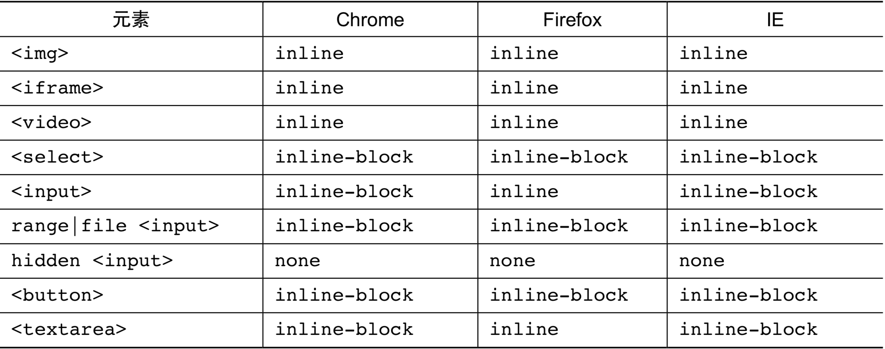
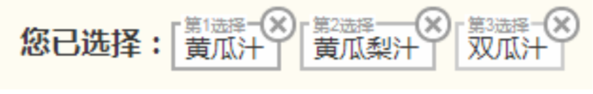

- [深入理解content](#%E6%B7%B1%E5%85%A5%E7%90%86%E8%A7%A3content)
  - [content与替换元素](#content%E4%B8%8E%E6%9B%BF%E6%8D%A2%E5%85%83%E7%B4%A0)
    - [什么是替换元素](#%E4%BB%80%E4%B9%88%E6%98%AF%E6%9B%BF%E6%8D%A2%E5%85%83%E7%B4%A0)
    - [替换元素的默认display值](#%E6%9B%BF%E6%8D%A2%E5%85%83%E7%B4%A0%E7%9A%84%E9%BB%98%E8%AE%A4display%E5%80%BC)
    - [替换元素的尺寸计算规则](#%E6%9B%BF%E6%8D%A2%E5%85%83%E7%B4%A0%E7%9A%84%E5%B0%BA%E5%AF%B8%E8%AE%A1%E7%AE%97%E8%A7%84%E5%88%99)
    - [替换元素和非替换元素的距离有多远](#%E6%9B%BF%E6%8D%A2%E5%85%83%E7%B4%A0%E5%92%8C%E9%9D%9E%E6%9B%BF%E6%8D%A2%E5%85%83%E7%B4%A0%E7%9A%84%E8%B7%9D%E7%A6%BB%E6%9C%89%E5%A4%9A%E8%BF%9C)
      - [替换元素和非替换元素之间只隔了一个src属性](#%E6%9B%BF%E6%8D%A2%E5%85%83%E7%B4%A0%E5%92%8C%E9%9D%9E%E6%9B%BF%E6%8D%A2%E5%85%83%E7%B4%A0%E4%B9%8B%E9%97%B4%E5%8F%AA%E9%9A%94%E4%BA%86%E4%B8%80%E4%B8%AAsrc%E5%B1%9E%E6%80%A7)
      - [替换元素和非替换元素之间只隔了一个 CSS content 属性](#%E6%9B%BF%E6%8D%A2%E5%85%83%E7%B4%A0%E5%92%8C%E9%9D%9E%E6%9B%BF%E6%8D%A2%E5%85%83%E7%B4%A0%E4%B9%8B%E9%97%B4%E5%8F%AA%E9%9A%94%E4%BA%86%E4%B8%80%E4%B8%AA-css-content-%E5%B1%9E%E6%80%A7)
    - [content 与替换元素关系剖析](#content-%E4%B8%8E%E6%9B%BF%E6%8D%A2%E5%85%83%E7%B4%A0%E5%85%B3%E7%B3%BB%E5%89%96%E6%9E%90)
  - [content 内容生成技术](#content-%E5%86%85%E5%AE%B9%E7%94%9F%E6%88%90%E6%8A%80%E6%9C%AF)
    - [content 辅助元素生成](#content-%E8%BE%85%E5%8A%A9%E5%85%83%E7%B4%A0%E7%94%9F%E6%88%90)
    - [content 字符内容生成](#content-%E5%AD%97%E7%AC%A6%E5%86%85%E5%AE%B9%E7%94%9F%E6%88%90)
    - [content 图片生成](#content-%E5%9B%BE%E7%89%87%E7%94%9F%E6%88%90)
    - [了解 content 开启闭合符号生成](#%E4%BA%86%E8%A7%A3-content-%E5%BC%80%E5%90%AF%E9%97%AD%E5%90%88%E7%AC%A6%E5%8F%B7%E7%94%9F%E6%88%90)
    - [content attr属性值内容生成](#content-attr%E5%B1%9E%E6%80%A7%E5%80%BC%E5%86%85%E5%AE%B9%E7%94%9F%E6%88%90)
    - [深入理解 content 计数器](#%E6%B7%B1%E5%85%A5%E7%90%86%E8%A7%A3-content-%E8%AE%A1%E6%95%B0%E5%99%A8)
      - [属性 counter-reset](#%E5%B1%9E%E6%80%A7-counter-reset)
      - [属性 counter-increment](#%E5%B1%9E%E6%80%A7-counter-increment)

# 深入理解content

## content与替换元素

### 什么是替换元素
替换元素（replaced element）可以说是CSS世界中的另外一个派系

根据“外在盒子”是内联还是块级我们可以把元素分为内联元素和块级元素，而根据是否具有可替换内容，我们可以把元素分为替换元素和非替换元素。

那什么是替换元素呢？

替换元素，顾名思义，内容可以被替换，举个例子

```html

```

如果我们把上面的1.jpg换成2.jpg，是不是图片就会替换了？

**这种通过修改某个属性值呈现的内容就可以被替换的元素称为“替换元素”。因此，img、object、video、iframe或者表单元素textarea和input都是经典的替换元素**

替换元素除了内容可以替换这一项特性以外，还有以下一些特性
+ **内容的外观不受页面上的CSS的影响。用专业的话讲就是在样式表现在CSS作用域之外**
+ **有自己的尺寸。在web中，很多替换元素在没有明确尺寸设定的情况下，其默认的尺寸（不包括边框）是300像素*150像素，如video、iframe或者canvas等，也有少部分替换元素为0像素，如img图片，而表单元素的替换元素的尺寸则和浏览器有关，没有明显的规律**
+ **在很多CSS属性上有一套自己的规则，比较具有代表性的就是vertical-align属性，对于替换元素和非替换元素，vertical-align属性值的解释是不一样的。比方说vertical-align的默认值的baseline，很简单的属性值，基线之意，被定义为字符X的下边缘。但是到了替换元素那里就不适用了。为什么呢？因为替换元素的内容往往不可以包含有字符X，于是替换元素的基线就被硬生生定义成了元素的下边缘**

下面提个简单的问题：下拉框select是不是替换元素？答案：是的。首先，内容可替换，例如设置multiple属性，下拉直接变成了展开的直选多选模式

### 替换元素的默认display值
所有的替换元素都是内联水平元素，也就是替换元素和替换元素、替换元素和文字都是可以在一行显示的。但是，替换元素默认的 display 值却是不一样的



替换元素有很多表现规则和非替换元素不一样，其中之一是宽度和高度的尺寸计算规则，简单描述一下就是，替换元素的 display 是 inline、block 和 inline-block 中的任意一个，其尺寸计算规则都是一样的

### 替换元素的尺寸计算规则
+ **固有尺寸指的是替换内容原本的尺寸。** 例如，图片、视频作为一个独立文件存在的时候，都是有着自己的宽度和高度的。这个宽度和高度的大小就是这里的“固有尺寸”。对于表单类替换元素，“固有尺寸”可以理解为“不加修饰的默认尺寸”。比方说，你在空白页面写上 input，此时的尺寸就可以看成是input元素的“固有尺寸”。这就是输入框、下拉框这些表单元素默认的 font-size/padding/margin 等属性全部使用 px 作为单位的原因，因为这样可以保证这些元素的“固有尺寸”是固定大小，不会受外界 CSS 的影响。
+ **HTML 尺寸这个概念略微抽象，“HTML 尺寸”只能通过
HTML 原生属性改变，这些 HTML 原生属性包括img的 width 和 height 属性、input 的 size 属性、textarea的 cols 和 rows 属性等。**
  ```html
  
  <input type="file" size="30">
  <textarea cols="20" rows="5></textarea>
  ```

+ **CSS 尺寸特指可以通过 CSS 的 width 和 height 或者 max-width/min-width 和max-height/min-height 设置的尺寸，对应盒尺寸中的 content box。**
  + 如果没有 CSS 尺寸和 HTML 尺寸，则使用固有尺寸作为最终的宽高。图片比如是256像素 * 192像素，那就是256像素 * 192像素
  + 如果没有 CSS 尺寸，则使用 HTML 尺寸作为最终的宽高
    ```html
    
    ```
    通过 HTML 属性 width 和 height 限定了图片的 HTML 尺寸，因此，最终图片 所呈现的宽高就是 128 像素×96 像素
  + 如果有 CSS 尺寸，则最终尺寸由 CSS 属性决定
    ```html
    <style>
        img { width: 200px; height: 150px; }
    </style>
    
    ```
    此时固有尺寸、HTML 尺寸和 CSS 尺寸同时存在，起作用的是 CSS 属性限定的尺寸， 因此，最终图片所呈现的宽高就是 200 像素×150 像素。
  + 如果“固有尺寸”含有固有的宽高比例，同时仅设置了宽度或仅设置了高度，则元素依然按照固有的宽高比例显示
    ```html
    <style>
        img { width: 200px; }
    </style>
    
    ```
    **虽然 CSS 中仅仅设置了 width，但图片这种替换元素的资源本身具有特定的宽高比例， 因此，height 也会等比例计算。所以，最终图片所呈现的宽高就是 200 像素×150 像素(150 = 200 ×192 / 256)**
  + 如果上面的条件都不符合，则最终宽度表现为300像素，高度为150像素，宽高比2:1。
    ```html
    <video></video>
    ```
  + 内联替换元素和块级替换元素使用上面同一套尺寸计算规则
    ```html
    <style>
        img { display: block; }
    </style>
    
    ```
    **虽然图片此时变成了块级，但是尺寸规则还是和内联状态下一致，因此，图片呈现的 宽高还是 256 像素×192 像素。这也是为何图片以及其他表单类替换元素设置 display:block 宽度却没有 100%容器的原因**。

    > 如果单看规则，似乎面面俱到，无懈可击。但是，实际上，意外还是发生了，这个意外就
    是最常用的img元素。如果任何尺寸都没有，则元素应该是 300 像素×150 像素，这条规则 video、canvas和iframe这些元素都符合，唯独图片例外

    ```html
      
    ```

    这段HTML表示一个没有替换内容也没有尺寸设定的裸露的img元素。按照规范尺寸应该是 300 像素× 150 像素，结果不仅不是这个尺寸，而且各个浏览器下 的尺寸还不一样

    其实尺寸不一样不打紧，因为我们平时使用都会设置尺寸，不可能像这样放任不管，但是，如果表现型也不一样，那就麻烦了。我们从一个常用功能的前端小技巧说起

    **Web开发的时候，为了提高加载性能以及节约带宽费用，首屏以下的图片就会通过滚屏加载的方式异步加载，然后，这个即将被异步加载的图片为了布局稳健、体验良好，往往会使用一张透明的图片占位，例如**

    ```html
      
    ```

    实际上，这个透明的占位图片也是多余的资源，我们直接:

    ```html
      
    ```

    然后配合下面的CSS可以实现一样的效果

    ```css
      img { visibility: hidden; }
      img[src] { visibility: visible; }
    ```

    然后配合下面的CSS可以实现一样的效果

    > 注意，这里的img直接没有src属性，再强调一遍，是直接没有，不是 src=""，src="" 在很多浏览器下依然会有请求，而且请求的是当前页面数据。当图片的 src 属性缺省的时候，图片不会有任何请求，是最高效的实现方式

    > 理论再次无懈可击，然而，正如之前提到的，“似乎 Firefox 浏览器在替换元素的内联表现 这一块还是有些自己的想法的”。对于 Firefox 浏览器，src缺省的img不是替换元素，而是一个普通的内联元素，所以使用的就不是替换元素的尺寸规则，而是类似span的内联元素尺寸规则，宽高会无效

    ```html
      <style>
          img { width: 200px; height: 150px; }
      </style>
      
    ```

    在 IE 和 Chrome 浏览器下都按照预期图片尺寸 200 像素×150 像素，但是，Firefox 浏览器却纹丝不动，依然是默认图片尺寸，这就比较尴尬了，好在要修复此兼容性问题很简单，只需直接 设置

    ```css
      img { display: inline-block; }
    ```

    就理解为span标签设置 display:inline-block 后可以设置宽高就可以了。**这个针对 Firefox 浏览器的修复既有效，又对其他浏览器的图片表现没有任何影响，因此，建议在 CSS 重置的时候加上下面这行:**

    ```css
      img { display: inline-block; }
    ```

    > `CSS 世界中的替换元素的固有尺寸有一个很重要的特性，那就是"我们是无法改变这个替换元素内容的固有尺寸的"`

    我们平常打交道的图片的尺寸规则是“默认的宽高设置会覆盖固有尺寸”，因此，我们可能会误认为我们的宽高设置修改的是图片的固有尺寸，实际上并不是。要证明这一观点，我们可以借助非替换元素的::before 或::after 伪元素

    ```html
      div::before {
          content: url(1.jpg);
          display: block;
          width: 200px;
          height: 200px;
      }
    ```

    此时::before 伪元素呈现的图片的宽高是多少?

    很多人会按照经验认为是 200 像素×200 像素，非也!实际上，这里的图片尺寸是 1.jpg
    这张图片的原始尺寸大小 256 像素×192 像素，width 和 height 属性都被直接无视了。这就是我上面所说的，在 CSS 世界中，图片资源的固有尺寸是无法改变的

    👉 [example](https://demo.cssworld.cn/4/1-1.php)

    可以看到图片是按照原始尺寸展示的，并不是 CSS 设定的 200 像素×200 像素，200 像素仅仅是设定了 content box 尺寸，对 content 生成图片资源并没有任何影响

    我们再回到img元素，既然图片的固定尺寸不受 CSS 宽高控制，那为何我们设定 width和 height 会影响图片的尺寸呢?

    **我就不卖关子了，那是因为图片中的 content 替换内容默认的适配方式是填充(fill)，也就是外部设定的尺寸多大，我就填满、跟着一样大。换句话说，尺寸变化的本质并不是改变固有尺寸，而是采用了填充作为适配 HTML 尺寸和 CSS 尺寸的方式，且在 CSS3 之前，此适配方式是不能修改的**

    在 CSS3 新世界中，img和其他一些替换元素的替换内容的适配方式可以通过 object-fit 属性修改了。例如，img元素的默认声明是 object-fit:fill，如果我们设置 object-fit:none，则我们图片的尺寸就完全不受控制，表现会和非替换元素::before 生成的图片尺寸类似;如果我们设置 object-fit:contain，则图片会以保持比例图片，尽可能利用 HTML 尺寸但又不会超出的方式显示，有些类似于 background-size:contain 的呈现原理

    👉 [example](https://www.zhangxinxu.com/wordpress/2015/03/css3-object-position-object-fit/)

### 替换元素和非替换元素的距离有多远
图片可以说是最典型最常用的替换元素了，因此，本节依然以图片为代表来深入替换元素的“内心世界”。

#### 替换元素和非替换元素之间只隔了一个src属性
由于我们平时使用图片肯定都会使用 src 属性，所以难免会思维定式，认为img等同于图片，实际上完全不是的。如果我们把 src 属性去掉，img其实就是一个和span类似的普通的内联标签，也就是成了一个非替换元素。

非常有想法的 Firefox 浏览器很好地证实了这一点。例如，对于以下 CSS 和 HTML 代码，最后图片宽度是多少?

```html
<style>
img {
      display: block;
      outline: 1px solid;
}
</style>

```

按照替换元素的尺寸规则，宽度应该是 0，但实际上，在 Firefox 浏览器下，最终的宽度是 100%自适应父容器的可用宽度的。其表现和普通的span类似，已经完全不是替换元素了。 大家应该都知道，span标签设置 width 和 height 是无效的，所以大家应该明白为何 Firefox 浏览器下img设置 width 和 height 不起作用了吧。

**Firefox 浏览器的案例很好地证明了“如果图片没有替换内容，图片就是一个普通的内联标签”。**

**Chrome 浏览器其实也有类似的表现，只是需要特定的条件触发而已，这个触发条件就是需要有不为空的 alt 属性值。** 例如:

```html

```

此时，Chrome 这个img宽度也是 100%父容器。

但是，如果真是这样，那为何 IE 浏览器没有 src 属性还是完全的替换元素表现呢?原因就在于 IE 浏览器中有个默认的占位替换内容，当 src 属性缺失的时候，会使用这个默认的占位内容，这也是 IE 浏览器下默认img尺寸是 28×30 而不像 Chrome 浏览器那样为 0×0 的原因所在。在高版本的 IE 浏览器下，这个占位的替换内容似乎做了透明处理，但是，在原生的 IE8 浏览器下，这个占位内容却全然暴露了

另外一个可以很好证明“替换元素和非替换元素区别就在于 src 属性”的点是“基于伪元素的图片内容生成技术”。用一句更易懂的话描述就是，我们可以对img元素使用::before 和::after 伪元素进行内容生成以及样式构建，但是这种方法支持是有限制的。首先是兼容性问题，根据我的测试，目前 Chrome 和 Firefox 等浏览器支持，但 IE 浏览器不支持;其次，要想让 Chrome 或 Firefox 等浏览器生效，还有其他一些需要注意的 技术点

+ 不能有 src 属性(证明观点的关键所在);
+ 不能使用 content 属性生成图片(针对 Chrome);
+ 需要有 alt 属性并有值(针对 Chrome);
+ **Firefox 下::before 伪元素的 content 值会被无视，::after 无此问题，应该与 Firefox 自己占用了::before 伪元素的 content 属性有关。**

虽然“基于伪元素的图片内容生成技术”并不属于实用技术，但是，实际网页开发的时候， 会有一些场景必须使用img标签，此时，这些隐蔽的技术往往就会有神迹表现。我这里举个小例子抛砖引玉一下，上一小节提到使用缺省 src 的img元素实现滚屏加载效果，但是，就有可能存在这样一个体验问题:如果我们的 JavaScript 加载比较慢，我们的页面就很有可能出现一块一块白色的图片区域，纯白色的，没有任何信息，用户完全不知道这里的内容是什么。 虽然 alt 属性可以提供描述信息，但由于视觉效果不好，被隐藏掉了。此时，我们总不免畅想: 要是在图片还没加载时就把 alt 信息呈现出来该多好啊。

恭喜你可以美梦成真!办法就是使用这里的“基于伪元素的图片内容生成技术”。

👉 [example](https://demo.cssworld.cn/4/1-2.php)

此时，图片 src 没有，因此，::before 和::after 可以生效，我们就可以把 alt 属性值通过 content 属性呈现出来， 核心 CSS 代码如下:

```css
img::after {
    /* 黑色alt信息条 */
    content: attr(alt);
    position: absolute;
    left: 0; bottom: 0;
    width: 100%;
    line-height: 30px;
    background-color: rgba(0,0,0,.5);
    color: white;
    font-size: 14px;
    transform: translateY(100%);
    /* 来点过渡动画效果 */
    transition: transform .2s;
    visibility: visible;
}
img:hover::after {
    transform: translateY(0);
}
```

**下面是此技术最有意思的部分。当我们点击按钮给图片添加一个 src 地址时，图片从普通元素变成替换元素，原本都还支持的::before 和::after 此时全部无效，此时再 hover 图 片，是不会有任何信息出现的。于是就非常巧妙地增强了图片还没加载时的信息展示体验。**

#### 替换元素和非替换元素之间只隔了一个 CSS content 属性
替换元素之所以为替换元素，就是因为其内容可替换，而这个内容就是 margin、border、 padding和content这4个盒子中的content box，对应的CSS属性是content，所以，从理论层面讲，content 属性决定了是替换元素还是非替换元素。

理论太虚，我们还是看一些有趣的真实案例吧。在开始之前，我们需要感谢 Chrome 浏览器，Chrome 浏览器的渲染表现帮助我们更好地理解了替换元素。什么表现呢?就是在 Chrome 浏览器下，所有的元素都支持content 属性，而其他浏览器仅在::before/::after 伪元素中才有支持。因此，下面的所有案例，请在 Chrome、Safari、Opera 等浏览器下查看。

前面已经证明了，没有 src 属性的img是非替换元素，但是，如果我们此时使用 content 属性给它生成一张图片呢?

```html
<style>
  img { content: url(1.jpg); }
</style>

```

结果和下面 HTML 的视觉效果一模一样

```html

```

👉 [example](https://demo.cssworld.cn/4/1-3.php)

结果图片都正常显示了，且各种表现都符合替换元素，如尺寸规则，或者不支持::before/ ::after 伪元素等。

另外还有一点很有意思，如果图片原来是有 src 地址的，我们也是可以使用 content 属性把图片内容给置换掉的，于是，我们就能轻松实现 hover 图片变成另外一张图片的效果。例如:

```html
<style>
img:hover {
       content: url(laugh-tear.png);
}
</style>

```

👉 [example](https://demo.cssworld.cn/4/1-4.php)

该实例中， 我们鼠标经过笑脸，笑脸会飙出眼泪，就是通过 CSS 的 content 属性直接替换 img的替换内容实现的。要是放在以前，我们只能借助 background-image 或者两个img元素显隐控制实现。

然后，还有一点有必要说明一下，content 属性改变的仅仅是视觉呈现，当我们以右键或 其他形式保存这张图片的时候，所保存的还是原来 src 对应的图片。

**不仅如此，使用 content 属性，我们还可以让普通标签元素变成替换元素。** 举个例子，官网的标志往往都会使用h1标签，里面会有网站名称和标志图片使用背景图，类似下面的代码:

```html
<h1>《CSS 世界》</h1> 
<style>
h1 {
  width: 180px;
  height: 36px;
  background: url(logo.png); /* 隐藏文字 */
  text-indent: -999px;
}
<style>
```

下面展示一个创新的方法，大家可以在移动端试试。还是一样的 HTML 代码，但是 CSS 代码微调了一下:

```css
h1 {
  content: url(logo.png);
}
```

👉 [example](https://demo.cssworld.cn/4/1-5.php)

**我们简单分析一下:传统 CSS 代码的h1是一个普通元素，因此需要设定尺寸隐藏文字; 但是，后面使content 属性实现，h1分分钟就变成了替换元素，文字自动被替换，同时尺寸规则就是替换元素的尺寸规则，完美适应原始图片大小。**

**此外，虽然视觉上文字被替换了，但是屏幕阅读设备阅读的还是文字内容，搜索引擎 SEO 抓取的还是原始的文本信息，因此，对页面的可访问性等没有任何影响。看起来这是一个完美的文字换图显示方案，但还是有一些局限。前文也说到了，替换元素的固有尺寸是无法设置的， 如今在移动端 retina 屏幕几乎是标配，为了图片显示细腻，往往真实图片尺寸是显示图片尺寸的两倍。于是问题就来了，使用 content 生成图片，我们是无法设置图片的尺寸的，只能迫不得已使用一倍图，然后导致图片看上去有点儿模糊**

所以，要想在移动端使用该技术，建议使用 SVG 矢量图片。例如:

```css
h1 {
  content: url(logo.svg);
}
```

> 好了，最后和标题再呼应下，替换元素和非替换元素的距离有多远?就是 src 或 content 那一点。

### content 与替换元素关系剖析
从前一节大家一定早就看出 content 属性和替换元素之间有着非常微妙的联系了。实际上，在 CSS 世界中，我们把 content 属性生成的对象称为“匿名替换元素”(anonymous replaced element)。 看到没，直接就“替换元素”叫起来了，可见，它们之间的联系并不是微妙，而是赤裸裸

**content 属性生成的内容都是替换元素?没错，就是替换元素!**

也正是这个原因，content 属性生成的内容和普通元素内容才会有很多不同的特性表现。 我这里举几个简单的例子。

+ **我们使用 content 生成的文本是无法选中、无法复制的，好像设置了 user-select:none 声明一般，但是普通元素的文本却可以被轻松选中。同时，content 生成的文本无法被屏幕阅读设备读取，也无法被搜索引擎抓取，因此，千万不要自以为是地把重要的文本信息使用 content 属性生成，因为这对可访问性和 SEO 都很不友好，content 属性只能用来生成一些无关紧要的内容，如装饰性图形或者序号之类;同样，也不要担心原本重要的文字 信息会被 content 替换，替换的仅仅是视觉层。**

  **这里有人可能会反驳:content 内容无法复制也可能是伪元素的原因，而不是替换元素的原 因。要回答这个问题，我们可以将其与同样是替换元素的::first-letter 对比一下。在 IE 和 Firefox 浏览器下，::first-letter 伪元素内容都是可以被选中的，但是::before/::after 内容却无法选中。由此可见，文字无法选中多半是 content 的原因，而非伪元素。**

+ 不能左右:empty 伪类。:empty 是一个 CSS 选择器，当元素里面无内容的时候进行 匹配。例如，下面的 HTML 和 CSS 代码:
  ```html
    <div>有内容</div>
    <div></div>
    <style>
      div { padding: 10px; border: 10px solid #cd0000; }
      div:empty { border-style: dashed; }
    </style>
  ```

  前面一个div是实线边框，而后面的，因为里面无内容，所以就是虚线边框。
  接下来，我们使用 content 属性给div生成一些文字，例如:
  ```css
      div::after { content: "伪元素生成内容"; }
  ```

  结果看上去好像div里面出现了文字内容，实际上，还是当成了:empty

  👉 [example](https://demo.cssworld.cn/4/1-6.php)

+ content 动态生成值无法获取。content 是一个非常强大的 CSS 属性，其中一个强 大之处就是计数器效果，可以自动累加数值

## content 内容生成技术
在实际项目中，content属性几乎都是用在::before/::after这两个伪元素中， 因此，“content 内容生成技术”有时候也称为“::before/::after 伪元素技术”。

提前说明一下，因为本书目标浏览器是 IE8 及以上版本浏览器，而 IE8 浏览器仅支持单冒号的伪元素，所以下面内容代码示意部分全部使用单冒号。

### content 辅助元素生成
此应用的核心点不在于 content 生成的内容，而是伪元素本身。通常，我们会把 content 的属性值设置为空字符串，像这样:

```css
.element:before {
      content: '';
}
```

只要是空字符串就可以，我曾多次见到有人设置为 content:'.'，这是完全没有必要的。

然后，利用其它 CSS 代码来生成辅助元素，或实现图形效果，或实现特定布局。与使用显式的 HTML 标签元素相比，这样做的好处是 HTML 代码会显得更加干净和精简。

图形效果实现跟着设计走，不具有普适性，这里不介绍。重点说说辅助元素在布局中的应用。其中，最常见的应用之一就是清除浮动带来的影响

```css
.clear:after {
  content: '';
  display: table; /* 也可以是'block' */ clear: both;
}
```

**另外一个很具有代表性的应用就是辅助实现“两端对齐”以及“垂直 居中/上边缘/下边缘对齐”效果**

👉 [example](https://demo.cssworld.cn/4/1-7.php)

此实例演示是一 个自动等宽布局且底部对齐的柱状图，默认展示了4项。当我们动态插入更多柱子元素，布局依然智能均分剩余空间，活脱脱一个弹性盒子布局，而且此方法所有浏览器全兼容。

```css
.box {
  width: 256px; height: 256px; /* 两端对齐关键 */
  text-align: justify;
}
.box:before {
    content: "";
    display: inline-block;
    height: 100%;
}
.box:after {
    content: "";
    display: inline-block;
    width: 100%;
}
.bar {
    display: inline-block;
    width: 20px;
}
```

```html
<div class="box"><i class="bar"></i>
  <i class="bar"></i>
  <i class="bar"></i>
  <i class="bar"></i>
</div>
```

**至于实现原理，:before 伪元素用于辅助实现底对齐，:after 伪元素用于辅助实现两端对齐**

这一方法的最大好处是足够兼容，如果想要兼容 IE7 浏览器，直接使用标签元素即可，但这种方法也有不足处，就是 HTML 代码需要注意有些地方不能换行或者空格，有些地方则必须要换行或者有空格，这在多人协作的时候就容易出问题。例如，开发人员喜欢编辑器的 HTML 格式化功能，然后标签自动换行，于是样式就会出现偏差，所以，一定记得在 HTML 代码中写上明确的注释— “这里千万不能换行”，或者类似这种。

### content 字符内容生成
content 字符内容生成就是直接写入字符内容，中英文都可以，比较常见的应用就是配合 @font-face 规则实现图标字体效果。
```html
<style>
@font-face {
font-family: "myico";
src: url("/fonts/4/myico.eot");
src: url("/fonts/4/myico.eot#iefix") format("embedded-opentype"),
        url("/fonts/4/myico.ttf") format("truetype"),
        url("/fonts/4/myico.woff") format("woff");
}
.icon-home:before { 
  font-size: 64px; font-family: myico; content: "家";
}
</style>
<span class="icon-home"></span>
```

此时，页面显示的可能就不是一个“家”字，而是一个图标

👉 [example](https://demo.cssworld.cn/4/1-8.php)

另外一个值得介绍的点就是，除常规字符之外，我们还可以插入 Unicode 字符，比较经典
的就是插入换行符来实现某些布局或者效果
```css
:after {
  content: '\A';
  white-space: pre;
}
```

很多人可能会问:这个'\A'是什么?'\A'其实指的是换行符中的 LF 字符，其 Unicode 编码是 000A，在 CSS 的 content 属性中则直接写作'\A';换行符除了 LF 字符还有 CR 字符， 其 Unicode 编码是 000D，在 CSS 的 content 属性中则直接写作'\D'。CR 字符和 LF 字符分 别指回车(CR)和换行(LF)，content 字符生成强大之处就在于不仅普通字符随便插，Unicode 字符也不在话下。

那它具体有什么作用呢?很显然，作用就是换行。那换行又有什么用呢?确实，很多时候，换行效果看上去没什么特别之处，我在 HTML 中弄个br标签不是照样有一样的效果?但是 content 字符生成在某些场景下真的可以大放异彩，我们不妨看下面这个配合 CSS3 animation 用来实现字符动画效果的例子。

我们动态加载页面内容的时候，经常会使用“正在加载中...”这几个字，基本上，后面的 3 个点都是静态的。静态的问题在于，如果网络不流畅，加载时间比较长，就会给人有假死的 感觉，但是，如果是点点点这种横向的动画效果，用户就会耐心很多，体验也会好很多，用户流失率就会有所下降。没错，我们可以利用这里的'\A'换行特性让“...”这几个字符动起来，
```html
正在加载中<dot>...</dot> 
<style>
dot {
    display: inline-block;
    height: 1em;
    line-height: 1;
    text-align: left;
    vertical-align: -.25em;
    overflow: hidden;
}
dot::before {
    display: block;
    content: '...\A..\A.';
      white-space: pre-wrap;
    animation: dot 3s infinite step-start both;
}
@keyframes dot {
    33% { transform: translateY(-2em); }
    66% { transform: translateY(-1em); }
}
</style>
```

效果即达成，IE6 至 IE9 浏览器下是静态的点点点，支持 animation 动画的浏览器下全部都是打点 loading 动画效果，颜色大小可控，使用非常方便。


动画实现的原理不难理解，插入 3 行内容，分别是 3 个点、2 个点和 1 个点，然后通过 transform 控制垂直位置，依次展示每一行的内容。

### content 图片生成
content 图片生成指的是直接用 url 功能符显示图片
```css
div:before {
  content: url(1.jpg);
}
```

url 功能符中的图片地址不仅可以是常见的 png、jpg 格式，还可以是 ico 图片、svg 文件以及 base64URL 地址，但不支持 CSS3 渐变背景图。

虽然支持的图片格式多种多样，但是实际项目中，content 图片生成用得并不多，主要原因在于图片的尺寸不好控制，我们设置宽高无法改变图片的固有尺寸。所以，伪元素中的图片更多的是使用 background-image 模拟，类似这样:
```css
div:before {
  content: '';
  background: url(1.jpg);
}
```

在我看来 content 图片生成技术的实用性，还不如上一节提到的直接使用 content 属性替换文字为图片的技术，除非这个生成的图片是 base64URL 地址。因为 content 图片和img图片的加载表现是一样的，如果没有尺寸限制，都是尺寸为0，然后忽然图片尺寸一下子出现， 所导致的问题就是页面加载的时候会晃动，影响体验。为了避免这个问题，我们只能限制容器尺寸，那么，既然限制了容器尺寸，为何不使用 background-image 呢?显然更好控制啊? 所以，只有不需要控制尺寸的图片才有使用优势。

base64 图片由于内联在 CSS 文件中，因此直接出现，没有尺寸为 0 的状态，同时无须额外设置 display 属性值为块状，CSS 代码更省。如果还没理解我说的，可以看一个对比例子，就明白什么意思了。

👉 [example](https://demo.cssworld.cn/4/1-10.php)

### 了解 content 开启闭合符号生成

### content attr属性值内容生成
此功能比较常用，我个人用得就比较多，比方说前面一节替换元素那里利用 alt 属性显示
图片描述信息的例子:

```css
img::after {
/* 生成alt信息 */ 
content: attr(alt); 
/* 其他CSS略 */
}
```

除了原生的 HTML 属性，自定义的 HTML 属性也是可以生产的，例如:
```css
.icon:before {
  content: attr(data-title);
}
```

**需要注意的是，attr 功能符中的属性值名称千万不要自以为是地在外面加个引号。不能有引号，否则浏览器会认 为是无效的声明**

### 深入理解 content 计数器
计数器效果可以说是 content 部分的重中之重，因为此功能非常强大、实用，且不具有可替代性，甚至可以实现连 JavaScript 都不好实现的效果。但同样，content 计数器具有一定的深度，大家可以适当放慢节奏。

所谓 CSS 计数器效果，指的是使用 CSS 代码实现随着元素数目增多，数值也跟着变大的效果。举个例子，我曾经在业余时间给同事做过一个点果汁的小系统，由于果汁店经常会有水果因“果品”爆发被竞相购买而缺货的情况，因此，每人可以选择 3 种自由搭配的饮品，以免无货的尴尬。于是，就有了第 1 选择、第 2 选择和第 3 选择



图中的灰色小字中的 1、2、3 就是使用 CSS 计数器生成的，这个可以说是最最基本、 最最简单的计数器应用了。实际上，计数器能够实现的效果非常强大。但是，万丈高楼平地起，在介绍高级应用之前，我们一定要先牢牢掌握与计数器相关的基础知识。

CSS 计数就跟我们军训报数一样。其中有这么几个关键点。
+ 班级命名:有个称呼，如生信 4 班，就知道谁是谁了。
+ 报数规则:1、2、3、4 递增报数，还是 1、2、1、2 报数，让班级的人知道。
+ 开始报数:不发口令，大眼瞪小眼，会乱了秩序。

巧的是，以上3个关键点正好对应CSS计数器的两个属性(counter-reset和counter-increment)和一个方法(counter()/counters())，下面依次讲解。

#### 属性 counter-reset
顾名思义，就是“计数器-重置”的意思。其实就是“班级命名”，主要作用就是给计数器起个名字。如果可能，顺便告诉下从哪个数字开始计数。默认是 0， 注意，默认是 0 而不是 1。可能有人会疑惑，网上的各种例子默认显示的第 1 个数字不都是 1 吗?那是因为受了 counter-increment 普照的影响，后面会详细讲解。

```css
/* 计数器名称是'wangxiaoer', 并且默认起始值是 2 */
.xxx { counter-reset: wangxiaoer 2; }
```

👉 [example](https://demo.cssworld.cn/4/1-11.php)

counter-reset 的计数重置可以是负数，如-2，也可以写成小数，如 2.99，不过，IE 和 Firefox 对此都不识别，认为是不合法数值，直接无视，当作默认值 0 来处理;Chrome 不嫌贫嫉富，任何小数都是向下取整，如 2.99 当成 2 处理，于是王小二还是那个王小二。

到此为止?当然不是!counter-reset 还有一手，就是多个计数器同时命名。例如，王小二和王小三同时登台:

```css
 .xxx { counter-reset: wangxiaoer 2 wangxiaosan 3; }
```

直接空格分隔，而不是使用逗号分隔。

👉 [example](https://demo.cssworld.cn/4/1-12.php)

另外，counter-reset 还可以设置为 none 和 inherit。取消重置以及继承重置。这里 就不展开了。

#### 属性 counter-increment
顾名思义，就是“计数器递增”的意思。值为 counter-reset 的 1 个或多个关键字，后面可以跟随数字，表示每次计数的变化值。如果省略，则使用 默认变化值 1(方便起见，下面都使用默认值做说明)。

CSS 的计数器的计数是有一套规则的，我将之形象地称为“普照规则”。具体来讲就是:普照源(counter-reset)唯一，每普照(counter-increment)一次，普照源增加一次计数值。

于是，我们就可以解释上面提到的“默认值是 0”的问题了。通常 CSS 计数器应用的时候，我们都会使用 counter-increment，肯定要用这个，否则怎么递增呢!而且一般都是一次普 照，正好加 1，于是，第一个计数的值就是 1(0+1=1)!

👉 [example](https://demo.cssworld.cn/4/1-13.php)

这里 counter-increment 普照了p标签，counter-reset 值增加，默认递增 1，于是计数从设置的初始值 2 变成了 3，wangxiaoer 就是这里的计数器，自然伪元素 content 值 counter(wangxiaoer)就是 3。

当然，它也可以普照自身，也就是 counter-increment 直接设置在伪元素上:

```css
.counter {
  counter-reset: wangxiaoer 2;
}
.counter:before {
  content: counter(wangxiaoer);
  counter-increment: wangxiaoer;
}
```

依然是 1 次普照，依旧全局的计数器加 1，所以显示的数值还是 3，和上面的例子一样。 趁热打铁，如果父元素和子元素都被 counter-increment 普照 1 次，结果会如何呢? 很简单，父元素 1 次普照，子元素 1 次普照，共 2 次普照，counter-reset 设置的计数器值增加 2 次，计数起始值是 2，于是现实的数字就是 4 啦!

👉 [example](https://demo.cssworld.cn/4/1-14.php)

**总而言之，无论位置在何处，只要有 counter-increment，对应的计数器的值就会变化， counter()只是输出而已!**