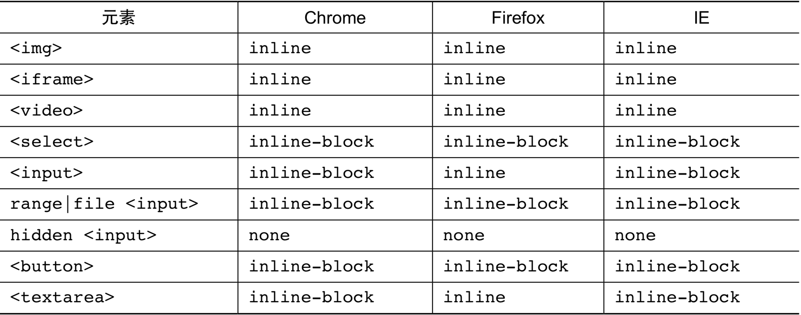

- [深入理解content](#%E6%B7%B1%E5%85%A5%E7%90%86%E8%A7%A3content)
  - [content与替换元素](#content%E4%B8%8E%E6%9B%BF%E6%8D%A2%E5%85%83%E7%B4%A0)
    - [什么是替换元素](#%E4%BB%80%E4%B9%88%E6%98%AF%E6%9B%BF%E6%8D%A2%E5%85%83%E7%B4%A0)
    - [替换元素的默认display值](#%E6%9B%BF%E6%8D%A2%E5%85%83%E7%B4%A0%E7%9A%84%E9%BB%98%E8%AE%A4display%E5%80%BC)
    - [替换元素的尺寸计算规则](#%E6%9B%BF%E6%8D%A2%E5%85%83%E7%B4%A0%E7%9A%84%E5%B0%BA%E5%AF%B8%E8%AE%A1%E7%AE%97%E8%A7%84%E5%88%99)
# 深入理解content

## content与替换元素

### 什么是替换元素
替换元素（replaced element）可以说是CSS世界中的另外一个派系

根据“外在盒子”是内联还是块级我们可以把元素分为内联元素和块级元素，而根据是否具有可替换内容，我们可以把元素分为替换元素和非替换元素。

那什么是替换元素呢？

替换元素，顾名思义，内容可以被替换，举个例子

```html

```

如果我们把上面的1.jpg换成2.jpg，是不是图片就会替换了？

这种通过修改某个属性值呈现的内容就可以被替换的元素称为“替换元素”。因此，img、object、video、iframe或者表单元素textarea和input都是经典的替换元素

替换元素除了内容可以替换这一项特性以外，还有以下一些特性
+ **内容的外观不受页面上的CSS的影响。用专业的话讲就是在样式表现在CSS作用域之外**
+ **有自己的尺寸。在web中，很多替换元素在没有明确尺寸设定的情况下，其默认的尺寸（不包括边框）是300像素*150像素，如video、iframe或者canvas等，也有少部分替换元素为0像素，如img图片，而表单元素的替换元素的尺寸则和浏览器有关，没有明显的规律**
+ **在很多CSS属性上有一套自己的规则，比较具有代表性的就是vertical-align属性，对于替换元素和非替换元素，vertical-align属性值的解释是不一样的。比方说vertical-align的默认值的baseline，很简单的属性值，基线之意，被定义为字符X的下边缘。但是到了替换元素那里就不适用了。为什么呢？因为替换元素的内容往往不可以包含有字符X，于是替换元素的基线就被硬生生定义成了元素的下边缘**

下面提个简单的问题：下拉框select是不是替换元素？答案：是的。首先，内容可替换，例如设置multiple属性，下拉直接变成了展开的直选多选模式

### 替换元素的默认display值
所有的替换元素都是内联水平元素，也就是替换元素和替换元素、替换元素和文字都是可以在一行显示的。但是，替换元素默认的 display 值却是不一样的



替换元素有很多表现规则和非替换元素不一样，其中之一是宽度和高度的尺寸计算规则，简单描述一下就是，替换元素的 display 是 inline、block 和 inline-block 中的任意一个，其尺寸计算规则都是一样的

### 替换元素的尺寸计算规则
+ **固有尺寸指的是替换内容原本的尺寸。例如，图片、视频作为一个独立文件存在的时候，都是有着自己的宽度和高度的。这个宽度和高度的大小就是这里的“固有尺寸”。对于表单类替换元素，“固有尺寸”可以理解为“不加修饰的默认尺寸”。比方说，你在空白页面写上 input，此时的尺寸就可以看成是input元素的“固有尺寸”。这就是输入框、下拉框这 些表单元素默认的 font-size/padding/margin 等属性全部使用 px 作为单位的原因，因为
这样可以保证这些元素的“固有尺寸”是固定大小，不会受外界 CSS 的影响。**
+ **HTML 尺寸这个概念略微抽象，“HTML 尺寸”只能通过
HTML 原生属性改变，这些 HTML 原生属性包括img的 width 和 height 属性、input 的 size 属性、textarea的 cols 和 rows 属性等。**

```html

<input type="file" size="30">
<textarea cols="20" rows="5></textarea>
```

+ **CSS 尺寸特指可以通过 CSS 的 width 和 height 或者 max-width/min-width 和max-height/min-height 设置的尺寸，对应盒尺寸中的 content box。**
  + 如果没有 CSS 尺寸和 HTML 尺寸，则使用固有尺寸作为最终的宽高。图片比如是256像素 * 192像素，那就是256像素 * 192像素
  + 如果没有 CSS 尺寸，则使用 HTML 尺寸作为最终的宽高
    ```html
    
    ```
    通过 HTML 属性 width 和 height 限定了图片的 HTML 尺寸，因此，最终图片 所呈现的宽高就是 128 像素×96 像素
  + 如果有 CSS 尺寸，则最终尺寸由 CSS 属性决定
    ```html
    <style>
        img { width: 200px; height: 150px; }
    </style>
    
    ```
    此时固有尺寸、HTML 尺寸和 CSS 尺寸同时存在，起作用的是 CSS 属性限定的尺寸， 因此，最终图片所呈现的宽高就是 200 像素×150 像素。
  + 如果“固有尺寸”含有固有的宽高比例，同时仅设置了宽度或仅设置了高度，则元素依然按照固有的宽高比例显示
    ```html
    <style>
        img { width: 200px; }
    </style>
    
    ```
    **虽然 CSS 中仅仅设置了 width，但图片这种替换元素的资源本身具有特定的宽高比例， 因此，height 也会等比例计算。所以，最终图片所呈现的宽高就是 200 像素×150 像素(150 = 200 ×192 / 256)**
  + 如果上面的条件都不符合，则最终宽度表现为300像素，高度为150像素，宽高比2:1。
    ```html
    <video></video>
    ```
  + 内联替换元素和块级替换元素使用上面同一套尺寸计算规则
    ```html
    <style>
        img { display: block; }
    </style>
    
    ```
    **虽然图片此时变成了块级，但是尺寸规则还是和内联状态下一致，因此，图片呈现的 宽高还是 256 像素×192 像素。这也是为何图片以及其他表单类替换元素设置 display:block 宽度却没有 100%容器的原因**。

> 如果单看规则，似乎面面俱到，无懈可击。但是，实际上，意外还是发生了，这个意外就
是最常用的img元素。如果任何尺寸都没有，则元素应该是 300 像素×150 像素，这条规则 video、canvas和iframe这些元素都符合，唯独图片例外

```html

```

这段 HTML 表示一个没有替换内容也没有尺寸设定的裸露的img元素。按照规范尺寸应该是 300 像素× 150 像素，结果不仅不是这个尺寸，而且各个浏览器下 的尺寸还不一样

其实尺寸不一样不打紧，因为我们平时使用都会设置尺寸，不可能像这样放任不管，但是， 如果表现型也不一样，那就麻烦了。我们从一个常用功能的前端小技巧说起

**Web 开发的时候，为了提高加载性能以及节约带宽费用，首屏以下的图片就会通过滚屏加载的方式异步加载，然后，这个即将被异步加载的图片为了布局稳健、体验良好，往往会使用 一张透明的图片占位，例如**

```html

```

实际上，这个透明的占位图片也是多余的资源，我们直接:

```html

```

然后配合下面的 CSS 可以实现一样的效果

```css
img { visibility: hidden; }
img[src] { visibility: visible; }
```

然后配合下面的 CSS 可以实现一样的效果

> 注意，这里的img直接没有 src 属性，再强调一遍，是直接没有，不是 src=""，src="" 在很多浏览器下依然会有请求，而且请求的是当前页面数据。当图片的 src 属性缺省的时候， 图片不会有任何请求，是最高效的实现方式

> 理论再次无懈可击，然而，正如之前提到的，“似乎 Firefox 浏览器在替换元素的内联表现 这一块还是有些自己的想法的”。对于 Firefox 浏览器，src 缺省的img不是替换元素，而是 一个普通的内联元素，所以使用的就不是替换元素的尺寸规则，而是类似span的内联元素尺 寸规则，宽高会无效

```html
<style>
    img { width: 200px; height: 150px; }
</style>

```


在 IE 和 Chrome 浏览器下都按照预期图片尺寸 200 像素×150 像素，但是，Firefox 浏览器却纹丝不动，依然是默认图片尺寸，这就比较尴尬了，好在要修复此兼容性问题很简单，只需直接 设置

```css
 img { display: inline-block; }
```

就理解为span标签设置 display:inline-block 后可以设置宽高就可以了。**这个针对 Firefox 浏览器的修复既有效，又对其他浏览器的图片表现没有任何影响，因此，建议在 CSS 重置的时候加上下面这行:**

```css
img { display: inline-block; }
```

> `CSS 世界中的替换元素的固有尺寸有一个很重要的特性，那就是"我们是无法改变这个替换元素内容的固有尺寸的"`

我们平常打交道的图片的尺寸规则是“默认的宽高设置会覆盖固有尺寸”，因此，我们可能会误认为我们的宽高设置修改的是图片的固有尺寸，实际上并不是。要证明这一观点，我们可以借助非替换元素的::before 或::after 伪元素

```html
 div::before {
    content: url(1.jpg);
    display: block;
    width: 200px;
    height: 200px;
}
```

此时::before 伪元素呈现的图片的宽高是多少?

很多人会按照经验认为是 200 像素×200 像素，非也!实际上，这里的图片尺寸是 1.jpg
这张图片的原始尺寸大小 256 像素×192 像素，width 和 height 属性都被直接无视了。这就 是我上面所说的，在 CSS 世界中，图片资源的固有尺寸是无法改变的

👉 [example](https://demo.cssworld.cn/4/1-1.php)

可以看到图片是按照原始尺寸展示的，并不是 CSS 设定的 200 像素×200 像素，200 像素仅仅是设定了 content box 尺寸，对 content 生成图片资源并没有任何影响

我们再回到img元素，既然图片的固定尺寸不受 CSS 宽高控制，那为何我们设定 width和 height 会影响图片的尺寸呢?

我就不卖关子了，那是因为图片中的 content 替换内容默认的适配方式是填充(fill)，
也就是外部设定的尺寸多大，我就填满、跟着一样大。换句话说，尺寸变化的本质并不是改变固有尺寸，而是采用了填充作为适配 HTML 尺寸和 CSS 尺寸的方式，且在 CSS3 之前，此适配方式是不能修改的

在 CSS3 新世界中，img和其他一些替换元素的替换内容的适配方式可以通过 object-fit 属性修改了。例如，img元素的默认声明是 object-fit:fill，如果我们设 置 object-fit:none，则我们图片的尺寸就完全不受控制，表现会和非替换元素::before 生成的图片尺寸类似;如果我们设置 object-fit:contain，则图片会以保持比例图片，尽可能利用 HTML 尺寸但又不会超出的方式显示，有些类似于 background-size:contain 的呈现原理

👉 [example](https://www.zhangxinxu.com/wordpress/2015/03/css3-object-position-object-fit/)