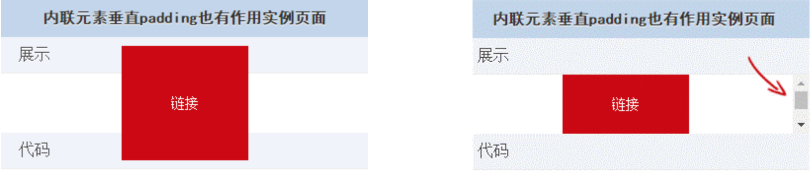
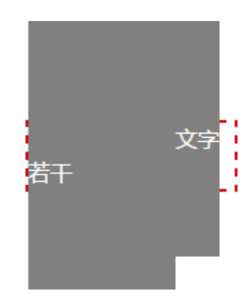
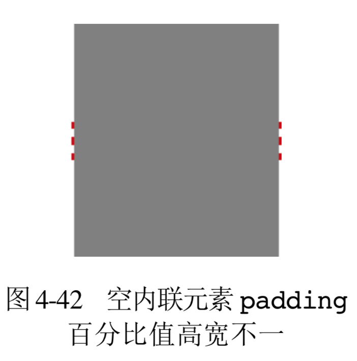

- [温和的 padding 属性](#%E6%B8%A9%E5%92%8C%E7%9A%84-padding-%E5%B1%9E%E6%80%A7)
  - [padding 与元素的尺寸](#padding-%E4%B8%8E%E5%85%83%E7%B4%A0%E7%9A%84%E5%B0%BA%E5%AF%B8)
  - [padding 的百分比值](#padding-%E7%9A%84%E7%99%BE%E5%88%86%E6%AF%94%E5%80%BC)

# 温和的 padding 属性
盒尺寸四大家族元素中，padding 的性格是最温和的。所谓“温和”指的是我们在使用 padding 进行页面开发的时候很少会出现意想不到的情况，这种感觉就好比和一个几乎不会发脾气的人相处。

padding 指盒子的内补间。“补间”这个词比较术语化，我们不妨将其理解为快递盒子内快递商品外包裹的那层起保护作用的海绵。只是在 CSS 中，这个“海绵”默认是透明的。在现实世界中，海绵不会影响盒子的尺寸，但在 CSS 世界中，尺寸规则就有所不同了。

## padding 与元素的尺寸
因为 CSS 中默认的 box-sizing 是 content-box，所以使用 padding 会增加元素的尺寸。例如:
```css
.box {
    width: 80px;
    padding: 20px;
}
```

如果不考虑其他 CSS 干扰，此时.box 元素所占据的宽度就应该是 120 像素(80px +20px×2)，这其实是不符合现实世界的认知的，人们总是习惯把代码世界和现实世界做映射，因此，新人难免会在 padding 的尺寸问题上踩到点坑。这也导致很多人乐此不疲地设置 box-sizing 为 border-box，甚至直接全局重置:
```css
* { box-sizing: border-box; }
```

我个人是不推荐这种做法的，原因见 3.2.4 节。局部使用，尽量采用无宽度以及宽度分离准则实现才是好的解决之道。

很多人可能有这样的误区，认为设置了 box-sizing:border-box，元素尺寸就不会变化。大多数情况下是这样的，但是，如果 padding 值足够大，那么 width 也无能为力了。例如:

```css
.box {
    width: 80px;
    padding: 20px 60px;
    box-sizing: border-box;
}
```
则此时的 width 会无效，最终宽度为 120 像素(60px×2)，而里面的内容则表现为“首选最小宽度”。

**上述尺寸表现是对具有块状特性的元素而言的，对于内联元素(不包括图片等替换元素) 表现则有些许不同。这种不同的表现让很多很多的前端同事有这么一个错误的认识:内联元素 的 padding 只会影响水平方向，不会影响垂直方向。**

**`这种认知是不准确的，内联元素的 padding 在垂直方向同样会影响布局，影响视觉表现`。 只是因为内联元素没有可视宽度和可视高度的说法(clientHeight 和 clientWidth 永远是 0)，垂直方向的行为表现完全受 line-height 和 vertical-align 的影响，视觉上并没有 改变和上一行下一行内容的间距，因此，给我们的感觉就会是垂直 padding 没有起作用。**

如果我们给内联元素加个背景色或者边框，自然就可以看到其尺寸空间确实受 padding 影响了。例如:
```css
a{
    padding: 50px; background-color: #cd0000;
}
```

👉 [example](https://demo.cssworld.cn/4/2-1.php)

**可以明显看到，尺寸虽有效，但是对上下元素的原本布局却没有任何影响，仅仅是垂直方向发生了层叠**

**CSS 中还有很多其他场景或属性会出现这种不影响其他元素布局而是出现层叠效果的现象。比如，relative 元素的定位、盒阴影 box-shadow 以及 outline 等。这些层叠现象虽然看似类似，但实际上是有区别的。其分为两类:一类是纯视觉层叠，不影响外部尺寸;另一类则会影响外部尺寸。box-shadow 以及 outline 属于前者，而这里的 inline 元素的padding 层叠属于后者。区分的方式很简单，如果父容器 overflow:auto，层叠区域超出父容器的时候，没有滚动条出现，则是纯视觉的;如果出现滚动条，则会影响尺寸、影响布局。**



如果上面的示例父元素设置 overflow:auto

**由此可见，内联元素 padding 对视觉层和布局层具有双重影响，所有类似“垂直方向 padding 对内联元素没有作用”的说法显然是不正确的。**

好了，现在知道了内联元素 padding 有用，这对我们做实际 CSS 开发有什么帮助呢?

首先，我们可以在不影响当前布局的情况下，优雅地增加链接或按钮的点击区域大小。比方说， 文章中会有一些文字链接，默认情况下，这些链接的点击区域的高度是受 font-size 字体大小控 制的，和行高没有关系。尤其在 Chrome 等浏览器下，高度仅 1em，这么小的高度，要是在移动端， 我们的手指不一定能够一次点中，可能要戳好多下，此时就有必要增加链接的点击区域大小，但是 前提是不影响当前的内容布局。此时，我们就可以使用 padding 天然实现我们想要的效果，例如:

```css
article a {
    padding: .25em 0;
}
```

**前文多次提到，CSS2.1 的属性就是为了图文显示而设计的，从这一点出发，我们就不难理解为何内联元素的垂直 padding 会是这样的样式表现了，目的就是如上面说的例子这样，增加点击区域同时对现有布局无任何影响;如果我们设置成 inline-block，则行间距等很多麻烦事就会出来。**

当然，CSS 的有趣之处在于我们可以利用其特性表现实现其设计初衷以外的一些效果。例如，这里有个简单的例子，利用内联元素的 padding 实现高度可控的分隔线。传统偷懒的实现方式可能是直接使用“管道符”，如:

    登录 | 注册

但是使用“管道符”的话，因为是字符，所以高度不可控。如果对视觉呈现要求比较高，就需要进行 CSS 图形模拟，其中方法之一就是可以借助内联元素和 padding 属性来实现，CSS 和 HTML 代码如下:

```html
<style>
a + a:before {
    content: "";
    font-size: 0;
    padding: 10px 3px 1px;
    margin-left: 6px;
    border-left: 1px solid gray;
}
</style>
<a href="">登录</a><a href="">注册</a>
```

一个高度不那么高的垂直分隔符就出来了

👉 [example](https://demo.cssworld.cn/4/2-2.php)

**最后，再简单说一个内联元素垂直 padding 的妙用吧!大家应该都知道网页可以通过地址栏的 hash 值和页面 HTML 中 id 值一样的元素发生锚点定位吧?有时候，我们希望定位的元素，如标题距离页面的顶部有一段距离，比方说页面正好有一个 50 像素高的 position:fixed 的导航栏。如果按照浏览器自己的特性，标题就会定位在这个固定导航的下面，这显然不是我们想看到的，那怎么办呢?**

很多人会想到让标题栏设置一个 padding-top:50px，但是，这种影响布局的事情大多数时候只是理论上可行，难道没有什么简单实用的办法吗?这时候，我们不妨试试使用内联元素，块级元素设置 padding-top:50px 会影响布局，但是内联元素不会，于是，事情就简单了。假设下面是原来的实现:

```html
<h3 id="hash">标题</h3>
<style>
h3 {
    line-height: 30px;
    font-size: 14px;
}
</style>
```
则我们可以将其改成:
```html
<h3><span id="hash">标题</span></h3>
<style>
h3 {
    line-height: 30px;
    font-size: 14px;
}
h3 > span {
    padding-top: 58px;
}
</style>
```

这样既不影响原来的布局和定位，同时又把定位位置往下移动了 50 像素，岂不美哉!

虽然这不是十全十美的方法，但是总体性价比还是很不错的。然后，如果我们的h3标签 设置verflow:hidden，则 Chrome 和 Firefox 浏览器定位不受影响，但是 IE 浏览器会定位 在h3标签位置，这个需要注意。

**实际上，对于非替换元素的内联元素，不仅 padding 不会加入行盒高度的计算，margin 和 border 也都是如此，都是不计算高度，但实际上在内联盒周围发生了渲染。**

## padding 的百分比值
关于 padding 的属性值，其实没多少好说的。其一，和 margin 属性不同，padding 属性是不支持负值的;其二，padding 支持百分比值，但是，和 height 等属性的百分比计算规则 有些差异，**差异在于:padding 百分比值无论是水平方向还是垂直方向均是相对于宽度计算的!**

为何这么设计呢?首先绝对和“死循环”无关，相对高度计算其实也没什么问题。我个人猜想，如果垂直 padding 相对于 height 计算，大多数情况下计算值都是 0，跟摆设没什么区别，还不如相对宽度计算，因为 CSS 默认的是水平流，计算值一直会有效，而且我们还可以利用这一特性实现一些有意思的布局效果。也就是面向场景和需求设计，这种设计可以让我们轻松实现自适应的等比例矩形效果。例如，使用

```css
div { padding: 50%; }
```

就可以实现一个正方形，如果这样:

```css
div { padding: 25% 50%; }
```

就得到了一个宽高比为 2:1 的矩形效果。

网页开发的时候经常会有横贯整个屏幕的头图效果，我们通常的做法是定高，如 200 像素高，屏幕小的时候图片两侧内容隐藏。然而，这种实现有一个问题，就是类似笔记本这样的小屏幕，头图高度过高会导致下面主体内容可能一屏都实现不了，但是，如果我们使用 padding 进行等比例控制，则小屏幕下头图高度天然等比例缩小，没有任何 JavaScript，却依然适配良好!例如

```css
.box {
    padding: 10% 50%;
    position: relative;
}
.box > img {
    position: absolute;
    width: 100%; height: 100%;
    left: 0; top: 0;
}
```

就实现了一个宽高比为 5:1 的比例固定的头图效果，上述方法包括 IE6 在内的浏览器都兼容。

👉 [example](https://demo.cssworld.cn/4/2-3.php)

**上面百分比值是应用在具有块状特性的元素上的，如果是内联元素，会有怎样的表现呢?**
+ **同样相对于宽度计算;**
+ **默认的高度和宽度细节有差异;**
+ **padding 会断行。**

我们先来看一下内联元素的 padding 断行，代码如下:

```html
<style>
.box {
    border: 2px dashed #cd0000;
}
span {
    padding: 50%;
    background-color: gray;
}
</style>
<span>内有文字若干</span>
```



效果如图 4-41 所示(截自 Chrome 浏览器)。表现诡异之处有: “内有”两字不见了，“文字”两字居右显示了，背景区域非矩形，背景色宽度和外部容器宽度不一致等。

CSS 的很多现象很难解释，原因在于其表现往往是多个属性多个规则一起生效的结果，并非单一属性作用的结果。例如这里的例子，虽然几乎没有什么实用价值，但是对于我们深入理解内联元素的世界很有帮助。

对于内联元素，其 padding 是会断行的，也就是 padding 区域是跟着内联盒模型中的行框盒子走的，上面的例子由于文字比较多，一行显示不了，于是“若干”两字换到了下一行， 于是，原本的 padding 区域也跟着一起掉下来了，根据后来居上的层叠规则，“内有”两字自 然就正好被覆盖，于是看不见了;同时，规则的矩形区域因为换行，也变成了五条边;至于宽度和外部容器盒子不一样宽，那是自然的，如果没有任何文字内容，那自然宽度正好和容器一致;现在有“内有文字若干”这 6 个字，实际宽度是容器宽度和这 6 个字宽度的总和，换行后 的宽度要想和容器宽度一样，那可真要靠极好的人品了

这么一分析，上面平时很少见到的“诡异”现象就好解释了。


事情还没完，我们再看一个现象，假如是空的内联元素，里面没有任何文字，仅有一个 span标签:

```html
<span>内有文字若干</span>
```

此时，我们会发现居然最终背景区域的宽度和高度是不相等的(见图 4-42)，这不科学啊!padding:50%相对宽度计算，应该出来是个正方形啊，为何高度要高出一截呢?



**原因其实很简单:内联元素的垂直 padding 会让“幽灵空白节点”显现，也就是规范中的“strut”出现。**

**知道了原因，要解决此问题就简单了。由于内联元素默认的高度完全受 font-size 大小控制，因此，我们只要:**

```css
span {
    padding: 50%;
    font-size: 0;
    background-color: gray;
}
```

**此时，“幽灵空白节点”高度变成了 0，高和宽就会一样，和块状元素一样的正方形就出现了。**