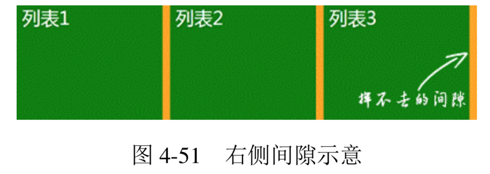
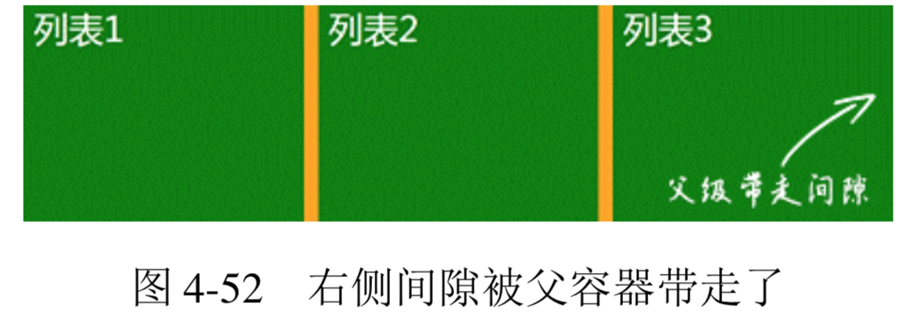
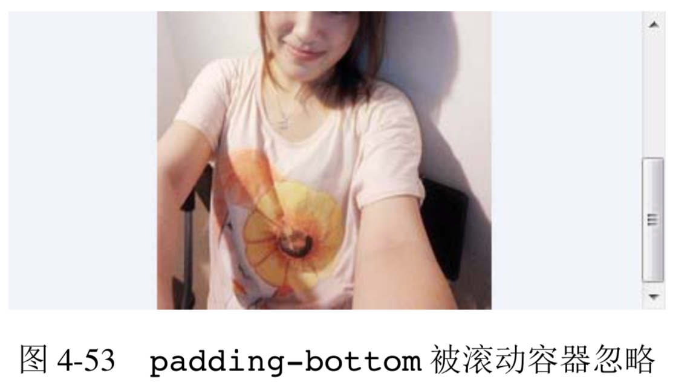
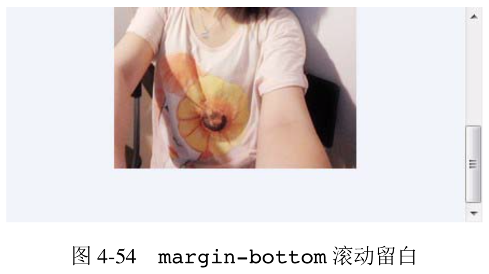
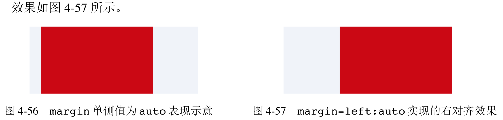

- [激进的margin属性](#%E6%BF%80%E8%BF%9B%E7%9A%84margin%E5%B1%9E%E6%80%A7)
  - [margin 与元素尺寸以及相关布局](#margin-%E4%B8%8E%E5%85%83%E7%B4%A0%E5%B0%BA%E5%AF%B8%E4%BB%A5%E5%8F%8A%E7%9B%B8%E5%85%B3%E5%B8%83%E5%B1%80)
    - [元素尺寸的相关概念](#%E5%85%83%E7%B4%A0%E5%B0%BA%E5%AF%B8%E7%9A%84%E7%9B%B8%E5%85%B3%E6%A6%82%E5%BF%B5)
    - [margin 与元素的内部尺寸](#margin-%E4%B8%8E%E5%85%83%E7%B4%A0%E7%9A%84%E5%86%85%E9%83%A8%E5%B0%BA%E5%AF%B8)
    - [margin 与元素的外部尺寸](#margin-%E4%B8%8E%E5%85%83%E7%B4%A0%E7%9A%84%E5%A4%96%E9%83%A8%E5%B0%BA%E5%AF%B8)
  - [margin 的百分比值](#margin-%E7%9A%84%E7%99%BE%E5%88%86%E6%AF%94%E5%80%BC)
  - [正确看待 CSS 世界里的 margin 合并](#%E6%AD%A3%E7%A1%AE%E7%9C%8B%E5%BE%85-css-%E4%B8%96%E7%95%8C%E9%87%8C%E7%9A%84-margin-%E5%90%88%E5%B9%B6)
    - [什么是 margin 合并](#%E4%BB%80%E4%B9%88%E6%98%AF-margin-%E5%90%88%E5%B9%B6)
    - [margin 合并的 3 种场景](#margin-%E5%90%88%E5%B9%B6%E7%9A%84-3-%E7%A7%8D%E5%9C%BA%E6%99%AF)
    - [margin 合并的计算规则](#margin-%E5%90%88%E5%B9%B6%E7%9A%84%E8%AE%A1%E7%AE%97%E8%A7%84%E5%88%99)
    - [margin 合并的意义](#margin-%E5%90%88%E5%B9%B6%E7%9A%84%E6%84%8F%E4%B9%89)
  - [深入理解 CSS 中的 margin:auto](#%E6%B7%B1%E5%85%A5%E7%90%86%E8%A7%A3-css-%E4%B8%AD%E7%9A%84-marginauto)
  - [margin 无效情形解析](#margin-%E6%97%A0%E6%95%88%E6%83%85%E5%BD%A2%E8%A7%A3%E6%9E%90)

# 激进的margin属性
padding 性格温和，负责内间距;而 margin 则比较激进，负责外间距。虽然都是间距，但是差别相当大，尤其是 margin，特异之处相当多。

## margin 与元素尺寸以及相关布局

### 元素尺寸的相关概念
下面的内容会牵扯到各类包含“尺寸”字样的名词，为了大家在阅读的时候不产生困扰，这里专门把相关概念梳理一下。

我们这里的各类“尺寸”命名和对应的盒子类型全部参考自 jQuery 中与尺寸相关 API 的名称。

+ **元素尺寸: 对应 jQuery 中的$().width()和$().height()方法，包括 padding 和 border，也就是元素的 border box 的尺寸。在原生的 DOM API 中写作 offsetWidth和 offsetHeight，所以，有时候也成为“元素偏移尺寸”。**
+ **元素内部尺寸: 对应 jQuery 中的$().innerWidth()和$().innerHeight()方法，表示元素的内部区域尺寸，包括 padding 但不包括 border，也就是元素的 padding box的尺寸。在原生的DOM API中写作clientWidth和clientHeight，所以，有时候也称为“元素可视尺寸”。**
+ **元素外部尺寸: 对应 jQuery 中的$().outerWidth(true)和$().outerHeight (true)方法，表示元素的外部尺寸，不仅包括 padding 和 border，还包括 margin，也就是元素的 margin box 的尺寸。没有相对应的原生的 DOM API。**

**“外部尺寸”有个很不一样的特性，就是尺寸的大小有可能是负数，没错，负尺寸。这和我们现实世界对尺寸的认知明显冲突了，因为现实世界没有什么物体的尺寸是负的。所以，我总是把“外部尺寸”理解为“元素占据的空间尺寸”，把概念从“尺寸”转换到 “空间”，这时候就容易理解多了。**

### margin 与元素的内部尺寸
**margin 同样可以改变元素的可视尺寸，但是和 padding 几乎是互补态势。什么意思呢? 对于 padding，元素设定了 width 或者保持“包裹性”的时候，会改变元素可视尺寸;但是对于 margin 则相反，元素设定了width 值或者保持“包裹性”的时候，margin 对尺寸没有影响，只有元素是“充分利用可用空间”状态的时候，margin 才可以改变元素的可视尺寸。**

```css
father {
    width: 300px;
    margin: 0 -20px;
}
```

**此时元素宽度还是 300 像素，尺寸无变化。因为只要宽度设定，margin 就无法改变元素尺寸，这和 padding 是不一样的。**

但是，如果是下面这样的 HTML 和 CSS:

```html
<div class="father">
       <div class="son"></div>
</div>
<style>
.father { width: 300px; } 
.son { margin: 0 -20px; }
</style>
```

**则.son 元素的宽度就是 340 像素了，尺寸通过负值设置变大了，因为此时的宽度表现是“充分利用可用空间”**

**或者这么说吧，只要元素的尺寸表现符合“充分利用可用空间”，无论是垂直方向还是水平方向，都可以通过 margin 改变尺寸。**

**CSS 世界默认的流方向是水平方向，因此，对于普通流体元素，margin 只能改变元素水平方向尺寸; 但是，对于具有拉伸特性的绝对定位元素，则水平或垂直方向都可以，因为此时的尺寸表现符合“充分利用可用空间”。**

由于 margin 具有这种流体特性下的改变尺寸特性，因此，margin 可以很方便地实现很多流体布局效果。例如，一侧定宽的两栏自适应布局效果，假设我们定宽的部分是 128 像素宽的图片，自适应的部分是文字。

+ 如果图片左侧定位:
    ```html
    <style>
    .box { overflow: hidden; }
    .box > img { float: left; }
    .box > p { margin-left: 140px; }
    </style>
    <div class="box">
        
        <p>文字内容...</p>
    </div>
    ```

    此时，文字内容就会根据.box 盒子的宽度变化而自动排列，形成自适应布局效果，无论盒子是 200 像素还是 400 像素，布局依然良好，不会像纯浮动布局那样发生错位。

+ 如果图片右侧定位:只要图片的左浮动改成右浮动，文字内容的左 margin 改成右 margin 即可。
    ```css
    .box { overflow: hidden; }
    .box > img { float: right; }
    .box > p { margin-right: 140px; }
    ```

    HTML 和上面的左侧定位效果一模一样，最终实现的也是一个效果良好的自适应布局。然而，这里的实现有一点瑕疵，那就是元素在 DOM 文档流中的前后顺序和视觉表现上的前后顺序不一致。什么意思呢?我们这里的图片是右浮动，视觉表现在.box 的右侧，但是图片相关的HTML 代码却在前面。这个相反的位置关系有时候会给其他同事造成一些困难。所以，如果想要实现顺序完美一致的自适应效果，可以借助 margin 负值定位实现。

+ 如果图片右侧定位，同时顺序一致:
    ```html
    <style>
    .box { overflow: hidden; }
    .full { width: 100%; float: left; }
    .box > img { float: left; margin-left: -128px; }
    .full > p { margin-right: 140px; }
    </style>
    <div class="box">
        <div class="full"> 
        <p>文字内容...</p>
        </div>
        
    </div>
    ```
👉 [example](https://demo.cssworld.cn/4/3-1.php)


我们还可以利用 margin 改变元素尺寸的特性来实现两端对齐布局效果。列表是我们 Web 开发中是非常常见的，一般都是通过循环遍历呈现出来的，也就是实际上每个列表的 HTML 样式都是一致的。现在有这样一个需求:列表块两端对齐，一行显示 3 个，中间有 2 个 20 像素的间隙。假如我们使用浮动来实现，CSS 代码可能是下面这样

```css
li {
    float: left;
    width: 100px;
    margin-right: 20px;
}
```

此时就遇到了一个问题，即最右侧永远有个 20 像素的间隙，无法完美实现两端对齐，如图 4-51 所示。



如果不考虑 IE8，我们可以使用 CSS3 的 nth-of-type 选择器:

```css
li:nth-of-type(3n) {
    margin-right: 0;
}
```

但如果需要兼容 IE8 那么 nth-of-type 就无能为力了。要么专门使用 JavaScript 打个补丁，要么列表 HTML 输出的时候给符合 3n 的li标签加个类名。例如.li-third:

```css
.li-third {
    margin-right: 0;
}
```

然而这种技术选型，需要 HTML 逻辑和 CSS 样式相互配合才能生效，相比纯 CSS 控制而言后期风险和维护成本提高了一倍，那有没有更好的实现方法呢?

有!我们可以通过给父容器添加 margin 属性，增加容器的可用宽度来实现。

```css
ul {
       margin-right: -20px;
}
ul > li {
       float: left;
       width: 100px;
       margin-right: 20px;
}
```

此时ul的宽度就相当于 100%+20px，于是，第 3n 的li标签的 margin-right: 20px 就多了 20 像素的使用空间，正好列表的右边缘就是父级ul容器 100%宽度位置，两端对齐效果就此实现了，如图 4-52 所示。



👉 [example](./example/4-52.html)

### margin 与元素的外部尺寸
对于普通块状元素，在默认的水平流下，margin 只能改变左右方向的内部尺寸，垂直方向则无法改变。如果我们使用 writing-mode 改变流向为垂直流，则水平方向内部尺寸无法改变，垂直方向可以改变。这是由 margin:auto 的计算规则决定的。

**但是，对于外部尺寸，margin 属性的影响则更为广泛，只要元素具有块状特性，无论有没有设置 width/height，无论是水平方向还是垂直方向，即使发生了 margin 合并，margin 对外部尺寸都着着实实发生了影响。只是很多时候，抛开定位而言，我们似乎对外部尺寸的变化不是很敏感，实际上，CSS 世界中不少棘手的问题都是需要借助 margin 的外部尺寸特性来实现的。**

前面讲 padding 的时候，我们说过它没有什么兼容性问题。实际上，padding 是有不兼容的，只是这个不兼容不常遇到，即使遇到，也很容易被不太敏感的人“一笔带过”。此兼容问题描述为:如果容器可以滚动，在 IE 和 Firefox 浏览器下是会忽略 padding-bottom 值的，Chrome 等浏览器则不会。也就是说，在 IE 和 Firefox 浏览器下:

```html
<div style="height:100px; padding:50px 0;">
    
</div>
```

底部没有 50 像素的 padding-bottom 间隙，如图 4-53 所示。



**此兼容性差异的本质区别在于:Chrome 浏览器是子元素超过 content box 尺寸触发滚动条显示，而IE和Firefox浏览器是超过padding box尺寸触发滚动条显示。**

由于规范中并没有找到准确的说明，因此，浏览器之间不同的做法不能说孰对孰错，可以看成是一种“未定义行为”。一般而言，开发人员更喜欢Chrome 的做法，因为其更好理解。总之，不管怎样，滚动容器底部留白使用 padding 是不推荐的，因为兼容性是个大问题。但是，我们可以借助 margin 的外部尺寸特性来实现底部留白，代码如下:

```html
 <div style="height:200px;">
    
</div>
```

结果所有浏览器都成功留白，如图 4-54 所示。



记住了，只能使用子元素的 margin-bottom 来实现滚动容器的底部留白。

下面再举一个利用 margin 外部尺寸实现等高布局的经典案例。此布局多出现在分栏有背景色或者中间有分隔线的布局中，有可能左侧栏内容多，也有可能右侧栏内容多，但无论内容多少，两栏背景色都和容器一样高。

由于 height:100%需要在父级设定具体高度值时才有效，因此我们需要使用其他技巧来实现。方法其实很多，例如使用 display:table-cell 布局，左右两栏作为单元格处理，或者使用 border 边框来模拟，再或者使用我们这里的 margin 负值实现，核心 CSS 代码如下:

```css
 .column-box {
    overflow: hidden;
}
.column-left,
.column-right {
    margin-bottom: -9999px;
    padding-bottom: 9999px;
}
```

👉 [example](https://demo.cssworld.cn/4/3-2.php)

垂直方向 margin 无法改变元素的内部尺寸，但却能改变外部尺寸，这里我们设置margin-bottom:-9999px 意味着元素的外部尺寸在垂直方向上小了 9999px。默认情况下，垂直方向块级元素上下距离是 0，一旦 margin-bottom:-9999px 就意味着后面所有元素和上面元素的空间距离变成了-9999px，也就是后面元素都往上移动了 9999px。此时，通过神来一笔 padding-bottom:9999px 增加元素高度，这正负一抵消，对布局层并无影响，但却带来了我们需要的东西— 视觉层多了 9999px 高度的可使用的背景色。但是，9999px 太大了，所以需要配合父级 overflow:hidden 把多出来的色块背景隐藏掉，于是实现了视觉上的等高布局效果。

## margin 的百分比值
**和 padding 属性一样，margin 的百分比值无论是水平方向还是垂直方向都是相对于宽度计算的。不过相对于 padding，margin 的百分比值的应用价值就低了一截，根本原因在于和 padding 不同，元素设置 margin 在垂直方向上无法改变元素自身的内部尺寸，往往需要父元素作为载体，此外，由于 margin 合并的存在，垂直方向往往需要双倍尺寸才能和 padding 表现一致。例如:**

```html
<style>
.box {
    background-color: olive;
    overflow: hidden;
}
.box > div {
    margin: 50%;
}
</style>
<div class="box">
    <div></div>
</div>
```

结果.box 是一个宽高比为 2:1 的橄榄绿长方形。是不是有点儿奇怪:50%+50%应该是 100%， 应该上下一样，是 1:1 的正方形，怎么最后是 2:1 的长方形呢?

这就涉及下面一节 margin 合并的内容了。

## 正确看待 CSS 世界里的 margin 合并

### 什么是 margin 合并
块级元素的上外边距(margin-top)与下外边距(margin-bottom)有时会合并为单个外边距，这样的现象称为“margin 合并”。从此定义上，我们可以捕获两点重要的信息。

+ **块级元素，但不包括浮动和绝对定位元素，尽管浮动和绝对定位可以让元素块状化。**
+ **只发生在垂直方向，需要注意的是，这种说法在不考虑 writing-mode 的情况下才是正确的，严格来讲，应该是只发生在和当前文档流方向的相垂直的方向上。由于默认文档流是水平流，因此发生 margin 合并的就是垂直方向。**

### margin 合并的 3 种场景
margin 合并有以下 3 种场景。

+ **相邻兄弟元素 margin 合并。** 这是 margin 合并中最常见、最基本的，例如:
    ```html
    <style>
    p { margin: 1em 0; } 
    <style>
    <p>第一行</p> <p>第二行</p>
    ```
    则第一行和第二行之间的间距还是 1em，因为第一行的 margin-bottom 和第二行的 margin-top 合并在一起了，并非上下相加。
+ **父级和第一个/最后一个子元素。** 我们直接看例子，在默认状态下，下面 3 种设置是等效的:
    ```html
    <div class="father">
        <div class="son" style="margin-top:80px;"></div>
    </div>
    <div class="father" style="margin-top:80px;">
        <div class="son"></div>
    </div>
    <div class="father" style="margin-top:80px;">
        <div class="son" style="margin-top:80px;"></div>
    </div>
    ```
    在实际开发的时候，给我们带来麻烦的多半就是这里的父子 margin 合并。

    比方说，现在流行官网使用一张帅帅的大图，然后配上大大的网站标题。由于这个标题一般在头图中间的某位置，因此，我们很自然会想到使用margin-top 定位，然后问题就来了。因为发生了“奇怪”的事情，头图居然掉下来了!

    👉 [example](https://demo.cssworld.cn/4/3-3.php)

    **问题产生的原因就是这里的父子 margin 合并。这里大家需要理清楚“合并”这个概念。如果我们按照中文释义理解，应该必须有多个对象才能进行合并，否则根本就没有“合”这一 说，确实如此。但是，这样理解也有可能会带来这样一个误区，即你要出点儿力，我要出点儿力，才叫“合”，其实不然。放到我们这里，这个父子 margin 合并的案例上就是:父元素没有出一点力，子元素出了全部的力，然后最终的 margin 全部合到了父元素上。也就是虽然是在子元素上设置的 margin-top，但实际上就等同于在父元素上设置了 margin-top，我想这样大家就能理解为何头图会掉下来了吧。但是有一点需要注意，“等同于”并不是“就是”的意思，我们使用 getComputedStyle 方法获取父元素的 margin-top 值还是 CSS 属性中设置值，并非 margin 合并的表现值。**

    那该如何阻止这里 margin 合并的发生呢?

    > 对于 margin-top 合并，可以进行如下操作(满足一个条件即可):
    > + 父元素设置为块状格式化上下文元素;
    > + 父元素设置 border-top 值;
    > + 父元素设置 padding-top 值;
    > + 父元素和第一个子元素之间添加内联元素进行分隔。
    > 对于 margin-bottom 合并，可以进行如下操作(满足一个条件即可):
    > + 父元素设置为块状格式化上下文元素;
    > + 父元素设置 border-bottom 值;
    > + 父元素设置 padding-bottom 值;
    > + 父元素和最后一个子元素之间添加内联元素进行分隔;
    > + 父元素设置 height、min-height 或 max-height。

    所以，上面因为 margin 合并导致头图掉下来的问题可以添加下面的 CSS 代码进行修复:
    ```css
    .container {
        overflow: hidden;
    }
    ```

    其原理就是通过设置 overflow 属性让父级元素块状格式化上下文，这在 6.4 节会有深入的探讨。

    说到此处，忍不住再多说几句。jQuery 中有个$().slideUp()/$().slideDown()方法，如果在使用这个动画效果的时候，发现这内容在动画开始或结束的时候会跳一下，那八九不离十就是布局存在margin合并。跳动之所以产生，就是因为jQuery的slideUp和slideDown 方法在执行的时候会被对象元素添加overflow:hidden 设置，而 overflow: hidden 会阻止 margin 合并，于是一瞬间间距变大，产生了跳动。

+ **空块级元素的 margin 合并。** 例如，下面 CSS 和 HTML 代码
    ```html
    <style>
    .father { overflow: hidden; }
    .son { margin: 1em 0; }
    <style>
    <div class="father">
       <div class="son"></div>
    </div>
    ```
    结果，此时.father 所在的这个父级div元素高度仅仅是 1em，因为.son 这个空div元素的margin-top 和 margin-bottom 合并在一起了。这也是上一节 margin:50%最终宽高比是 2:1 的原因，因为垂直方向的上下 margin 值合二为一了，所以垂直方向的外部尺寸只有水平方向的一半。

    这种空块级元素的 margin 合并特性即使自身没有设置 margin 也是会发生的，所谓“合” 并不一定要自己出力，只要出人就可以。比方说，我们一开始的“相邻兄弟元素 margin 合并”， 其实，就算兄弟不相邻，也是可以发生合并的，前提是中间插手的也是个会合并的家伙。比方说:

    ```html
    <style>
    p { margin: 1em 0; }
    </style>
    <p>第一行</p> <div></div> <p>第二行</p>
    ```

    此时第一行和第二行之间的距离还是 1em，中间看上去隔了一个div元素，但对最终效果却没有任何影响。如果非要细究，则实际上这里发生了 3 次 margin 合并，div和第一行p 的 margin-bottom 合并，然后和第二行p的 margin-top 合并，这两次合并是相邻兄弟合并。由于自身是空div，于是前两次合并的 margin-bottom 和 margin-top 再次合并， 这次合并是空块级元素合并，于是最终间距还是 1em。

    根据我多年开发的经验，由于空块级元素的 margin 合并发生不愉快事情的情况非常之少。一来，我们很少会在页面上放置没什么用的空div;二来，即使使用空div也是画画分隔线之类的，一般都是使用 border 属性，正好可以阻断 margin 合并;三来，CSS 开发人员普遍没有 margin 上下同时开工的习惯，比方说一个列表，间距都是一样的，开发人员一般都是单独设定 margin-top 或 margin-bottom 值，因为这会让他们内心觉得更安全。于是，最终，空块级元素的 margin 合并就变成了一个对 CSS 世界有着具有巨大意义但大多数人都不知道的特性。

    如果有人不希望空div元素有 margin 合并，可以进行如下操作:
    + 设置垂直方向的 border;
    + 设置垂直方向的 padding;
    + 里面添加内联元素(直接 Space 键空格是没用的);
    + 设置 height 或者 min-height。

### margin 合并的计算规则
**我把 margin 合并的计算规则总结为“正正取大值”“正负值相加”“负负最负值”3 句话。**

### margin 合并的意义
我之前曾见到类似这样的说法:“margin-top 合并 bug。”这种说法是大有问题的，“margin-top 合并”这种特性是故意这么设计的，在实际内容呈现的时候是有着重要意义的，根本就不是 bug!不要遇到出乎自己意料或者自己无法理解的现象就称其为 bug。

CSS世界的CSS属性是为了更好地进行图文信息展示而设计的，博客文章或者新闻信息是图文信息的典型代表，基本上离不开下面这些 HTML:

```html
<h2>文章标题</h2> 
<p>文章段落 1...</p> 
<p>文章段落 2...</p> 
<ul>
    <li>列表 1</li> 
    <li>列表 2</li> 
    <li>列表 3</li>
</ul>
```

而这里的h2、p、ul默认全部都是有垂直方向的 margin 值的，而且单位全部都是 em。 首先解释一下为何需要 margin 值。其实原因很简单，CSS 世界的设计本意就是图文信息展示，有了默认的 margin 值，我们的文章、新闻就不会挤在一起，垂直方向就会层次分明、段落有致，阅读体验就会好!为何使用 em 作为单位也很好理解，大家应该知道浏览器默认的字号大小是可以自定义的吧，例如，默认的是 16 像素，假如我们设置成更大号的字号，同时 HTML 标签的 margin 是像素大小，则会发生文字变大但是间距不变的情况，原本段落有致的阅读体验必然又会变得令人窒息。em 作为相对单位，则可以让我们的文章或新闻无论多大的字体都排版良好。可以看到，HTML 标签默认内置的 CSS 属性值完全就是为了更好地进行图文信息展示而设计的。

我们平时进行网站开发的时候都会重置各种默认的 margin 尺寸，这是件需要好好审视的事情，对于绝大多数网站，确实需要做这样的处理，因为这些网站鲜有传统的图文信息展示区域。但是，如果你的站点是博客、新闻门户或公众号文章，我们应该做的是统一标签的 margin 大小，而不是一股脑地重置成 0。

下面说说 margin 合并的意义。对于兄弟元素的 margin 合并其作用和 em 类似，都是让图文信息的排版更加舒服自然。假如说没有 margin 合并这种说法，那么连续段落或列表之类 首尾项间距会和其他兄弟标签成 1:2 关系;文章标题距离顶部会很近，而和下面的文章详情内容距离又会很开，就会造成内容上下间距不一致的情况。这些都是糟糕的排版体验。而合并机 制可以保证元素上下间距一致，无论是h2标题这种 margin 偏大的元素，还是中规中矩的p 元素，因为“正正取大值”。

## 深入理解 CSS 中的 margin:auto
下面讲讲 margin:auto 的作用机制。首先，我们需要知道下面这些事实。

+ 有时候元素就算没有设置 width 或 height，也会自动填充。例如:
    ```html
    <div></div>
    ```
    
    此div宽度就会自动填满容器。

+ 有时候元素就算没有设置 width 或 height，也会自动填充对应的方位。例如:
    ```css
    div {
        position: absolute;
        left: 0; right: 0;
    }
    ```

    此时div宽度就会自动填满包含块容器。

    此时，如果设置 width 或 height，自动填充特性就会被覆盖。例如:

    ```css
    div { width: 200px; }
    ```

    此时，div宽度被限制成了 200px，无法自动填充外部容器的可用宽度了。

    **假设外部的容器宽度是 300px，则有 100px 的宽度原本应该自动填满的，现在因为width设置而闲置，而 margin:auto 就是为了填充这个闲置的尺寸而设计的!**

margin:auto 的填充规则如下。

+ **如果一侧定值，一侧 auto，则 auto 为剩余空间大小。**
+ **如果两侧均是 auto，则平分剩余空间。**

上面这两条规则中第二条可能大家都知道，但是第一条怕是知道的人就不多了。我们来看一个例子:

```css
.father {
       width: 300px;
}
.son {
       width: 200px;
       margin-right: 80px;
       margin-left: auto;
}
```

请问:此时.son 的左右边距计算值是多少?

**如果是对 margin:auto 没有一定深入了解的人，可能会认为左边距 0、右边距 100px，实际上不是的，应该是左边距 20px、右边距 80px。margin 的'auto'可不是摆设，是具有强烈的计算意味的关键字，用来计算元素对应方向应该获得的剩余间距大小。譬如这里，总剩余间距大小是 100 px，其中 margin-right 使用了80 px，那自然 margin-left 的'auto'计算值就是剩余的 20px 了。**

👉 [example](https://demo.cssworld.cn/4/3-4.php)

**由于 CSS 世界中 margin 的初始值大小是 0，** 因此，上面的例子如果 margin-right 缺失，实现的效果正好是块级元素的右对齐效果。也就是:

```css
.son {
    width: 200px;
    margin-left: auto;
}
```



**所以，如果想让某个块状元素右对齐，脑子里不要就一个 float:right，很多时候，margin-left:auto 才是最佳的实践，浮动毕竟是个“小魔鬼”。我甚至可以这么说:margin 属性的 auto 计算就是为块级元素左中右对齐而设计的，和内联元素使用 text-align 控制左中右对齐正好遥相呼应!**

居中对齐左右同时 auto 计算即可，CSS 如下:

```css
.son {
    width: 200px;
    margin-right: auto;
    margin-left: auto;
}
```

此时，左右边距都是 50px，因为对立方向都是 auto 的时候剩余间距等分，所以左右间距一样，形成居中效果。

虽然知道了 margin:auto 的计算规则，但有人还是会有一些疑问，比方说:为什么明明容器定高、元素定高，margin:auto 却无法垂直居中?

```css
.father {
    height: 200px;
}
.son {
    height: 100px;
    margin: auto;
}
```

**`原因在于触发 margin:auto 计算有一个前提条件，就是 width 或 height 为 auto 时，元素是具有对应方向的自动填充特性的。`比方说这里，假如说把.son 元素的 height:100px 去掉，.son 的高度会自动和父元素等高变成 200px 吗?显然不会!因此无法触发 margin:auto 计算，故而无法垂直居中。**

可能有人又会问了:我们垂直方向 margin 无法实现居中了吗?当然是可以的，而且场景 还不止一种。

+ **第一种方法是使用 writing-mode 改变文档流的方向:**
    ```css
    .father {
        height: 200px;
        writing-mode: vertical-lr;
    }
    .son {
        height: 100px;
        margin: auto;
    }
    ```
    **此时.son 就是垂直居中对齐的，但是这也带来另外的问题，就是水平方向无法 auto 居中了。**
    
    所以，有人会关心有没有让水平垂直同时居中的方法。有，就是这里要提的第二种方法，

+ **绝对定位元素的 margin:auto 居中。** 下面我们边解释为何居中边展示效果。首先，下面的 CSS代码:

    ```css
    .father {
        width: 300px; height:150px;
        position: relative;
    }
    .son {
        position: absolute;
        top: 0; right: 0; bottom: 0; left: 0;
    }
    ```

    **此时.son 这个元素的尺寸表现为“格式化宽度和格式化高度”，和div的“正常流宽度”一样，同属于外部尺寸，也就是尺寸自动填充父级元素的可用尺寸，** 此时我们给.son 设置尺寸。 例如:

    ```css
    .son {
        position: absolute;
        top: 0; right: 0; bottom: 0; left: 0;
        width: 200px; height: 100px;
    }
    ```

    **此时宽高被限制，原本应该填充的空间就被空余了出来，这多余的空间就是 margin:auto计算的空间，因此，如果这时候我们再设置一个 margin:auto:**

    ```css
    .son {
        position: absolute;
        top: 0; right: 0; bottom: 0; left: 0;
        width: 200px; height: 100px;
        margin: auto;
    }
    ```

    那么我们这个.son 元素就水平方向和垂直方向同时居中了。因为 auto 正好把上下左右剩余空间全部等分了，自然就居中!

    👉 [example](https://demo.cssworld.cn/4/3-5.php)

    **由于绝对定位元素的格式化高度即使父元素 height:auto 也是支持的，因此，其应用场景可以相当广泛，可能唯一的不足就是此居中计算 IE8 及以上版本浏览器才支持。至少对我来讲，如果项目无须兼容 IE7 浏览器，绝对定位下的 margin:auto 居中是我用得最频繁的块级元素垂直居中对齐方式，比 top:50%然后 margin 负一半元素高度的方法要好使得多。**

    最后，还有一个大家可能关心的问题，假如说这里面的元素尺寸比外面的大，那这个 auto 该怎么计算呢?

    很简单，如果里面元素尺寸大，说明剩余可用空间都没有了，会被当作 0 来处理，也就是 auto 会被计算成 0，其实就等于没有设置 margin 属性值，因为 margin 的初始值就是 0。

    另外，对于替换元素，如果我们设置 display:block，则 margin:auto 的计算规则同样适合。

## margin 无效情形解析
因为 margin 属性的诸多特异性，所以，我们在实际开发的时候，经常会遇到设置的 margin 无效的情形，这里我罗列一下，希望大家遇到类似的问题知道原因以及如何对症下药。

+ **display 计算值 inline 的非替换元素的垂直 margin 是无效的，虽然规范提到有渲染，但浏览器表现却未寻得一点踪迹，这和 padding 是有明显区别的。对于内联替换元素，垂直 margin 有效，并且没有 margin 合并的问题，所以图片永远不会发生 margin 合并。**

+ **表格中的tr和td元素或者设置 display 计算值是 table-cell 或 table-row 的元素的 margin 都是无效的。但是，如果计算值是 table-caption、table 或者 inline-table 则没有此问题，可以通过 margin 控制外间距，甚至::first-letter 伪元素也可以解析 margin。**

+ **margin 合并的时候，更改 margin 值可能是没有效果的。以父子 margin 重叠为例，假设父元素设置有margin-top:50px，则此时子元素设置 margin-top:30px 就没有任何效果表现，除非大小比 50px 大，或者是负值。**

+ **绝对定位元素非定位方位的 margin 值“无效”。什么意思呢?很多时候，我们对元素进行绝对定位的时候，只会设置 1~2 个相邻方位。例如:**
    ```css
    img { top: 10%; left: 30%;}
    ```
    **此时 right 和 bottom 值属于 auto 状态，也就是右侧和底部没有进行定位，此时，这两个方向设置 margin 值我们在页面上是看不到定位变化的。例如:**
    ```css
    img {
        top: 10%; left: 30%;
        margin-right: 30px;
    }
    ```
    **此时 margin-right:30px 几乎就是摆设。是 margin 没起作用吗?实际上不是的，绝对定位元素任意方位的 margin 值无论在什么场景下都一直有效。** 譬如这个例子，假设img宽度 70%，同时父元素是具有定位属性，且 overflow 设置为 auto 的元素，则此时就会出现水平滚动条，因为 =margin-right:30px 增加了图片的外部尺寸。

    **那为什么一般情况下没有效果呢?主要是因为绝对定位元素的渲染是独立的，普通元素和兄弟元素是心连心，你动我也动，但是绝对定位元素由于独立渲染无法和兄弟元素插科打诨，因此，margin 无法影响兄弟元素定位，所以看上去就“无效”。**

+ **定高容器的子元素的 margin-bottom 或者宽度定死的子元素的 margin-right 的定位“失效”。**
    ```html
    <div class="box">
        <div class="child"></div>
    </div>
    <style>
    .box {
        height: 100px;
    }
    .child {
        height: 80px;
        margin-bottom: 100px;
    }
    </style>
    ```

    这里，margin-bottom:100px 是不会在容器底部形成 100px 的外间距的，看上去就像是“失效”一样，同样的 HTML，CSS 代码如下:

    ```css
    .box {
        width: 100px;
    }
    .child {
        width: 80px;
        margin-right: 100px;
    }
    ```

    **此时，margin-right:100px 对元素的定位也没有任何影响，给人“无效”的感觉，实际上，这个现象的本质和上面绝对定位元素非对立方位 margin 值“无效”类似。原因在于，若想使用 margin 属性改变自身的位置，必须是和当前元素定位方向一样的 margin 属性才可以，否则，margin 只能影响后面的元素或者父元素。**

    **例如，一个普通元素，在默认流下，其定位方向是左侧以及上方，此时只有 margin-left 和 margin-top 可以影响元素的定位。但是，如果通过一些属性改变了定位方向，如 float:right 或者绝对定位元素的 right 右侧定位，则反过来 margin-right 可以影响元素的定位，margin-left 只能影响兄弟元素。**

    在本例中，父容器只有一个子元素，因此没有影响兄弟元素的说法，加上要么定宽要么定高，右侧和底部无 margin 重叠，因此外部的元素也不会有任何布局上的影响，因此就给人“无效”的错觉，实际上是margin 自身的特性导致，有渲染只是你看不到变化而已。

+ **鞭长莫及导致的 margin 无效。** 我们直接看下面这个例子:
    ```html
    <div class="box"> 
        
        <p>内容</p>
    </div>
    <style>
    .box > img {
        float: left;
        width: 256px;
    }
    .box > p {
        overflow: hidden;
        margin-left: 200px;
    }
    </style>
    ```

    其中的 margin-left:200px 是无效的，准确地讲，此时的p的 margin-left 从负无穷到 256px 都是没有任何效果的。要解释这里为何会无效，需要对 float 和 overflow 深入理解，而这两个属性都是后面的内容，因此，深入原因分析我们将在 6.4 节介绍。

+ **内联特性导致的 margin 无效。** 我们直接看下面这个例子:
    ```html
    <div class="box">
      
    </div>
    <style>
    .box > img {
       height: 96px;
       margin-top: -200px;
    }
    </style>
    ```

    这里的例子也很有代表性。一个容器里面有一个图片，然后这张图片设置 margin-top 负值，让图片上偏移。但是，随着我们的负值越来越负，结果达到某一个具体负值的时候，图片不再往上偏移了。比方说，本例 margin-top 设置的是-200px，如果此时把 margin-top 设置成-300px，图片会再往上偏移100px 吗?不会!它会微丝不动，margin-top 变得无效 了。要解释这里为何会无效，需要对 vertical-align 和内联盒模型有深入的理解，而这 vertical-align 是后面的内容，因此，深入原因分析我们将在 5.3 节介绍。这里大家先记住 有这么一个 margin 失效的场景即可。