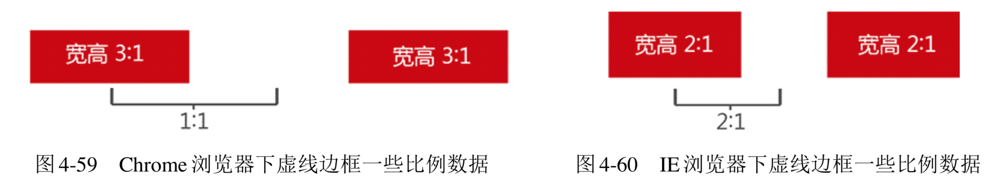
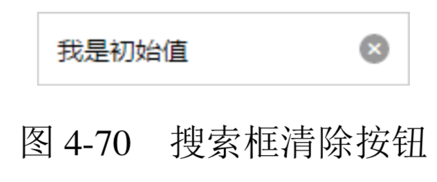
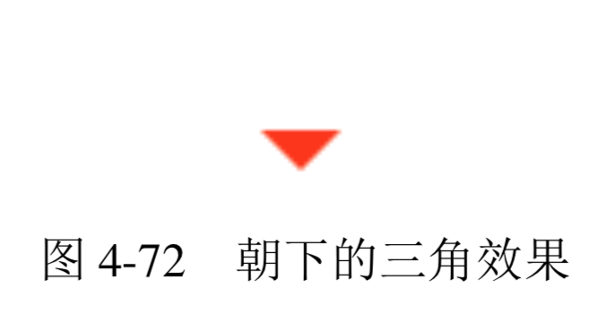
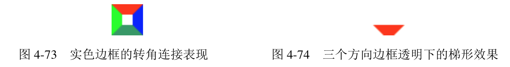

- [功勋卓越的 border 属性](#%E5%8A%9F%E5%8B%8B%E5%8D%93%E8%B6%8A%E7%9A%84-border-%E5%B1%9E%E6%80%A7)
  - [为什么 border-width 不支持百分比值](#%E4%B8%BA%E4%BB%80%E4%B9%88-border-width-%E4%B8%8D%E6%94%AF%E6%8C%81%E7%99%BE%E5%88%86%E6%AF%94%E5%80%BC)
  - [了解各种 border-style 类型](#%E4%BA%86%E8%A7%A3%E5%90%84%E7%A7%8D-border-style-%E7%B1%BB%E5%9E%8B)
    - [border-style:none](#border-stylenone)
    - [border-style:solid](#border-stylesolid)
    - [border-style:dashed](#border-styledashed)
    - [border-style:dotted](#border-styledotted)
    - [border-style:double](#border-styledouble)
    - [其他 border-style 类型](#%E5%85%B6%E4%BB%96-border-style-%E7%B1%BB%E5%9E%8B)
  - [border-color 和 color](#border-color-%E5%92%8C-color)
  - [border 与透明边框技巧](#border-%E4%B8%8E%E9%80%8F%E6%98%8E%E8%BE%B9%E6%A1%86%E6%8A%80%E5%B7%A7)
    - [右下方 background 定位的技巧](#%E5%8F%B3%E4%B8%8B%E6%96%B9-background-%E5%AE%9A%E4%BD%8D%E7%9A%84%E6%8A%80%E5%B7%A7)
    - [优雅地增加点击区域大小](#%E4%BC%98%E9%9B%85%E5%9C%B0%E5%A2%9E%E5%8A%A0%E7%82%B9%E5%87%BB%E5%8C%BA%E5%9F%9F%E5%A4%A7%E5%B0%8F)
    - [三角等图形绘制](#%E4%B8%89%E8%A7%92%E7%AD%89%E5%9B%BE%E5%BD%A2%E7%BB%98%E5%88%B6)
  - [border 与图形构建](#border-%E4%B8%8E%E5%9B%BE%E5%BD%A2%E6%9E%84%E5%BB%BA)
  - [border 等高布局技术](#border-%E7%AD%89%E9%AB%98%E5%B8%83%E5%B1%80%E6%8A%80%E6%9C%AF)

# 功勋卓越的 border 属性
顾名思义，border 就是“边框”，从名字就可以看出来 CSS 设计者设计此属性的目的就是给元素弄个边框什么的。但是，CSS 世界中很多大受欢迎的属性之所以受欢迎，并不是因为其本职工作做得很好，而是衍生出来的特性可以用来解决很多棘手的问题。border 属性就是 典型代表之一。我总是称赞 border“功勋卓越”，正是因为 border 属性在图形构建、体验优化以及网页布局这块几大放异彩，同时保证其良好的兼容性和稳定的特性表现才得此荣耀的，如果就老老实实画个框框，就不可能称赞它“功勋卓越”。

## 为什么 border-width 不支持百分比值
虽然同属盒模型基本成员，但是 border-width 却不支持百分比。例如，设置:
```css
div { border-width: 50%; }
```
是无效的，直接声明无效。这一点和 margin 和 padding 都不一样，下面问题来了:为什么 border-width 不支持百分比呢?

有人说不好解析、不好表现。在我看来，是没有这个问题的，直接和 margin 和 padding 一样，全部相对于宽度计算就好了，没有任何渲染上的难度。之所以不支持，在我看来是语义和使用场景决定的。

**首先看语义。顾名思义，border-width 是“边框宽度”，我们先来看看现实世界的物体的边框，假设我们现在有两台数码设备，分别是 iMac 和 iPhone，很显然，这两台设备的尺寸差异很大，但是，大家仔细对比就会发现，这两者的边框大小差别跟屏幕设备相比较而言就可以忽略不计了。看到没，所谓“边框”，是不会因为设备大就按比例变大的。因此，如果支持百分比值，是不是就意味着设备大了边框也跟着变大?这显然不合“边框”的语义嘛!然后再看使用场景，虽然说如果 border-width 支持百分比值布局什么的能做的事情就更多了，但是，我们要想到 CSS 世界创造的背景主要是为图文展示服务的，有一张图片，大片区域都是白色的，在白底背景上和文字混在一起，就会有一片奇怪的空白区域，会让人产生没对齐的假象，此时，我们给这张图片套个 1px 灰色边框，区域就明显了，对吧!设计的初衷就是为了这么点儿事，没有需要使用百分比值的场景。于是，综合这两点，造成了 border-width 不支持百分比值。**

**其实还有很多 CSS 属性，如 outline、box-shadow、text-shadow 等，都是不支持百分比值的，原因也与此类似。**

我们平常使用 border-width 几乎全是固定的数值，如 border-width:1px 之类，但是，可能有些人并不知道 border-width 还支持若干关键字，包括 thin、medium(默认值) 和 thick，对应的尺寸大小具体如下。
+ thin:薄薄的，等同于 1px。
+ medium(默认值):薄厚均匀，等同于 3px。
+ thick:厚厚的，等同于 4px。

**不知道大家有没有想过这么一个问题:为什么 border 属性的默认宽度大小是 medium，也就是 3px，明明 thin(1px)宽度更常用吧?**

**为什么呢?因为......border-style:double 至少 3px 才有效果!border-style...double?我好像只知道 solid、dashed 和 dotted，这 double 是个什么?**

## 了解各种 border-style 类型

### border-style:none
**注意，border-style 的默认值是 none，有一部分人可能会误以为是 solid。这也是单纯设置border-width 或 border-color 没有边框显示的原因，如下示意:**

```css
div { border: 10px; } /* 无边框出现 */ 
div { border: red; } /* 无边框出现 */
```

如果是 border-style 类型值则边框出现。例如，下面 CSS 会出现 3 像素宽的边框:

```css
div { border: solid; } /* 有边框出现 */
```

平时我们使用 border-style:none 多出现在重置边框样式的时候，例如，实现一个没有下边框的边框效果:

```css
div {
    border: 1px solid;
    border-bottom: none;
}
```

当然，我们也可以通过直接设置边框宽度为 0 进行重置:

```css
div {
    border: 1px solid;
    border-bottom: 0;
}
```

**当然，如果你是一个“性能控”，可以两个一起写，根据前辈的测试，这样写渲染性能最高:**

```css
div {
    border: 1px solid;
    border-bottom: 0 none;
}
```

### border-style:solid
这个大家耳熟能详，妇孺皆知，实线边框，没什么好说的。

### border-style:dashed
虚线边框可以说是使用频率第二高的边框类型了，至于使用没什么好说的，倒是这边框本身的一些渲染数据挺有意思。这虚线颜色区的宽高比以及颜色区和透明区的宽度比例在不同浏览器下是有差异的。例如，在 Chrome 和 Firefox 浏览器下，颜色区的宽高比是 3:1，颜色区和透明区的宽度比例是 1:1，如图 4-59 所示;而 IE 浏览器则是另外的数据，颜色区的宽高比是 2:1，颜色区和透明区的宽度比例也是 2:1，如图 4-60 所示。



本身就是方方正正的，再加上兼容性的差异，基本上就只能当作虚框来用了。

### border-style:dotted
虚点边框在表现上同样有兼容性差异，虽然规范上明确表示是个圆点，但是 Chrome 以及 Firefox浏览器下虚点实际上是个小方点

### border-style:double
双线边框，顾名思义，即两根线且为实线。虽然平常我 们使用少，但是其兼容性非常好。

### 其他 border-style 类型
inset(内凹)、outset(外凸)、groove(沟槽)、ridge (山脊)风格老土过时，且兼容性惨不忍睹。因此，它 们没有任何实用价值。

##  border-color 和 color
**border-color 有一个很重要也很实用的特性，就是“border-color 默认颜色就是 color 色值”。具体来讲，就是当没有指定 border-color 颜色值的时候，会使用当前元素的 color 计算值作为边框色。** 例如，下面这个例子:

```css
.box {
    border: 10px solid;
    color: red;
}
```

此时，.box 元素的 10px 边框颜色就是红色。

具有类似特性的 CSS 属性还有 outline、box-shadow 和 text-shadow 等。

那这种特性对于实际开发有没有什么作用呢?我们直接看一个例子，我们在上传图片的时候，往往后面会跟着一个带有加号的框框按钮，表示可以继续传图，如图 4-68 所示，然后 hover 的时候会变个色。


这种方方正正、简简单单的图形最适合使用三三两两的CSS代码绘制了。通常，正常思维下，我们都是使用width/height 外加一个 background-color 绘制加号的，核心 CSS 代码如下:

```css
.add {
    border: 2px dashed #ccc;
}
.add:before,
.add:after {
    background: #ccc;
}
/* hover变色*/
.add:hover {
    border-color: #06C;
}
.add:hover:before, .add:hover:after {
    background: #06C;
}
```

功能没有任何问题，唯独当我们 hover 变色的时候，需要同时重置 3 处(元素本身以及两个伪元素)颜色。实际上，如果这里不是使用 background-color，而是使用 border 来绘制加号，则代码要简单得多，如下:

```css
.add {
    color: #ccc;
    border: 2px dashed;
}
.add:before {
    border-top: 10px solid;
}
.add:after {
    border-left: 10px solid;
}
/* hover变色*/ 
.add:hover {
    color: #06C;
}
```

**可以看到，使用 border 实现，我们 hover 变色的时候，只需要重置 1 处，也就是重置元素本身的 color 就可以了。因为整个图形都是使用border绘制的，同时颜色缺省，所以所有图形颜色自动跟着一起变了。**

👉 [example](https://demo.cssworld.cn/4/4-1.php)

## border 与透明边框技巧
虽然 color:transparent 在 IE9 以上版本的浏览器才支持，但是 border-color: transparent 在 IE7 浏览器就开始支持了，于是，我们解决一些棘手问题的思路就更加开阔了。

### 右下方 background 定位的技巧
在 CSS3 新世界还没到来的时候，background 定位有一个比较大的局限性，就是只能相对左上角数值定位，不能相对右下角。这种特性有时候会给我们的工作带来一点儿麻烦。举个例子，假设现在有一个宽度不固定的元素，我们需要在距离右边缘 50 像素的位置设置一个背景图片，此时 background 属性就遭遇尴尬了:由于宽度不固定，所以无法通过设定具体数值来实现我们想要的效果，因为 background 是相对左上角定位的，我们的需求是右侧定位。

要实现上面的需求，方法挺多。其中一种方法就是使用透明边框，如下 CSS 代码:

```css
.box {
    border-right: 50px solid transparent;
    background-position: 100% 50%;
}
```

**此时，对 50px 的间距我们使用 transparent 边框表示，这样就可以使用百分比 background-position 定位到我们想要的位置了。因为，默认 background 背景图片是相对于 padding box 定位的，也就是说，background-position:100%的位置计算默认是不会把 border-width 计算在内的。**

### 优雅地增加点击区域大小
这是提高用户体验的一个小技巧，尤其在移动端，我们的操作工具一般就是我们的手指，但是，我们的手指粗细可以媲美胡萝卜，而屏幕尺寸就那么点儿，如果我们正在走路，则一些精致的图标和按钮很容易就点不中甚至误点。举个例子，在移动端搜索输入框输入内容后，右侧会有一个清除按钮，类似于图 4-70 所示。



无论我们是使用 CSS 图标合并工具还是手写模拟，基本上都是按照图标的原始尺寸写的，类似下面:

```css
.icon-clear {
    width: 16px;
    height: 16px;
}
```

效果虽然没问题，但是体验不一定好，因为尺寸仅仅 16 像素，我们胡萝卜般的手指很容易点不中，甚至点到后面的输入框上，那就尴尬了。

**稳妥的方法是外部再嵌套一层标签，专门控制点击区域大小。如果对代码要求较高，则可以使用 padding 或者透明 border 增加元素的点击区域大小。**

**其中，首推透明 border 方法，原因很简单，假设我们的图标是使用工具生成的，那background-position 就是限定死的值，若再使用 padding 撑开间距，就会遇到定位不准的问题。但是，若是使用透明 border 增加点击区域，则无此问题，只要合并时留下足够的间距就可以了。**

```css
.icon-clear {
    width: 16px;
    height: 16px;
    border: 11px solid transparent;
}
```

此时，点击区域大小从 16×16 一下子提升到 38×38，显然更容易被点中了。

👉 [example](https://demo.cssworld.cn/4/4-2.php)

### 三角等图形绘制
**即使在移动端，使用CSS的border属性绘制三角形等图形仍是性价比最高的方式。例如，一个朝下的等腰直角三角形，直接用:**

```css
div {
    width: 0;
    border: 10px solid;
    border-color: #f30 transparent transparent;
}
```

则有图 4-72 所示的效果。



## border 与图形构建
border 属性可以轻松实现兼容性非常好的三角图形效果，为什么可以呢?其底层原因受 inset/outset 等看上去没有实用价值的 border-style 属性影响，边框 3D 效果在互联网早期其实还是挺潮的，那个时候人们喜欢有质感的东西，为了呈现逼真的 3D 效果，自然在边框转角的地方一定要等分平滑处理，然后不同的方向赋予不同的颜色。然后，这一转角规则也被 solid 类型的边框给沿用了。因此，我们就不难理解下面的 4 色边框的表现了:

```html
 div {
    width: 10px; height: 10px;
    border: 10px solid;
    border-color: #f30 #00f #396 #0f0;
}
```

效果如图 4-73 所示。

此时，如果设置左右下 3 个方向边框色为透明，是不是就是一个梯形了?

```css
div {
    width: 10px; height: 10px;
    border: 10px solid;
    border-color: #f30 transparent transparent;
}
```

效果如图 4-74 所示。



此时，再进一步，宽度从 10px 变成 0，是不是上面梯形下方的开口也就从 10px 变成 0了?是不是三角形效果就出现了?

```css
div {
    width: 0;
    border: 10px solid;
    border-color: #f30 transparent transparent;
}
```

当然，我们还可以让垂直方向的边框宽度更宽一点，这样三角形就会更加狭长:

```css
div {
    width: 0;
    border-width: 10px 20px;
    border-style: solid;
    border-color: #f30 transparent transparent;
}
```

效果如图 4-76 所示。

又或者是仅仅让两个方向的边框透明:

```css
div {
    width: 0;
    border-width: 10px 20px;
    border-style: solid;
    border-color: #f30 #f30 transparent transparent;
}
```

效果如图 4-77 所示。这种三角形可以作为类似于如图 4-78 所示对话框的尖角

如果把两个不同倾斜角度的三角效果叠加，则可以实现更加刁钻的尖角效果，如图 4-79 所示。


## border 等高布局技术
margin+padding 可以实现等高布局，同样，border 属性也可以实现等高布局。

👉 [example](https://demo.cssworld.cn/4/4-4.php)

```css
.box {
  border-left: 150px solid #333;
  background-color: #f0f3f9;
}
.box > nav {
  width: 150px;
  margin-left: -150px;
  float: left;
}
.box > section {
   overflow: hidden;
}
```

也就是说，左侧深色背景区域是由 border-left 属性生成的。元素边框高度总是和元素自身高度保持一致，因此可以巧妙地实现等高布局效果。

**此方法要想生效，有一点需要注意，父级容器不能使用 overflow:hidden 清除浮动影响，因为溢出隐藏是基于padding box的，如果设置了overflow:hidden，则左浮动的导航列表元素就会被隐藏掉，这显然不是我们想要的效果。**

此方法与用 margin+padding 实现的等高布局相比更加稳健，不会出现锚点定位带来的问题，但同样它也是有局限性的。

首先，由于 border 不支持百分比宽度，因此，适合至少一栏是定宽的布局。当然，如果不考虑 IE8 浏览器，可以试试使用 vw 单位，其可实现近似的百分比宽度效果。

其次，等高布局的栏目有限制。因为一个元素的边框数目是有限的，基本上，border 等高布局只能满足 2~3 栏的情况，除非正好是等比例的，那还可以使用 border-style:double 实现最多 7 栏布局，但这只是理论上而已。所以，一旦等高布局栏目过多，则建议使用 table-cell 等高布局或者 margin 负值等高布局。

最终如何选型，还是要看设计需求和产品的兼容性要求。